# KidsMath 系统设计、功能交互与实施计划

| 项目 | 内容 |
| --- | --- |
| 文档版本 | v1.3（对齐 PRD **v1.3**：Q11 开发自查 + R-1 风险 + 提示模板 `source_ref` 可追溯 + R4 阻断项；并含 v1.2 的 Q1/Q2/Q3/Q4/Q6、G-08 升 P0、G-10~G-14、§8.4 范围红线，以及 C-1 ~ C-4 语义澄清） |
| 日期 | 2026-10-07 |
| 作者 | 高见远 · 架构师 |
| 上游文档 | `docs/PRD.md` v1.3 |
| 目标读者 | 前端、后端、测试、内容配置与运维工程师 |
| 状态 | 可进入技术评审与开发 |

> 本设计对齐 **PRD v1.3**：响应式 Web 单代码库（预留 Capacitor，**首版不打包**）；云端账号为权威，**练习模块完全可离线（G-08 P0）**；首版家长端仅 3 件事；老师端/积分商城/家长报告/排行榜/语音/多语言/付费均不在本期；动画为 **Lottie ≤150KB + SVG/CSS，禁用 MP4/GIF**；无广告、无第三方追踪。
>
> **PRD v1.3（Q11 / R-1）两条硬约束**：
> - **提示模板可追溯**：每条 L1/L2 模板与特例卡必须带 `source_ref`（教材知识点/课标条目，如 `人教版二上·表内除法（一）`），**以结构化配置入库、禁止硬编码拼串，缺失不得上线**（DB 非空 + CI 校验 + 启动 fail-fast）。见 §4.4.1、§12.3.1。
> - **R4 是「P0 中的 P0」**：无教研审校时，**题目本身不越界是最后兜底**；R4 校验为**阻断性验收项**，见 T02/T04 的 B-1、B-2。
>
> **对齐 PRD v1.1 的三条关键实现口径**：
> - **C-1**：单题基础分恒为 `+1`，**不打折**；L1/L2 的差异不在基础分，而在 **Combo 连对是否中断**（`hintLevel∈{0,1}` 继续累加；`hintLevel=2` 归零；`hintLevel=3` 计“未答对”且进错题本）。【免扣卡】权益改为“L2 后答对仍保住连对”。
> - **C-2**：P0 保证表述为「**已成功同步至云端的累计积分永不丢失**」；全程离线后直接卸载/清缓存/换设备只丢失该离线期间 pending，属预期行为。按 H-12 的 6 个时机高频 flush、H-13/H-14/H-15 显式告知、H-16 卸载兜底压缩敞口。
> - **C-4**：H-15 拆为**双数据源** —— 「上次同步时间」取服务端 `lastSyncAt`（跨设备权威、P1 必做），「待同步积分」取本机 `pending_ledger`（**仅本机可见，跨设备隐藏且绝不显示 0**，P1 限本机）。详见 §5.5。
> - **版本说明**：本设计 v1.3 与 **PRD v1.3**（含 Q11 决策、R-1 风险、§8.4 范围红线、C-1~C-4）一致；后续 PRD 发 v1.4 时同步更新本文件头与修订记录。
> - **C-3**：服务端 **14 张表**（见 §3.3）+ 本地 **1 张** `pending_ledger`（见 §3.5，不进服务端）+ **5 张服务端支持表**（`point_rules`/`point_daily_counters`/`store_items`/`redemptions`/**`hint_templates`**）。
>
> **术语消歧**：全文 `difficultyLevel` 指题目难度 L1/L2/L3；`hintLevel` 指提示级别 0/1/2/3。二者不得混用同一字段。

---

## Part A：系统设计

## 1. 实施方法与总体架构

### 1.1 核心技术难点

1. **离线练习与云端积分一致性同时成立**：练习必须在无网时完整闭环，但积分账户必须以服务端为唯一权威；需要“本地乐观记账 + 幂等流水补登 + 服务端事务结算”。
2. **随机但可复现的题目生成**：R1–R12 同时满足，10 题组生成不超过 150ms，并能通过 `seed + generatorVersion` 复现历史题。
3. **低龄儿童即时反馈**：提交后 300ms 内开始反馈，热区足够大，不因网络请求阻塞答题、提示或切题。
4. **动画体验和小首包冲突**：28 个知识点动画及吉祥物动效资源较多，但首包 JS 必须不超过 300KB gzip、动画至少 50fps。
5. **4 位 PIN 与儿童隐私**：PIN 熵低，需要服务端 Argon2id、限流与锁定；不能使用硬件指纹或第三方追踪，设备侧只使用随机安装实例 ID 做幂等和可信设备会话。
6. **积分规则复杂且需要防刷**：每日 200 分总上限、子项上限、Combo 替代关系、一次性奖励和并发重复请求都必须原子处理。

### 1.2 技术选型

| 层 | 选型 | 理由 |
| --- | --- | --- |
| Web 框架 | React 18 + TypeScript + Vite | 生态成熟；Vite 按路由拆包与 Worker 支持良好；同一代码库可后续接 Capacitor。 |
| 路由 | React Router 6，所有业务页 `lazy()` | 首屏仅加载壳、登录态与首页；学习、练习、家长端、商城分别独立 chunk。 |
| UI | MUI 6（仅按需组件）+ Tailwind CSS 3 | MUI 提供可访问性基础和表单能力；Tailwind 承担轻量布局与 Design Token 映射，禁止整包导入和重复样式系统。 |
| 客户端状态 | Zustand 5 + TanStack Query 5 | Zustand 管理答题会话、动画/音效等瞬时状态；Query 管理服务端缓存、重试与失效，避免一个巨型 store。 |
| 离线数据库 | IndexedDB + Dexie 4 | 支持事务、复合索引和 schema 迁移，存账户快照、题组、错题与 `pending_ledger`；优于 localStorage 的容量和一致性。 |
| PWA | `vite-plugin-pwa` / Workbox | 缓存应用壳、当前年级知识包；后台同步触发积分补登；LRU 控制 200MB 上限。 |
| 动画 | `lottie-react` 懒加载 + SVG/CSS transform/opacity | Lottie 适合可缓存矢量内容；短反馈不用加载 Lottie；低端机和“减少动效”可降级为静态 SVG。 |
| 随机引擎 | 纯 TypeScript + `seedrandom`，Web Worker | 可确定性复现；预热 Worker 后离开 UI 主线程；同一份引擎供前端与 Node 属性测试使用。 |
| 表单/校验 | React Hook Form + Zod | 轻量、类型一致；API 边界和本地配置均校验。 |
| 后端 | Python 3.12 + FastAPI + Pydantic 2 | API 契约清晰、异步 I/O 适合积分同步；OpenAPI 可生成前端类型。 |
| ORM/迁移 | SQLAlchemy 2 async + Alembic | 显式事务、行锁和成熟迁移；关键积分 SQL 可使用 Core/原生 SQL。 |
| 数据库 | PostgreSQL 16 | 唯一索引、行级锁、JSONB、约束和事务足以保障积分一致性。 |
| 缓存/限流 | Redis 7 | OTP、PIN 失败计数、短期会话、接口限流；**不作为积分账本权威源**。 |
| 鉴权 | 短期 JWT Access Token + 旋转 Refresh Cookie + 离线租约 | Access 15 分钟；家长 Refresh 7 天并轮换；儿童可信设备租约最多 7 天支持离线进入。 |
| 部署 | **响应式 Web：CDN/对象存储静态站点**（Q1 决策）+ 容器化 FastAPI + 托管 PostgreSQL/Redis | 动画走带版本 CDN；API 水平扩展；数据库每日增量备份、定期全量备份。**首版不打包 App**，仅按 G-10 预留 Capacitor 能力（不引相关依赖、不引 Electron）。 |
| 测试 | Vitest、Testing Library、Playwright、Hypothesis、pytest | 题目约束适合属性测试；积分并发与幂等必须做集成测试。 |

### 1.3 架构模式与职责边界

- 前端采用 **Feature-Sliced + MVVM 式单向数据流**：页面/组件只发出意图；ViewModel（hooks/store）编排用例；领域引擎不依赖 React。
- 后端采用 **分层架构（API → Application Service → Domain/Repository → PostgreSQL）**。积分服务是事务边界，禁止 Controller 直接修改账户余额。
- 练习采用 **Local-first**：题组生成、判题、提示、动画反馈均不等待 API；网络只做结果与积分事件的异步持久化。
- 内容采用 **版本化知识包**：知识点、提示模板和动画清单发布为带 `contentVersion` 的静态 JSON；服务端接口用于发现版本和增量更新。

### 1.3.1 技术范围边界（对齐 PRD v1.2 §8.4「本期范围红线」，工程勿自行扩大）

**✅ 本期技术范围**：响应式 Web 单代码库（手机/平板竖屏/PC）；儿童账号 + 家长代建；28 知识点 Lottie/SVG 动画 + 23 特例卡；单一/混合运算练习与 R1–R12 出题；三级提示；积分获取/消费明细 + 云端持久化 + 练习完全离线；签到/每日任务/成长树/徽章；卡通视觉与防沉迷；家长端 3 件事；**现实奖励券兑现确认（本期唯一积分消费出口）**。

**❌ 本期不做（代码中不得出现对应实现，仅可预留接口）**：

| 项 | PRD 依据 | 架构处置 |
| --- | --- | --- |
| 老师端 / 班级 / 布置题组 / 班级热力图 | Q4、US-15/16、E-12 | **不建 teacher/class/assignment 表，不建账号类型，不建路由**；本设计全篇已无相关实体 |
| 家长学习报告、错题分析、掌握矩阵、PDF 导出 | Q3（V1.1） | 仅保留 `wrong_book`/`questions` 数据写入，不做报表 API 与页面、不引 PDF 库 |
| 错题本与错题重练 UI | 附录 B（V1.1） | 数据层与 `wrong_book` 表先建（L3 自动入本需要），**UI 与重练流程不做** |
| 积分商城（装扮/主题/道具/加倍卡/免扣卡/跳过卡） | U-11 延至 V1.1 | 见 §5.6：本期只实现 `reward_voucher` 一种消费类型；**不做商品目录、永久拥有权、库存、单日 5 次兑换限制** |
| 排行榜 / 对比 / 分享 | Q5、G-13 | 无排名查询、无对比接口、无分享 SDK |
| 语音朗读 / 语音答题 | Q8（V1.1 再评估） | 不引 TTS、不申请麦克风权限 |
| 多语言 | Q10、G-12 | **文案集中管理并预留 i18n key，但只提供 `zh-CN` 一份，不建语言切换** |
| 订阅 / 内购 / 广告 / 第三方追踪 | Q12、G-14 | **无任何支付链路、无计费 SDK、无广告/追踪 SDK** |
| App 打包（Capacitor/Electron） | Q1、G-10 | **首版不打包**；仅遵守代码层约束，不引 Capacitor/Electron 依赖 |
| MP4 / GIF 动画 | Q6、G-11 | 资源门禁禁止视频与 GIF，只允许 Lottie JSON / SVG / CSS / JS |

**G-10 单代码库约束（Capacitor 预留能力，首版不打包）**：

1. 领域层（`src/domain`、`features/*/engine`）**不得直接引用 `window`、`document`、`navigator`、原生 API**；平台能力统一经 `shared/platform` 适配层注入。
2. 服务端/领域代码不假设浏览器专有行为；Service Worker、IndexedDB、Lottie 均通过可降级接口使用（缺失时功能降级而非崩溃）。
3. 不引入 Electron、Cordova/Capacitor 插件、任何原生桥接依赖；仅保持目录与适配层结构，便于后续打包。
4. 响应式布局由 CSS Container/Media Query 完成，不做 UA 分支或设备类型硬编码。

**G-12 多语言预留做法**：所有用户可见文案集中在 `src/content/` 与组件文案表，使用 `t('key')` 形式的 key（首版 key 与中文一一对应）；不做语言包切换、不做 `Intl` 以外的本地化适配，避免为预留付出额外包体。

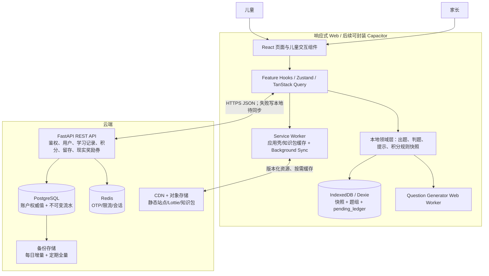

### 1.4 性能预算与落地措施

| 指标 | 预算/措施 | 验证方式 |
| --- | --- | --- |
| 首包 JS ≤300KB gzip | React/runtime ≤80KB；MUI 按需 ≤70KB；壳/状态/API ≤70KB；余量 ≤80KB。Lottie 运行时、家长端、奖励券页面均动态导入（**无商城/报表 chunk**）。设置 Vite `manualChunks` 与 CI 体积阈值。 | `vite build` + `size-limit`，超阈值阻断 CI。 |
| 首题渲染 ≤1.0s | 首页 hover/touchstart 预加载练习 chunk；Worker 在空闲时预热；导航前预生成整组；首题数据本地读取，无 API 瀑布。若 Worker 未就绪，主线程先生成首题（目标 <20ms），其余后台生成。 | Playwright 模拟中端 Android，P95 性能打点仅保存在自有后端的匿名聚合数据中。 |
| 反馈 ≤300ms | 判题纯函数同步完成；先更新 UI，再异步写 Dexie 和上报；音效小文件预解码；提交按钮 500ms 防连点。 | fake timer 单测 + Performance API。 |
| 动画 ≥50fps | 只动画 `transform/opacity`；**G-11：单个 Lottie ≤150KB、图层 ≤150**（门禁硬阈值）；同屏只运行一个主动画；页面不可见时暂停；低端/省电/减少动效用静态关键帧。 | Chrome Performance 录制 + 长任务监控；帧率不达标自动降级。 |
| 动画资源预算 | 51 段动画（28 知识点 + 23 特例）按 **≤150KB/个** 计 ≈7.7MB，加吉祥物/反馈动效总计按 ≤12MB 规划；**远低于 LRU 200MB 上限**，故缓存策略维持 200MB 并可容纳全部动画，无需压缩画质。 | 资源清单汇总校验 + 门禁。 |
| 首包与缓存 | 首包 JS ≤300KB gzip（Lottie 运行时动态导入，不计入首包）；缓存 LRU 200MB。 | `size-limit` + Cache Storage 用量打点。 |
| 内存 ≤200MB | 知识动画一次只保留当前与下一条；图片使用 WebP/AVIF；对象 URL 及时释放；缓存 LRU 200MB。 | 移动端内存冒烟、页面切换 30 次泄漏测试。 |

---

## 2. 模块划分、页面交互与文件结构

### 2.1 页面与路由

| 路由 | 页面 | 关键交互/状态 |
| --- | --- | --- |
| `/` | 启动与身份恢复 | 读取本地账号和快照；0 网络等待进入首页骨架；后台刷新权威值。 |
| `/choose-profile` | 头像选人 | 本机儿童头像大卡；离线租约有效可进入；否则输入 4 位 PIN。 |
| `/home` | 成长树首页 | 今日任务、累计/可用积分、学一学/练一练两个主 CTA；增长动画可跳过。 |
| `/learn` | 知识地图 | 按年级分岛；未学/学习中/已掌握同时用图标、文字与颜色表示。 |
| `/learn/:kpCode` | 知识点学习 | 动画→一句话→特例卡→3 题小测；断网时仅打开已缓存内容。 |
| `/practice/setup` | 练习设置 | 最多三步：模式→运算→星级；家长默认值可减少一步。 |
| `/practice/session/:localSetId` | 答题 | 进度点、大算式、大键盘、帮帮我；切题不等待网络。 |
| `/practice/result/:localSetId` | 结算 | 至少 1 星；展示正确率、用时、积分明细、再来一组（**错题入口 V1.1 开放，本期不展示**）。 |
| `/checkin` | 签到与成长树 | 在线结算，重复点击返回同一结果；断网提示稍后签到，不伪造日期。 |
| `/rewards` | 现实奖励券（**本期唯一消费出口**） | 儿童在线申请 500 分券 → 家长端确认/拒绝；消费不可离线。**本期无积分商城（U-11 → V1.1）** |
| `/parent/*` | 家长端 | 手机验证码/家长凭证保护；仅 3 件事：儿童账号代建/管理、时长与夜间管控、现实奖励兑现确认（含拒绝）。**无报告/错题分析（V1.1）** |
| `/settings` | 儿童设置 | 音效、大字、高对比、减少动效；家长管控项不可在此修改。 |

> **路由红线**：本期**不存在** `/store`（积分商城）、`/parent/report`、`/parent/wrongbook`、`/teacher/*` 等路由；不得因“接口已设计”就提前实现页面。

所有异步页面统一有 `loading / ready / empty / offline / error` 五态；儿童侧错误展示友好文案，技术错误码只写入去标识化日志。

### 2.2 前端文件清单

```text
frontend/
├─ package.json                         # 前端依赖与脚本
├─ vite.config.ts                       # 拆包、Worker、PWA 与代理
├─ tsconfig.json                        # TypeScript 严格模式
├─ tailwind.config.ts                   # Token 到工具类映射
├─ index.html                           # Web 入口与预连接
├─ public/
│  ├─ manifest.webmanifest              # PWA 元数据
│  └─ icons/                            # 本地图标，不含真实儿童头像
├─ src/
│  ├─ main.tsx                          # 启动 React、错误边界与 SW
│  ├─ app/
│  │  ├─ App.tsx                        # 根组件
│  │  ├─ router.tsx                     # 路由及 lazy chunk 边界
│  │  ├─ providers.tsx                  # Query、Theme、Auth 提供者
│  │  └─ bootstrap.ts                   # IDB 迁移、快照恢复与 Worker 预热
│  ├─ domain/
│  │  ├─ user.ts                        # User/Parent/Settings 类型
│  │  ├─ learning.ts                    # KnowledgePoint/Progress 类型
│  │  ├─ practice.ts                    # Question/QuestionSet/Hint 类型
│  │  └─ points.ts                      # Account/Ledger/Rule 类型
│  ├─ shared/
│  │  ├─ api/client.ts                  # fetch 封装、刷新 Token、统一错误
│  │  ├─ api/contracts.ts               # OpenAPI 生成类型再导出
│  │  ├─ config/env.ts                  # 环境变量校验
│  │  ├─ errors/AppError.ts             # 领域/网络错误模型
│  │  ├─ ui/AppButton.tsx               # 64px 儿童按钮
│  │  ├─ ui/ConfirmDialog.tsx            # 防误触二次确认
│  │  ├─ ui/OfflineBanner.tsx            # 离线但已保存提示
│  │  ├─ ui/ErrorBoundary.tsx            # 页面级兜底
│  │  ├─ audio/audioManager.ts           # 音效预加载、静音与降级
│  │  └─ utils/idempotency.ts            # ULID 与幂等键生成
│  ├─ offline/
│  │  ├─ db.ts                           # Dexie schema 与迁移
│  │  ├─ repositories.ts                # 快照/题组/待同步仓储
│  │  ├─ syncCoordinator.ts              # 联网、启动、后台同步编排
│  │  ├─ cachePolicy.ts                  # 200MB LRU 知识包缓存
│  │  └─ service-worker.ts               # Workbox 路由与后台同步
│  ├─ features/
│  │  ├─ auth/
│  │  │  ├─ api.ts                       # OTP、家长/儿童登录、刷新
│  │  │  ├─ authStore.ts                 # 当前身份和离线租约
│  │  │  ├─ ChooseProfilePage.tsx        # 本机选人
│  │  │  └─ PinPad.tsx                   # PIN 大键盘与锁定提示
│  │  ├─ home/
│  │  │  ├─ HomePage.tsx                 # 首页编排
│  │  │  ├─ GrowthTree.tsx               # 八级成长树
│  │  │  └─ TodayTasksCard.tsx            # 今日任务摘要
│  │  ├─ learn/
│  │  │  ├─ api.ts                       # 知识包/进度接口
│  │  │  ├─ LearnMapPage.tsx             # 年级知识地图
│  │  │  ├─ KnowledgePage.tsx            # 学习流程容器
│  │  │  ├─ LessonAnimation.tsx          # Lottie 懒加载/降级
│  │  │  ├─ SpecialCaseCard.tsx          # 错误→正确→动画→口诀
│  │  │  └─ LessonQuiz.tsx               # 3 题全对门槛
│  │  ├─ practice/
│  │  │  ├─ engine/prng.ts               # 确定性随机数
│  │  │  ├─ engine/ranges.ts             # 年级/难度数值范围
│  │  │  ├─ engine/generator.ts          # R1–R12 生成算法
│  │  │  ├─ engine/validators.ts         # 预生成约束与回代校验
│  │  │  ├─ engine/adaptive.ts           # 难度升降
│  │  │  ├─ engine/judge.ts              # 本地判题
│  │  │  ├─ engine/hintEngine.ts         # 模板渲染和三级解锁
│  │  │  ├─ engine/generator.worker.ts   # Worker 入口
│  │  │  ├─ practiceStore.ts             # 会话状态机
│  │  │  ├─ PracticeSetupPage.tsx        # 模式/运算/星级
│  │  │  ├─ PracticeSessionPage.tsx      # 答题页
│  │  │  ├─ NumberPad.tsx                # 数字/余数输入
│  │  │  ├─ HintPanel.tsx                # L1/L2/L3 提示
│  │  │  ├─ AnswerFeedback.tsx           # 对错、积分、Combo 动效
│  │  │  └─ ResultPage.tsx                # 结算页
│  │  ├─ points/
│  │  │  ├─ api.ts                       # 账户、流水、同步
│  │  │  ├─ localLedger.ts               # 本地乐观流水写入
│  │  │  ├─ pointsSync.ts                # 批量补登与快照替换
│  │  │  └─ PointsBadge.tsx               # 累计/可用明确区分
│  │  ├─ retention/
│  │  │  ├─ api.ts                       # 签到、任务、徽章
│  │  │  ├─ CheckinPage.tsx              # 签到
│  │  │  └─ BadgeDialog.tsx               # 徽章达成弹窗
│  │  ├─ rewards/                        # 本期唯一消费出口（U-12）
│  │  │  ├─ api.ts                       # 奖励券列表、申请、状态查询
│  │  │  ├─ RewardApplyPage.tsx          # 儿童在线申请（500分/张，家长自定义）
│  │  │  └─ RewardApplyDialog.tsx        # 二次确认与余额预览（防误触）
│  │  ├─ parent/
│  │  │  ├─ api.ts                       # 儿童账号、管控与奖励
│  │  │  ├─ ParentLayout.tsx              # 中性配色家长端壳
│  │  │  ├─ ChildrenPage.tsx              # 代建/重置 PIN
│  │  │  ├─ ControlsPage.tsx              # 时长、夜间和组长度
│  │  │  └─ RewardsPage.tsx               # 现实奖励兑现确认/拒绝
│  │  │                                  # ❌ 本期无 ReportPage / WrongBookPage（V1.1）
│  │  └─ settings/
│  │     ├─ accessibilityStore.ts         # 大字/高对比/减少动效
│  │     └─ SettingsPage.tsx              # 设置页
│  ├─ content/
│  │  ├─ schemas.ts                      # 知识包/提示模板 Zod schema（sourceRef 必填）
│  │  ├─ hintTemplates.zh-CN.json        # 提示模板库（带 sourceRef/curriculum/reviewer）
│  │  └─ fallback.zh-CN.json             # 最小内置提示与友好文案
│  ├─ styles/
│  │  ├─ tokens.css                      # CSS Design Token
│  │  └─ globals.css                     # Reset、字体与无障碍模式
│  └─ tests/
│     ├─ generator.property.test.ts       # R1–R12 属性测试
│     ├─ pointsSync.test.ts               # 离线补登与幂等场景
│     └─ practice.e2e.spec.ts             # 首题/提示/退出结算 E2E
```

### 2.3 后端文件清单

```text
backend/
├─ pyproject.toml                         # Python 依赖与工具配置
├─ alembic.ini                            # 迁移配置
├─ app/
│  ├─ main.py                             # FastAPI 入口、异常处理、中间件
│  ├─ config.py                           # 环境和密钥配置
│  ├─ db.py                               # async engine/session
│  ├─ api/
│  │  ├─ router.py                        # `/v1` 总路由
│  │  ├─ deps.py                          # 当前家长/儿童与 DB 依赖
│  │  └─ routes/
│  │     ├─ auth.py                       # OTP、登录、刷新、迁移码
│  │     ├─ children.py                   # 儿童账号 CRUD/PIN 重置
│  │     ├─ learning.py                   # 知识点、特例、进度
│  │     ├─ practice.py                   # 题组/答案/完成记录
│  │     ├─ points.py                     # 账户、流水、批量同步
│  │     ├─ retention.py                  # 签到、每日任务、徽章
│  │     ├─ rewards.py                    # 本期：现实奖励券申请/确认/拒绝/退款
│  │     ├─ store.py                      # 【V1.1 预留，本期不注册路由】商品与虚拟兑换
│  │     └─ parent_settings.py            # 家长管控设置
│  ├─ domain/
│  │  ├─ enums.py                         # 状态、规则、事件枚举
│  │  ├─ models.py                        # SQLAlchemy 实体
│  │  ├─ schemas.py                       # Pydantic 契约
│  │  └─ point_rules.py                   # 规则解释与 Combo 替代逻辑
│  ├─ services/
│  │  ├─ auth_service.py                  # OTP/PIN/Token/离线租约
│  │  ├─ child_service.py                 # 代建与最多 5 个约束
│  │  ├─ learning_service.py              # 进度状态机
│  │  ├─ practice_service.py              # 本地题组结果校验入库
│  │  ├─ points_service.py                # 账户锁、幂等、上限与流水事务
│  │  ├─ sync_service.py                  # pending 批量接收和逐条结果
│  │  ├─ retention_service.py             # 签到/任务/徽章/等级
│  │  ├─ reward_service.py                # 本期：奖励券扣减、家长确认、拒绝退款
│  │  └─ store_service.py                 # 【V1.1 预留，本期不实现】虚拟商品消费
│  ├─ repositories/
│  │  ├─ users.py                         # 用户/家长查询
│  │  ├─ learning.py                      # 内容与进度仓储
│  │  ├─ practice.py                      # 题组与错题仓储
│  │  └─ points.py                        # 账户/流水/计数器仓储
│  ├─ security/
│  │  ├─ tokens.py                        # JWT、刷新 Token 轮换
│  │  ├─ pin.py                           # Argon2id 与失败锁定
│  │  └─ crypto.py                        # 手机号字段加密/哈希
│  ├─ observability/
│  │  ├─ logging.py                       # 结构化、去标识化日志
│  │  └─ metrics.py                       # 自有运行指标，无第三方追踪
│  └─ migrations/versions/
│     ├─ 0001_core_schema.py              # 核心 14 表与索引
│     └─ 0002_points_rules_reward.py       # 规则、日计数、现实奖励券（无商城表）
├─ tests/
│  ├─ test_points_idempotency.py          # 重复/并发不重复加分
│  ├─ test_points_caps.py                 # 总/子项上限和日切
│  ├─ test_auth_lockout.py                # PIN 五次锁定
│  ├─ test_sync_conflicts.py              # 多端流水并集
│  └─ test_retention.py                   # 签到任务等级
└─ Dockerfile                              # 非 root 容器镜像

infra/
├─ docker-compose.yml                      # 本地 API/PostgreSQL/Redis
├─ nginx.conf                              # SPA fallback、安全头与缓存
├─ env.example                             # 环境变量清单（无真实密钥）
└─ ci.yml                                  # lint/test/build/体积/迁移检查
```

### 2.4 后端主要接口一览

`/v1/auth/*`、`/v1/parents/me/children*`、`/v1/knowledge-points*`、`/v1/practice/sets*`、`/v1/points/*`、`/v1/checkins`、`/v1/daily-tasks`、`/v1/rewards*`、`/v1/parent/settings`。详细契约见第 6 节。
> **本期不存在的接口**：`/v1/store/*`（积分商城，V1.1）、`/v1/parent/report*`（学习报告/错题分析/PDF，V1.1）、任何老师端/班级接口（P2）。

---

## 3. 数据结构与接口

### 3.1 领域类图

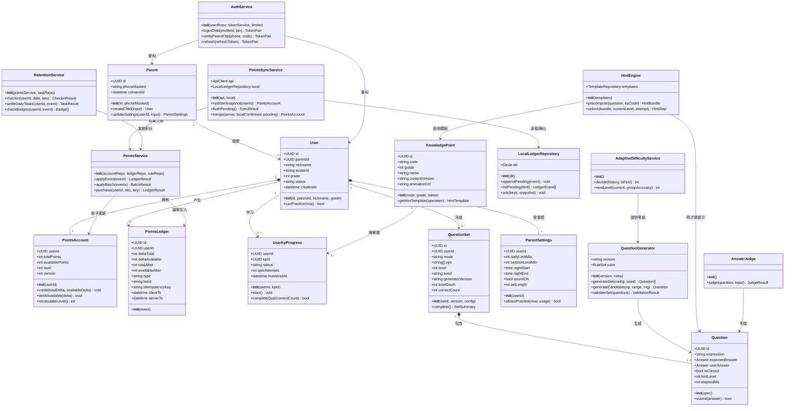

### 3.2 实体关系图（ER）

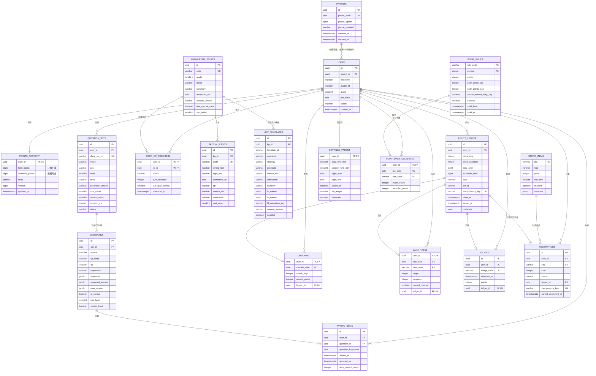

### 3.3 正式关系模型（附录 A 14 张草案表）

> PRD v1.2/v1.3 已订正为 **14 张服务端表**（v1.0 标题笔误写为 13 张）。本设计按 14 张全部落库，并增加 `point_rules`、`point_daily_counters`、`store_items`、`redemptions`、**`hint_templates`（PRD v1.3 §4.2.5 模板可追溯要求，R-1 缓解措施）** 五张服务端支持表；另有 1 张**纯本地** `pending_ledger`（见 §3.5），按 PRD 要求不进服务端。数据库时间均为 UTC；“自然日”按用户时区（首版固定 `Asia/Shanghai`）由服务端计算。

| 表 | 主键与核心字段 | 索引、约束与说明 |
| --- | --- | --- |
| `parents` | `id uuid`; `phone_hash char(64)`; `phone_cipher bytea`; `phone_masked varchar(20)`; `consent_at timestamptz`; `created_at` | `phone_hash UNIQUE`；手机号密文保存、hash 只用于等值检索；必须有家长同意时间。 |
| `users` | `id uuid`; `parent_id uuid`; `nickname varchar(20)`; `avatar_id varchar(40)`; `grade smallint`; `pin_hash text`; `status varchar(16)`; timestamps | `grade CHECK 1..3`; `status CHECK`; `(parent_id,status)` 索引；同一父母最多 5 个有效儿童由事务内锁父记录后校验。 |
| `points_account` | `user_id uuid`; `total_points bigint`; `available_points bigint`; `level smallint`; `version bigint`; `updated_at` | `user_id PK/FK`; 两余额不得为负；`total_points` 只能由积分服务增加，DB 权限禁止普通 repository 直接更新。 |
| `points_ledger` | `id uuid`; `user_id`; `delta_total`; `delta_available`; `total_after`; `available_after`; `type`; `biz_id`; `idempotency_key`; `client_ts`; `server_ts`; `metadata jsonb` | `UNIQUE(user_id,idempotency_key)` 是幂等核心；`(user_id,server_ts DESC)`；流水只插入不更新/删除，保留至少 180 天。 |
| `knowledge_points` | `id uuid`; `code varchar(16)`; `grade`; `name`; `summary`; `animation_url`; `content_version`; `has_special_case`; `sort_order`; `status` | `code UNIQUE`; `(grade,sort_order)`；内容发布后版本不可覆盖，只新增版本/更新指针。 |
| `special_cases` | `id uuid`; `kp_id`; `code`; `wrong_text`; `right_text`; `animation_url`; `tip`; `sort_order`; **`source_ref varchar(80) NOT NULL`（PRD v1.3）** | `code UNIQUE`; `(kp_id,sort_order)`；文本长度服务端校验；**PRD v1.3 要求每条注明教材知识点/课标条目**（配合 R-1 缓解与 V1.1 补教研复核）。 |
| **`hint_templates`**（PRD v1.3 新增） | `id`; `template_id`; `kp_id`; `operation`; `strategy`; `predicate`; **`source_ref`**; `curriculum`; `reviewer`; `l1_tokens jsonb`; `l2_tokens jsonb`; `l3_animation_key`; `content_version`; `enabled`; timestamps | `UNIQUE(template_id, content_version)`；`(kp_id, operation)`；**`source_ref NOT NULL` + 非空 CHECK**（无来源标注的模板不得上线）；`curriculum CHECK IN ('RJ','BSD')`。详见 §4.4.1。 |
| `user_kp_progress` | `user_id`; `kp_id`; `status`; `quiz_attempts`; `last_quiz_correct`; `mastered_at`; `updated_at` | 复合 PK `(user_id,kp_id)`；状态 `NOT_STARTED/LEARNING/MASTERED`；MASTERED 必须有 `mastered_at`。 |
| `question_sets` | `id`; `user_id`; `mode`; `ops varchar[]`; `difficulty_level`（1/2/3，**不要命名为 level**）; `seed`; `generator_version`; `total_count`; `correct_count`; `duration_ms`; `started_at`; `completed_at`; `status`; `client_set_id` | `UNIQUE(user_id,client_set_id)`；`(user_id,started_at DESC)`；计数范围约束。 |
| `questions` | `id`; `set_id`; `ordinal`; `kp_code`; `op`; `expression`; `operands jsonb`; `expected_answer jsonb`; `user_answer jsonb`; `is_correct`; `hint_level`（0=无提示 / 1=L1 / 2=L2 / 3=L3，`CHECK 0..3`）; **`combo_kept boolean`**; `attempt_count`; `elapsed_ms` | `UNIQUE(set_id,ordinal)`；答案 JSON 支持 `{value}` 与 `{quotient,remainder}`；服务端用版本化引擎抽样复核。**PRD v1.1 C-1 语义**：`hint_level∈{0,1}` → 独立答对且连对继续累加；`hint_level=2` → 提示后答对、基础分仍 +1、**连对归零**；`hint_level=3` → 计“未答对”+进错题本，仅 +1 鼓励分；使用【免扣卡】时 `hint_level=2` 且 `combo_kept=true`，连对不归零。 |
| `wrong_book` | `id`; `user_id`; `question_id`; `question_fingerprint`; `added_at`; `removed_at`; `retry_correct_count` | `(user_id,added_at DESC)`；对未移除记录建立部分唯一索引，防止同题重复入本。V1.1 开放 UI，但首版可先写数据。 |
| `checkins` | `user_id`; `checkin_date date`; `streak_days`; `reward_points`; `ledger_id`; `created_at` | 复合 PK `(user_id,checkin_date)`；日期以服务端为准；`ledger_id UNIQUE`。 |
| `daily_tasks` | `user_id`; `task_date`; `task_code`; `target`; `progress`; `reward_claimed`; `ledger_id`; `updated_at` | 复合 PK `(user_id,task_date,task_code)`；`progress >=0`；奖励通过幂等键自动发，不信任客户端“领取成功”。 |
| `badges` | `id`; `user_id`; `badge_code`; `achieved_at`; `points`; `ledger_id` | `UNIQUE(user_id,badge_code)`；重复达成返回原记录。 |
| `settings_parent` | `user_id`; `daily_limit_min`; `session_limit_min`; `night_start`; `night_end`; `sound_on`; `set_length`; `timezone`; `updated_at` | `user_id PK/FK`; 时长和组长白名单约束；更新必须家长 Token。 |
| `point_rules` | `rule_code`; `version`; `points`; `daily_count_cap`; `daily_points_cap`; `counts_toward_daily_cap`; `enabled`; `valid_from/to`; `metadata` | 复合 PK `(rule_code,version)`；仅后台迁移/配置发布可写；请求只传事件，不传积分数值。 |
| `point_daily_counters` | `user_id`; `biz_date`; `rule_code`; `event_count`; `awarded_points`; `updated_at` | 复合 PK；服务端事务内 `FOR UPDATE`；另以 `rule_code='__TOTAL__'` 维护每日 200 分。 |
| `store_items`（**本期仅 `reward_voucher` 一类**） | `sku`; `type`; `price`; `min_level`; `enabled`; `metadata` | **本期只存家长自定义现实奖励券**（默认 500 分，家长可改标题与分值），不存装扮/主题/道具；价格只能服务端读取。 |
| `redemptions` | `id`; `user_id`; `sku`; `cost`; `status`; `ledger_id`; `refund_ledger_id`; `parent_confirmed_at`; `idempotency_key`; timestamps | `UNIQUE(user_id,idempotency_key)`；状态 `PENDING_PARENT → FULFILLED / REJECTED`；**申请即扣可用积分（冻结）**，拒绝时以 `REFUND` 流水退回可用积分（`deltaTotal=0`）。**本期不做永久拥有权、库存与单日 5 次兑换限制**（商城能力属 V1.1）。 |

### 3.4 核心 DDL（PostgreSQL 16，可作为 Alembic 初稿）

```sql
CREATE EXTENSION IF NOT EXISTS pgcrypto;

CREATE TABLE parents (
  id uuid PRIMARY KEY DEFAULT gen_random_uuid(),
  phone_hash char(64) NOT NULL UNIQUE,
  phone_cipher bytea NOT NULL,
  phone_masked varchar(20) NOT NULL,
  consent_at timestamptz NOT NULL,
  created_at timestamptz NOT NULL DEFAULT now(),
  updated_at timestamptz NOT NULL DEFAULT now()
);

CREATE TABLE users (
  id uuid PRIMARY KEY DEFAULT gen_random_uuid(),
  parent_id uuid NOT NULL REFERENCES parents(id) ON DELETE RESTRICT,
  nickname varchar(20) NOT NULL CHECK (char_length(nickname) BETWEEN 1 AND 20),
  avatar_id varchar(40) NOT NULL,
  grade smallint NOT NULL CHECK (grade BETWEEN 1 AND 3),
  pin_hash text NOT NULL,
  status varchar(16) NOT NULL DEFAULT 'ACTIVE'
    CHECK (status IN ('ACTIVE','LOCKED','DELETING','DELETED')),
  created_at timestamptz NOT NULL DEFAULT now(),
  updated_at timestamptz NOT NULL DEFAULT now(),
  deleted_at timestamptz
);
CREATE INDEX ix_users_parent_status ON users(parent_id, status);

CREATE TABLE points_account (
  user_id uuid PRIMARY KEY REFERENCES users(id) ON DELETE RESTRICT,
  total_points bigint NOT NULL DEFAULT 0 CHECK (total_points >= 0),
  available_points bigint NOT NULL DEFAULT 0 CHECK (available_points >= 0),
  level smallint NOT NULL DEFAULT 1 CHECK (level BETWEEN 1 AND 8),
  version bigint NOT NULL DEFAULT 0,
  updated_at timestamptz NOT NULL DEFAULT now()
);
COMMENT ON COLUMN points_account.total_points IS '累计积分，只增不减，用于等级';
COMMENT ON COLUMN points_account.available_points IS '可用积分，获取增加、消费减少';

CREATE TABLE points_ledger (
  id uuid PRIMARY KEY DEFAULT gen_random_uuid(),
  user_id uuid NOT NULL REFERENCES users(id) ON DELETE RESTRICT,
  delta_total integer NOT NULL,
  delta_available integer NOT NULL,
  total_after bigint NOT NULL CHECK (total_after >= 0),
  available_after bigint NOT NULL CHECK (available_after >= 0),
  type varchar(40) NOT NULL,
  biz_id varchar(100) NOT NULL,
  idempotency_key varchar(160) NOT NULL,
  client_ts timestamptz NOT NULL,
  server_ts timestamptz NOT NULL DEFAULT now(),
  install_instance_id varchar(40),
  metadata jsonb NOT NULL DEFAULT '{}'::jsonb,
  UNIQUE (user_id, idempotency_key)
);
CREATE INDEX ix_ledger_user_server_ts ON points_ledger(user_id, server_ts DESC);
CREATE INDEX ix_ledger_user_type_ts ON points_ledger(user_id, type, server_ts DESC);
COMMENT ON TABLE points_ledger IS '不可变积分流水；只 INSERT，不 UPDATE/DELETE';

CREATE TABLE point_rules (
  rule_code varchar(40) NOT NULL,
  version integer NOT NULL,
  points integer NOT NULL CHECK (points >= 0),
  daily_count_cap integer CHECK (daily_count_cap IS NULL OR daily_count_cap >= 0),
  daily_points_cap integer CHECK (daily_points_cap IS NULL OR daily_points_cap >= 0),
  counts_toward_daily_cap boolean NOT NULL DEFAULT true,
  enabled boolean NOT NULL DEFAULT true,
  valid_from timestamptz NOT NULL,
  valid_to timestamptz,
  metadata jsonb NOT NULL DEFAULT '{}'::jsonb,
  PRIMARY KEY (rule_code, version),
  CHECK (valid_to IS NULL OR valid_to > valid_from)
);

CREATE TABLE point_daily_counters (
  user_id uuid NOT NULL REFERENCES users(id) ON DELETE RESTRICT,
  biz_date date NOT NULL,
  rule_code varchar(40) NOT NULL,
  event_count integer NOT NULL DEFAULT 0 CHECK (event_count >= 0),
  awarded_points integer NOT NULL DEFAULT 0 CHECK (awarded_points >= 0),
  updated_at timestamptz NOT NULL DEFAULT now(),
  PRIMARY KEY (user_id, biz_date, rule_code)
);

CREATE TABLE knowledge_points (
  id uuid PRIMARY KEY DEFAULT gen_random_uuid(),
  code varchar(16) NOT NULL UNIQUE,
  grade smallint NOT NULL CHECK (grade BETWEEN 1 AND 3),
  name varchar(60) NOT NULL,
  summary varchar(60) NOT NULL,
  animation_url text NOT NULL,
  content_version varchar(30) NOT NULL,
  has_special_case boolean NOT NULL DEFAULT false,
  sort_order smallint NOT NULL,
  status varchar(16) NOT NULL DEFAULT 'PUBLISHED'
    CHECK (status IN ('DRAFT','PUBLISHED','ARCHIVED'))
);
CREATE UNIQUE INDEX ux_kp_grade_order ON knowledge_points(grade, sort_order);

CREATE TABLE special_cases (
  id uuid PRIMARY KEY DEFAULT gen_random_uuid(),
  kp_id uuid NOT NULL REFERENCES knowledge_points(id) ON DELETE CASCADE,
  code varchar(16) NOT NULL UNIQUE,
  wrong_text varchar(120) NOT NULL,
  right_text varchar(120) NOT NULL,
  animation_url text,
  tip varchar(80) NOT NULL,
  -- PRD v1.3 §4.2.5 / R-1：每条特例卡注明教材知识点或课标条目，便于追溯与 V1.1 补教研复核
  source_ref varchar(80) NOT NULL,
  curriculum varchar(8) NOT NULL DEFAULT 'RJ' CHECK (curriculum IN ('RJ','BSD')),
  reviewer varchar(40) NOT NULL,
  sort_order smallint NOT NULL DEFAULT 0,
  CONSTRAINT ck_special_cases_source_ref CHECK (char_length(btrim(source_ref)) > 0)
);
CREATE INDEX ix_special_cases_kp_order ON special_cases(kp_id, sort_order);

-- PRD v1.3 §4.2.5 硬约束：提示模板结构化入库，必须携带 source_ref（教材知识点/课标条目）
CREATE TABLE hint_templates (
  id uuid PRIMARY KEY DEFAULT gen_random_uuid(),
  template_id varchar(60) NOT NULL,
  kp_id uuid NOT NULL REFERENCES knowledge_points(id) ON DELETE CASCADE,
  operation varchar(12) NOT NULL CHECK (operation IN ('ADD','SUB','MUL','DIV','MIXED')),
  strategy varchar(24) NOT NULL,
  predicate varchar(200) NOT NULL,
  source_ref varchar(80) NOT NULL,          -- 例：人教版二上·表内除法（一）
  curriculum varchar(8) NOT NULL CHECK (curriculum IN ('RJ','BSD')),
  reviewer varchar(40) NOT NULL,            -- 开发自查人，V1.1 补教研复核时定位
  l1_tokens jsonb NOT NULL,                 -- 方向提示，不含最终答案
  l2_tokens jsonb NOT NULL,                 -- 步骤提示，不含最终答案
  l3_animation_key varchar(80) NOT NULL,
  content_version varchar(30) NOT NULL,
  enabled boolean NOT NULL DEFAULT true,
  created_at timestamptz NOT NULL DEFAULT now(),
  updated_at timestamptz NOT NULL DEFAULT now(),
  UNIQUE (template_id, content_version),
  CONSTRAINT ck_hint_source_ref CHECK (char_length(btrim(source_ref)) > 0)
);
CREATE INDEX ix_hint_templates_kp_op ON hint_templates(kp_id, operation);
CREATE INDEX ix_hint_templates_lookup ON hint_templates(kp_id, operation, enabled);
COMMENT ON COLUMN hint_templates.source_ref IS 'PRD v1.3 硬约束：教材知识点/课标条目；缺失不得上线（启动校验 + CI 校验 + DB 约束）';

CREATE TABLE user_kp_progress (
  user_id uuid NOT NULL REFERENCES users(id) ON DELETE CASCADE,
  kp_id uuid NOT NULL REFERENCES knowledge_points(id) ON DELETE CASCADE,
  status varchar(16) NOT NULL DEFAULT 'NOT_STARTED'
    CHECK (status IN ('NOT_STARTED','LEARNING','MASTERED')),
  quiz_attempts integer NOT NULL DEFAULT 0 CHECK (quiz_attempts >= 0),
  last_quiz_correct smallint NOT NULL DEFAULT 0 CHECK (last_quiz_correct BETWEEN 0 AND 3),
  mastered_at timestamptz,
  updated_at timestamptz NOT NULL DEFAULT now(),
  PRIMARY KEY (user_id, kp_id),
  CHECK ((status = 'MASTERED' AND mastered_at IS NOT NULL) OR status <> 'MASTERED')
);

CREATE TABLE question_sets (
  id uuid PRIMARY KEY DEFAULT gen_random_uuid(),
  user_id uuid NOT NULL REFERENCES users(id) ON DELETE CASCADE,
  client_set_id varchar(80) NOT NULL,
  mode varchar(16) NOT NULL CHECK (mode IN ('SINGLE','MIXED','WRONG_RETRY','LESSON_QUIZ')),
  ops varchar(8)[] NOT NULL,
  difficulty_level smallint NOT NULL CHECK (difficulty_level BETWEEN 1 AND 3),
  seed varchar(80) NOT NULL,
  generator_version varchar(30) NOT NULL,
  total_count smallint NOT NULL CHECK (total_count BETWEEN 1 AND 20),
  correct_count smallint NOT NULL DEFAULT 0,
  duration_ms integer NOT NULL DEFAULT 0 CHECK (duration_ms >= 0),
  status varchar(16) NOT NULL DEFAULT 'STARTED'
    CHECK (status IN ('STARTED','COMPLETED','ABANDONED')),
  started_at timestamptz NOT NULL,
  completed_at timestamptz,
  UNIQUE (user_id, client_set_id),
  CHECK (correct_count BETWEEN 0 AND total_count)
);
CREATE INDEX ix_sets_user_started ON question_sets(user_id, started_at DESC);

CREATE TABLE questions (
  id uuid PRIMARY KEY DEFAULT gen_random_uuid(),
  set_id uuid NOT NULL REFERENCES question_sets(id) ON DELETE CASCADE,
  ordinal smallint NOT NULL CHECK (ordinal BETWEEN 1 AND 20),
  kp_code varchar(16) NOT NULL,
  op varchar(12) NOT NULL,
  expression varchar(100) NOT NULL,
  operands jsonb NOT NULL,
  expected_answer jsonb NOT NULL,
  user_answer jsonb,
  is_correct boolean,
  hint_level smallint NOT NULL DEFAULT 0 CHECK (hint_level BETWEEN 0 AND 3),
  combo_kept boolean NOT NULL DEFAULT true,
  attempt_count smallint NOT NULL DEFAULT 0 CHECK (attempt_count BETWEEN 0 AND 4),
  elapsed_ms integer NOT NULL DEFAULT 0 CHECK (elapsed_ms >= 0),
  UNIQUE (set_id, ordinal)
);
COMMENT ON COLUMN questions.hint_level IS '0=无提示 1=L1方向 2=L2步骤 3=L3完整讲解';
COMMENT ON COLUMN questions.combo_kept IS 'PRD v1.1 C-1：hint_level=2且未用免扣卡时为false，连对归零；其余为true';
COMMENT ON COLUMN questions.is_correct IS 'hint_level=3时固定为false（计未答对）';

CREATE TABLE wrong_book (
  id uuid PRIMARY KEY DEFAULT gen_random_uuid(),
  user_id uuid NOT NULL REFERENCES users(id) ON DELETE CASCADE,
  question_id uuid NOT NULL REFERENCES questions(id) ON DELETE CASCADE,
  question_fingerprint char(64) NOT NULL,
  added_at timestamptz NOT NULL DEFAULT now(),
  removed_at timestamptz,
  retry_correct_count integer NOT NULL DEFAULT 0 CHECK (retry_correct_count >= 0)
);
CREATE INDEX ix_wrong_user_added ON wrong_book(user_id, added_at DESC);
CREATE UNIQUE INDEX ux_wrong_active_fingerprint
  ON wrong_book(user_id, question_fingerprint) WHERE removed_at IS NULL;

CREATE TABLE checkins (
  user_id uuid NOT NULL REFERENCES users(id) ON DELETE CASCADE,
  checkin_date date NOT NULL,
  streak_days integer NOT NULL CHECK (streak_days >= 1),
  reward_points integer NOT NULL CHECK (reward_points >= 0),
  ledger_id uuid NOT NULL UNIQUE REFERENCES points_ledger(id),
  created_at timestamptz NOT NULL DEFAULT now(),
  PRIMARY KEY (user_id, checkin_date)
);

CREATE TABLE daily_tasks (
  user_id uuid NOT NULL REFERENCES users(id) ON DELETE CASCADE,
  task_date date NOT NULL,
  task_code varchar(40) NOT NULL,
  target integer NOT NULL CHECK (target > 0),
  progress integer NOT NULL DEFAULT 0 CHECK (progress >= 0),
  reward_claimed boolean NOT NULL DEFAULT false,
  ledger_id uuid UNIQUE REFERENCES points_ledger(id),
  updated_at timestamptz NOT NULL DEFAULT now(),
  PRIMARY KEY (user_id, task_date, task_code)
);

CREATE TABLE badges (
  id uuid PRIMARY KEY DEFAULT gen_random_uuid(),
  user_id uuid NOT NULL REFERENCES users(id) ON DELETE CASCADE,
  badge_code varchar(40) NOT NULL,
  achieved_at timestamptz NOT NULL DEFAULT now(),
  points integer NOT NULL CHECK (points >= 0),
  ledger_id uuid NOT NULL UNIQUE REFERENCES points_ledger(id),
  UNIQUE (user_id, badge_code)
);

CREATE TABLE settings_parent (
  user_id uuid PRIMARY KEY REFERENCES users(id) ON DELETE CASCADE,
  daily_limit_min smallint NOT NULL DEFAULT 40 CHECK (daily_limit_min IN (20,30,40,60)),
  session_limit_min smallint NOT NULL DEFAULT 20 CHECK (session_limit_min BETWEEN 10 AND 60),
  night_start time NOT NULL DEFAULT '21:00',
  night_end time NOT NULL DEFAULT '08:00',
  sound_on boolean NOT NULL DEFAULT true,
  set_length smallint NOT NULL DEFAULT 10 CHECK (set_length IN (5,10,20)),
  timezone varchar(40) NOT NULL DEFAULT 'Asia/Shanghai',
  updated_at timestamptz NOT NULL DEFAULT now()
);
```

**数据库权限约束**：应用运行账户无 `UPDATE/DELETE points_ledger` 权限；积分账户只允许 `points_service` 使用的数据库角色更新。生产迁移另加触发器阻止 `total_points` 减少。账户、流水、日计数必须在同一 PostgreSQL 事务提交。

### 3.5 IndexedDB 数据结构（14+1：服务端 14 张 + 本地 `pending_ledger`）

> 按 PRD v1.1 C-3：`pending_ledger` 是**纯本地表**，字段对齐 PRD 附录 A（`localId, userId, delta, type, bizId, idempotencyKey, clientTs, synced`），
> **绝不直接进服务端**；联网后由 `POST /points/ledger:sync` 批量上报，服务端按 `idempotencyKey` 幂等去重后再写入服务端 `points_ledger`。

```ts
interface AccountSnapshot {
  userId: string;
  // 只保存“服务端已确认”快照，不含 pending，防止合并时重复计算（H-5 的正确用法）
  confirmedTotalPoints: number;
  confirmedAvailablePoints: number;
  level: number;
  serverVersion: number;
  syncedAt: string;
}

interface PendingLedger {
  localId: string;         // ULID，本地主键
  userId: string;
  delta: number;           // 乐观估算增量，仅用于 UI 显示；服务端不采信
  type: PointEventType;
  bizId: string;           // 如 `localSet1:1`、`streak:s1:5`
  idempotencyKey: string;  // `${installInstanceId}:${ulid}`
  clientTs: string;
  synced: boolean;         // 上报成功且被服务端受理后置 true，可清理
  state: 'PENDING' | 'SENDING' | 'RETRY';
  retryCount: number;
  nextRetryAt?: string;
  payload: Record<string, unknown>; // 证据：ordinal、hintLevel、comboKept、setId、generatorVersion；不接受客户端自报分值
}

interface LocalQuestionSet {
  clientSetId: string;
  userId: string;
  seed: string;
  generatorVersion: string;
  contentVersion: string;
  questions: QuestionSpec[];
  result?: LocalSetResult;
  syncState: 'LOCAL' | 'SYNCED';
}
```

`Dexie` 关键索引：`pendingLedger: '++localId, &idempotencyKey, [userId+synced], [userId+state], nextRetryAt'`、`snapshots: '&userId'`、`questionSets: '&clientSetId, [userId+syncState]'`。本地事务顺序为：保存答题结果（含 `hintLevel/comboKept`） → 写 pending 事件 → 更新乐观显示；任一步失败均不切下一题并提示重试。`pending` 清理策略：上报被服务端受理后置 `synced=true`，保留 7 天用于审计与对账后再物理删除。

---

## 4. 核心程序调用与交互流程

### 4.1 概念学习流程

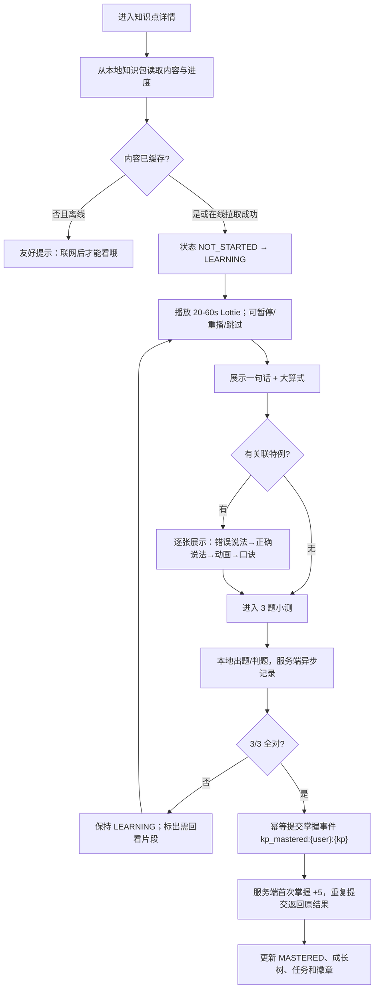

分步约定：

1. 页面先读内容清单与本地进度，动画网络请求不阻塞文字首屏。
2. 动画看完或跳过均可进入小测；“掌握”只由 3/3 全对产生。
3. 第一次打开写 `LEARNING`；回看不重复奖励；服务端以 `(user_id,kp_id)` 和固定幂等键保证首次奖励一次。
4. 小测未过只回到当前知识点，不出现失败、0 星或扣分。

### 4.2 练习出题：自适应、随机生成与预校验

#### 4.2.1 难度判定

```text
if 用户首次练该知识点: level = L1
else:
  取最近 2 个“已完成且题数>=5”的同知识点题组
  if 两组正确率均 >= 85%: level = min(current + 1, L3)
  else if 最近一组正确率 <= 50%: level = max(current - 1, L1)
  else: level = current 或默认 L2
第一题无论组等级均使用 L1 参数，但不改变整组 level。
```

#### 4.2.2 可实现的 R1–R12 伪代码

```ts
function generateSet(config: PracticeConfig, seed: string): QuestionSpec[] {
  const rng = seededRng(seed);                         // R11
  const target = config.setLength;                    // 5/10/20，默认10
  const opBag = weightedShuffle(expandByGrade(config.ops, config.grade), rng); // R9
  const out: QuestionSpec[] = [];
  const fingerprints = new Set<string>();             // R1
  const answerCounts = new Map<string, number>();      // R2
  let weakCount = 0;
  let zeroCount = 0;
  const deadline = performance.now() + 120;            // 留30ms用于最终校验，R12

  for (let i = 0; i < target; i++) {
    let accepted: QuestionSpec | undefined;
    for (let attempt = 0; attempt < 80 && performance.now() < deadline; attempt++) {
      const level = i === 0 ? 1 : config.level;        // R7
      const op = chooseOpAvoidingRun(opBag, out, rng, 2); // R3、R9
      const range = rangeFor(config.grade, op, level);
      const q = generateCandidate(op, range, rng);

      // generateCandidate 本身保证：减法 a>=b；除数!=0；0÷0 禁止；
      // 整除题回乘；余数题 0<=r<divisor 且 q,r<=999（R4/R8/R10）
      q.fingerprint = sha256(canonical(op, q.operands));
      q.answerKey = canonicalAnswer(q.answer);
      q.hints = hintEngine.precompute(q, q.kpCode);      // 离线提示

      const weak = isWeak(q);                           // ×1、÷1、+0、-0
      const zero = isZeroResult(q);
      if (fingerprints.has(q.fingerprint)) continue;    // R1
      if ((answerCounts.get(q.answerKey) ?? 0) >= 3) continue; // R2
      if (wouldMakeSameAnswerRun(out, q, 3)) continue;  // R3
      if (weak && weakCount >= Math.floor(target * 0.10)) continue; // R5
      if (zero && (zeroCount >= 1 || i < 3)) continue;  // R6
      if (!roundTripValidate(q)) continue;              // R10
      accepted = q;
      break;
    }

    if (!accepted) {
      // 不放松安全/可解性约束；只扩大可选数字与运算排列后使用备用确定性枚举池
      accepted = takeFirstValidFromFallbackPool(config, i, out, rng);
    }
    assert(accepted, 'GENERATION_EXHAUSTED');
    out.push(accepted);
    fingerprints.add(accepted.fingerprint);
    answerCounts.set(accepted.answerKey, (answerCounts.get(accepted.answerKey) ?? 0) + 1);
    weakCount += Number(isWeak(accepted));
    zeroCount += Number(isZeroResult(accepted));
  }

  const report = validateWholeSet(out, config, seed);   // 再跑R1-R11
  if (!report.ok) throw new GenerationError(report);   // 不展示未校验题组
  return out;
}
```

**运算候选生成要点**：

- 除法整除：先随机生成 `divisor∈[1,9]` 与 `quotient`，再算 `dividend=divisor*quotient`，避免“先随机被除数再重试”的偏差。
- 有余数除法：先生成 `divisor∈[2,9]`、`quotient`、`remainder∈[1,divisor-1]`，再合成被除数；回代验证。
- 结果去重对余数题使用 `q{商}:r{余数}` 作为答案键。
- 混合运算权重通过“配额袋”而非独立随机，10 题严格形成一年级 5:5、二年级 3:3:2:2、三年级 2:2:3:3；5/20 题按最大余数法分配。
- `generatorVersion` 采用 `semver`；旧版本代码至少保留 180 天用于错题回放，不能用新版静默重算旧题。
- CI 属性测试每个年级/模式/等级至少跑 10,000 个种子，并断言 R1–R12。

#### 4.2.3 预生成调用流

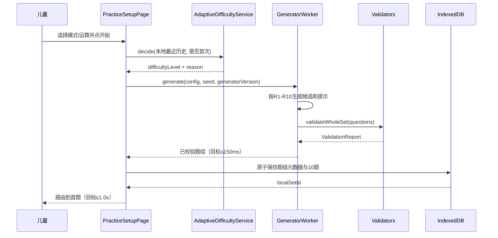

### 4.3 答题判分与反馈

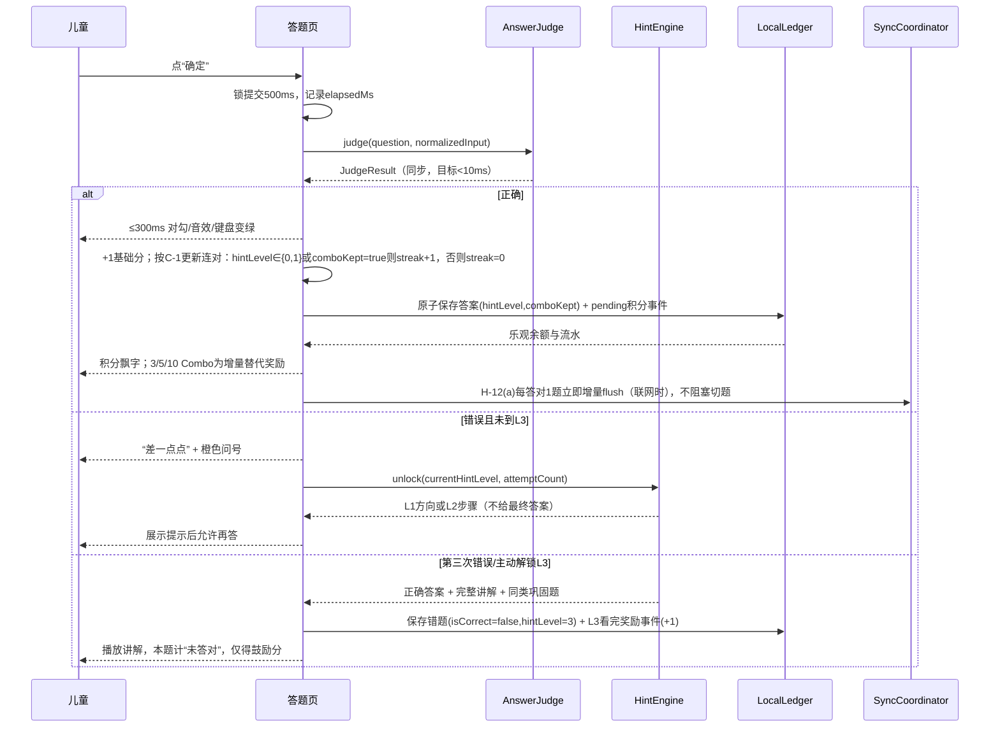

#### 4.3.1 积分与连对口径（对齐 PRD v1.1 C-1，务必按此实现）

| 结果 | 基础分 | 连对 streak | `is_correct` | `combo_kept` | 归类 |
| --- | --- | --- | --- | --- | --- |
| 无提示答对 | +1 | +1 | true | true | 独立答对 |
| L1 后答对 | +1（**不打折**） | +1 | true | true | 独立答对（与无提示完全一致） |
| L2 后答对 | +1（**不打折**，严守“儿童永不零奖励”） | **归零** | true | false | 提示后答对，损失 Combo 大额奖励 |
| L2 后答对且持有【免扣卡】 | +1 | +1 | true | true | 免扣卡生效，保住 Combo |
| L3 完整讲解（含看完） | +1（鼓励分） | 归零 | **false** | false | 计“未答对”+进错题本 |

实现要点：

- **删除 v1.0 的 `max(1, floor(base*0.5))` 半额逻辑**；单题基础分恒为 +1，不存在折扣分支。
- 服务端事件：`ANSWER_CORRECT`（hintLevel∈{0,1,2} 均 +1）、`COMBO`（`streakId` + 目标 3/5/10 + 增量）、`L3_COMPLETED`（+1 鼓励分）。客户端上报证据（`hintLevel`、`comboKept`、`ordinal`、`generatorVersion`），不上传 `delta`。
- `question_sets.correct_count` 与结算页正确率：**L3 计为未答对**（`is_correct=false`）。
- 【不放弃】徽章的“使用提示后答对”统计口径为 `hint_level ∈ {1,2}`，**L3 不计**（服务端按此条件累计）。
- 服务端必须用版本化引擎复核题组，并按相同规则重算 Combo，客户端声明的 `comboKept` 只作参考。

**连对归零的精确语义（回答产品确认项）**：采用**前者** —— L2 后答对时，**本题仍已答对且仍得 +1，但从本题起 streak 归零并作为新的计数起点**：即本题结算后 `streak = 0`，下一题再答对时从 1 开始累计，因此 L2 题无法让 streak 达到 3/5/10 阈值，损失的是 Combo 大额奖励。实现伪代码：

```ts
if (!isCorrect || hintLevel === 3) { streak = 0; }
else if (hintLevel === 2 && !hasComboProtectCard) { streak = 0; comboKept = false; }
else { streak += 1; comboKept = true; }
```

**Combo“替代、不叠加”算法**：题组内为每条连续 streak 维护 `streakId` 与 `comboAwarded`。连对 3 时目标总奖励 2，发 2；连对 5 时目标总奖励 5，只追加 `5-2=3`；连对 10 时目标总奖励 15，只追加 `15-5=10`。streak 归零后 `comboAwarded=0`，新 streak 使用新 `bizId` 和 `streakId`，避免同一连续段重复发奖。

### 4.4 三级提示实现机制

提示不在答错后临时请求 AI，也不由算法自由生成，更**不得在代码里硬编码拼接提示文案**。采用“**表/配置驱动的模板库 + 题目生成时预计算参数 + 运行时逐级解锁**”，保证离线、内容准确和 300ms 响应。

#### 4.4.1 模板可追溯：新增 `source_ref`（对齐 PRD v1.3 §4.2.5 + Q11 + R-1）

PRD v1.3 已确认**无教研人力、改为开发对照人教版/北师大版自查**（Q11），并登记高风险 **R-1（数学内容表述偏差）**。因此每条 L1/L2 提示模板必须携带 **`source_ref`**（服务端列名 snake_case，API/TS 中为 `sourceRef`），注明对应的**教材知识点 / 课标条目**，示例：`"人教版二上·表内除法（一）"`。

```ts
interface HintTemplate {
  templateId: string;
  kpCode: string;
  operation: 'ADD'|'SUB'|'MUL'|'DIV'|'MIXED';
  strategy: 'COUNT_ON'|'MAKE_TEN'|'BREAK_TEN'|'ARRAY'|'INVERSE'|'LONG_DIVISION';
  predicate: string;             // 受限 DSL，如 `a<10 && a+b>=10`，禁止 eval
  /** PRD v1.3 §4.2.5 硬约束：教材知识点/课标条目，如 人教版二上·表内除法（一） */
  sourceRef: string;             // 必填，非空，≤80 字符；无此字段的模板不得上线
  curriculum: 'RJ'|'BSD';        // 人教版 / 北师大版，便于 V1.1 按版本复核
  reviewer: string;              // 自查人（开发），配合 V1.1 补教研复核
  l1: HintToken[];               // 方向，不含 answer token
  l2: HintToken[];               // 部分步骤，不含 finalAnswer token
  l3AnimationKey: string;
  contentVersion: string;
}
```

**表驱动 + 门禁（三层校验，缺一不可）**：

| 层 | 机制 | 失败后果 |
| --- | --- | --- |
| 落库 DDL | `source_ref varchar(80) NOT NULL` + `CHECK (char_length(source_ref) > 0)`（见 §3.4） | 写入即被数据库拒绝 |
| 构建/CI | `pnpm lint:content` 校验 `content/hint-templates/*.json`：非空、`curriculum ∈ {RJ,BSD}`、`kpCode` 存在、**每个已发布 `kpCode` 至少一套 L1/L2** | CI 红，不能合并 |
| 启动/发布 | 后端启动时扫描 `hint_templates` 表，发现 `source_ref` 缺失/为空或知识点无模板 → **启动失败**（fail-fast） | 服务拒绝启动，避免带病上线 |

模板文件在仓库中以带版本 JSON 维护（可 git 追溯），发布时写入 `hint_templates` 表；客户端通过版本化知识包预下载，离线时读取本地模板，**运行时不得拼字符串生成提示**。

```ts
type HintToken =
  | { kind: 'text'; value: string }
  | { kind: 'number'; ref: 'a'|'b'|'sum'|'split1'|'split2'|'quotient'|'remainder' }
  | { kind: 'visual'; asset: 'number-line'|'ten-frame'|'array'|'sharing'|'place-value' };

interface HintBundle {
  templateId: string;
  sourceRef: string;             // 随 bundle 透出，便于错题回看与 V1.1 复核定位
  resolved: {
    l1: RenderNode[];
    l2: RenderNode[];
    l3: { answer: Answer; steps: RenderNode[]; animationKey: string };
  };
  unlockedLevel: 0|1|2|3;
}
```

算法：

1. 根据 `kpCode + operation` 取**库中模板**（`hint_templates` / 本地知识包）；用受限 DSL 解释器匹配操作数，未匹配则走该知识点必备 fallback 模板（fallback 模板同样必须带 `sourceRef`）。
2. 生成题时计算凑十拆分、逆运算、商余数等中间值；模板渲染为无 HTML 字符串的 `RenderNode`，避免注入。
3. 静态校验器断言 L1/L2 token 不引用 `finalAnswer`，L3 回代正确，每个已发布知识点至少一套模板，**且 `sourceRef` 非空**（缺失即失败）。
4. `HintBundle` 随题存 IndexedDB，运行时只做解锁；L1→L2→L3 每级最多一次且不可跳级。
5. L3 的同类巩固题使用相同 `strategy`、不同 fingerprint；它不属于原 10 题计分，但结果写复习记录。

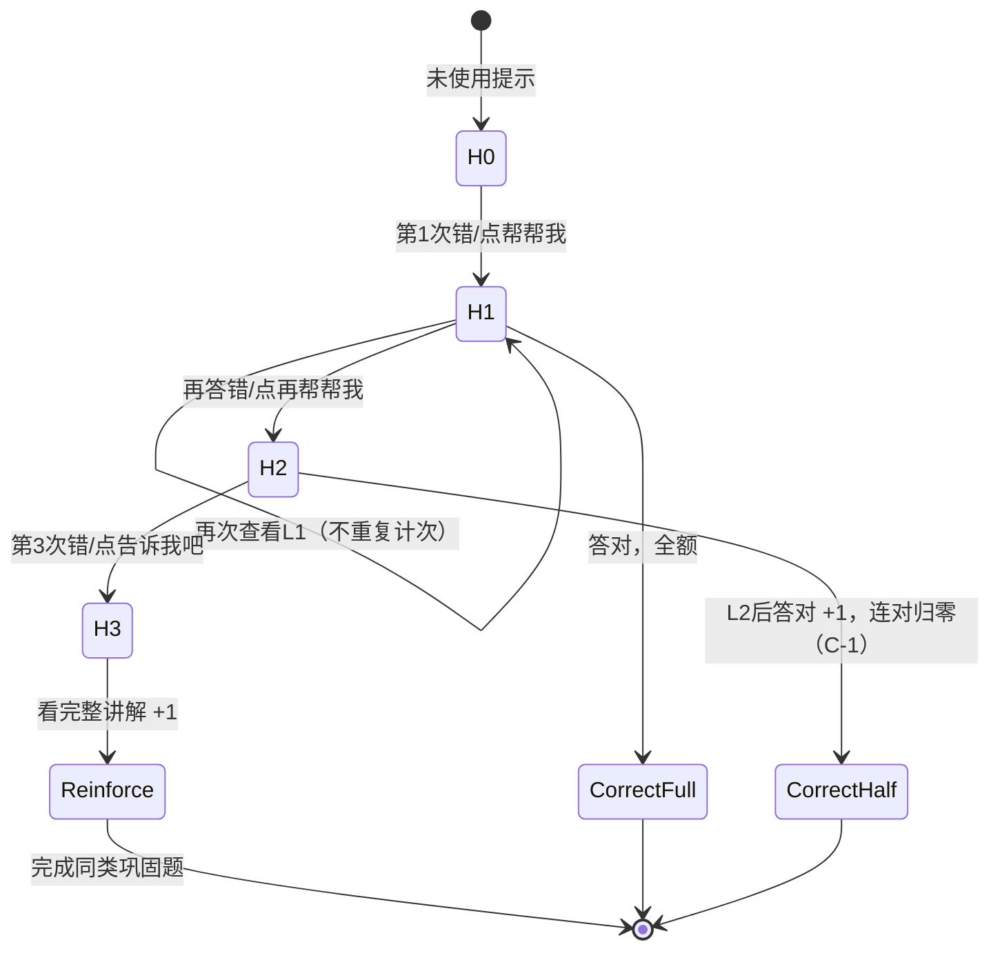

### 4.5 登录与积分同步

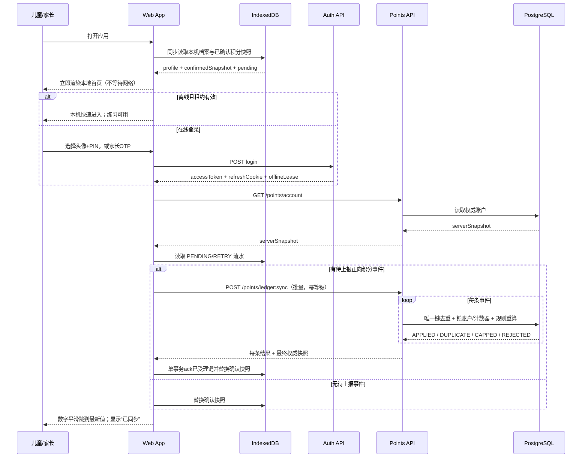

**合并定义**：

```text
confirmedBase = max(local.confirmedTotalPoints, server.totalPoints)
optimisticTotal = confirmedBase + Σ(尚未被服务端受理的正向 pending 事件的规则估算增量)
最终 totalPoints = 服务端在幂等补登后返回的 authoritativeTotal
最终 availablePoints = 服务端旧余额 + Σ(服务端实际批准的获取增量) − Σ(在线消费增量)
```

PRD 公式 `total = max(本地快照, 服务端) + Σ未上报增量` 中，“本地快照”必须定义为**已确认快照**，不能包含 pending，否则会二次累加。消费只允许在线，故离线流水只有非负获取事件；服务端可能因日上限将乐观值下调，UI 使用“今日星星已装满”而不是“扣回积分”。

同步策略：批次最多 100 条/256KB；指数退避 1s/5s/30s/2min，最多后转后台等待；每条独立返回状态，不能因一条坏数据回滚整批。

**flush 触发点（对齐 PRD v1.1 H-12 ~ H-16，逐条对照全覆盖）**：

| 约束 | 触发时机 | 实现位置/机制 |
| --- | --- | --- |
| H-12(a) | **每答对 1 题即时增量上报**（联网时） | `PracticeSessionPage` 提交正确后异步 fire-and-forget flush 单条事件；离线则入 `pending_ledger` |
| H-12(b) | 每组练习结算页 | 进入 `/practice/result/:id` 触发批量 flush（含组完成/全对/Combo） |
| H-12(c) | 切后台 / `visibilitychange` 隐藏 | 全局监听器触发 flush；移动端同时视为“可能关闭”的兜底点 |
| H-12(d) | 所有积分变动后（签到/任务/兑换/掌握知识点） | 各 feature 成功后由 `PointsSyncService` 主动 flush |
| H-12(e) | 网络恢复 `online` 事件 | 监听 `online` + 首次成功请求后触发；Service Worker Background Sync 作为补充 |
| H-12(f) | **防沉迷 20 分钟休息蒙层弹出时** | 休息蒙层逻辑内显式调用 flush（该场景最易被忽略，必须实现） |
| H-13 | 离线常驻提示条 | `OfflineBanner`：“现在是离线模式，你的星星先存在本机，联网后会自动飞到云端～”；首页与练习页常驻 |
| H-14 | 退出二次确认 | `pending > 0` 时退出弹“还有 X 颗星星没飞到云端，连上网再走吧～”（不阻断） |
| H-15 | 家长端同步状态 | **双数据源（C-4）**：「上次同步时间」= 服务端 `lastSyncAt`，跨设备展示；「待同步积分」= 本机 `pending_ledger` 汇总，仅同设备展示、跨设备隐藏 |
| H-16 | 卸载前兜底 | `beforeunload` / `pagehide` 最后一次 flush；PWA 用 Background Sync API 在恢复网络后补登 |

设计目标：单次离线未上报时长中位数 ≤ 10 分钟（H-12 目标值），通过“每答对 1 题 + 切后台 + 休息蒙层”三个高频点实现。

### 4.6 签到、每日任务、成长树与徽章

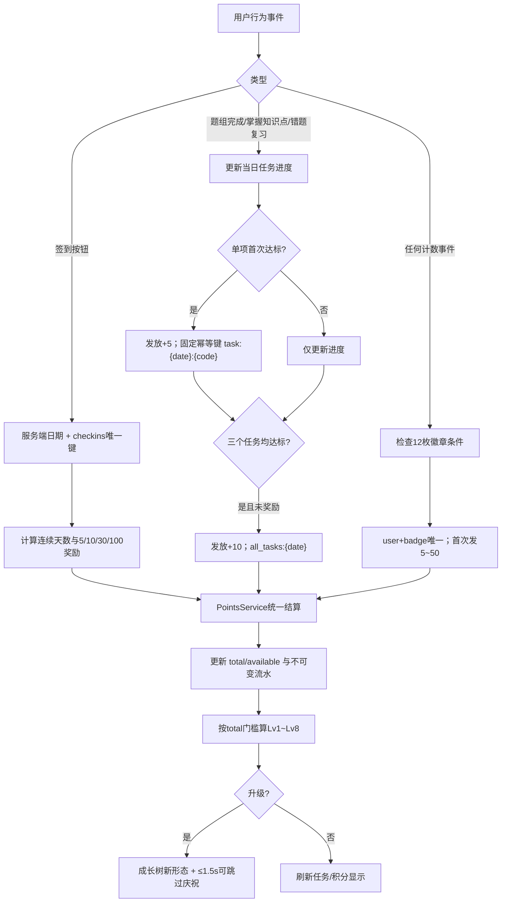

- 签到必须在线，以服务端 `biz_date` 防改本地时间；重复请求返回原签到结果。
- 离线练习产生的题组完成/掌握事件在补登时更新其**事件发生日**的任务进度，但每日积分计入服务端规则认可的业务日；客户端时间偏差超过 24h 时以接收日计入并标记审计。
- 成长树等级只看 `totalPoints`：`[0,100,300,600,1000,1500,2200,3000]`；消费不触发降级。
- 多个奖励在同一行为中可分别产生流水，但受每日 200 分总上限；UI 明细逐项展示实际批准分值。

---

## 5. 积分与留存规则技术落地

### 5.1 表驱动规则引擎

客户端只保留用于乐观动画的签名规则快照，服务端 `point_rules` 才是结算权威。规则通过数据库迁移/受控后台发布，不提供儿童或家长写接口。

> **PRD v1.1 C-1 后规则配置口径**：`ANSWER_CORRECT` **不再区分 L1/L2**，凡 `hintLevel ∈ {0,1,2}` 一律 +1（不打折）；差异只体现在 `COMBO` 规则上 —— Combo 事件只在 `hintLevel∈{0,1}` 或 `comboKept=true` 时才随连对累加产生，`hintLevel=2 且 comboKept=false` 会中断连对从而拿不到 Combo 大额奖励。

```json
{
  "ruleCode": "ANSWER_CORRECT",
  "version": 2,
  "eventType": "ANSWER_CORRECT",
  "predicate": { "hintLevel": { "in": [0, 1, 2] } },
  "points": 1,
  "deltaTotal": 1,
  "deltaAvailable": 1,
  "dailyCountCap": 100,
  "dailyPointsCap": 100,
  "globalDailyPointsCap": 200,
  "countsTowardDailyCap": true,
  "idempotencyScope": "user+questionAttempt",
  "evidenceRequired": ["clientSetId", "questionOrdinal", "hintLevel", "comboKept", "generatorVersion"],
  "validFrom": "2026-10-07T00:00:00Z"
}
```

```json
{
  "ruleCode": "COMBO",
  "version": 2,
  "eventType": "COMBO",
  "predicate": {
    "thresholds": [3, 5, 10],
    "targetBonus": [2, 5, 15],
    "replacement": true,
    "comboContinuesWhen": "hintLevel in (0,1) OR comboKept = true"
  },
  "pointsRule": "award = targetBonus[maxReached] - alreadyAwardedInSameStreak",
  "dailyCountCap": 30,
  "globalDailyPointsCap": 200,
  "idempotencyScope": "user+streakId+threshold",
  "evidenceRequired": ["clientSetId", "streakId", "reached", "alreadyAwarded"],
  "validFrom": "2026-10-07T00:00:00Z"
}
```

`type` 使用稳定枚举：`ONBOARDING`、`CHECKIN`、`CHECKIN_STREAK`、`ANSWER_CORRECT`、`GROUP_COMPLETED`、`GROUP_PERFECT`、`COMBO`、`KP_MASTERED`、`GRADE_MASTERED`、`L3_COMPLETED`、`WRONG_RETRY_CORRECT`、`DAILY_TASK`、`ALL_TASKS`、`BADGE`、`PARENT_PRAISE`、`PURCHASE`、`REFUND`（仅运营异常补偿）。其中 `L3_COMPLETED` 固定 +1 且对应 `questions.is_correct = false`。

### 5.2 每日上限、幂等与日切

```text
BEGIN;
1. INSERT idempotency receipt / 查询 points_ledger(userId, idempotencyKey)
   - 已存在：直接返回该流水（DUPLICATE），不再执行。
2. SELECT points_account WHERE user_id=? FOR UPDATE;
3. 以服务端业务日期 UPSERT 并 SELECT ... FOR UPDATE：
   - point_daily_counters(ruleCode)
   - point_daily_counters('__TOTAL__')
4. 根据服务端规则与证据算 requestedPoints；
   grant = min(
     requestedPoints,
     子项次数剩余额度对应分值,
     子项积分剩余额度,
     200 - 今日总 awardedPoints
   );
5. 消费事件：校验在线、available>=price、当日兑换次数<5，deltaTotal=0；
   获取事件：deltaTotal=grant，deltaAvailable=grant。
6. UPDATE account SET ... version=version+1；
   INSERT immutable ledger（含 award=0 的封顶审计结果时写 metadata.capped=true）；
   UPDATE counters；
COMMIT;
```

- 日切无需定时清零：计数器主键含 `biz_date`，新日自动是新行。
- 服务端不信任 `clientTs` 决定日期；正常离线事件允许有限回溯窗口，异常时间记到接收日。
- Combo 子项上限按“完成的阈值事件”计数；同一 streak 的 `bizId` 和目标奖金唯一。
- 注册、知识点首次掌握、徽章均有业务唯一约束；即使幂等键生成错误，也不会重复发。

### 5.3 一致性、防刷与异常回滚

1. **唯一键**：传输幂等 `UNIQUE(user_id,idempotency_key)`；业务幂等如掌握 `(user,kp)`、签到 `(user,date)`、徽章 `(user,badge)` 双保险。
2. **并发安全**：按 `user_id` 锁 `points_account`，同一用户事件串行结算；多个 API 实例不会丢更新。
3. **规则重算**：客户端上传事件和证据，不上传可信分值；题组根据 `seed + version` 抽样复算，明显伪造拒绝并限流。
4. **防刷**：用户/IP 速率限制；题组最小合理耗时只作为风险信号，不打击熟练儿童；连续异常进入人工审计而非直接封号。
5. **事务回滚**：账户、流水、计数、商品拥有权在一个事务；任一失败全部回滚。响应超时后客户端用同一幂等键重试。
6. **冲正而非删改**：错误奖励用一条关联原流水的 `REVERSAL`/`REFUND` 流水；但累计积分“只增不减”的产品约束下，普通消费不减 total，运营纠错是否允许减 total 需产品审批，默认只冻结异常可用积分。
7. **备份与恢复**：PostgreSQL PITR + 每日增量；恢复演练至少每季度一次；账本与账户做每日对账，`sum(delta)` 不一致报警。

### 5.4 离线记账完整机制

- 本地答题事务写 `LocalQuestionSet`、`PendingLedger`（本地表，字段对齐 PRD：`localId/userId/delta/type/bizId/idempotencyKey/clientTs/synced`），立即显示规则估算奖励。
- `pending` 只存事件证据；不得存消费请求，**现实奖励券申请与消费断网直接不可用**。
- **6 个高频 flush 时机按 §4.5 的 H-12 表实现**（尤其“每答对 1 题”与“20 分钟休息蒙层”两个最易漏的点）；配合 H-13 提示条、H-14 退出提醒、H-15 家长端可见、H-16 `pagehide`/Background Sync 兜底。
- 同步请求携带 `clientBatchId` 和每条 `idempotencyKey`；服务端返回 `APPLIED/DUPLICATE/CAPPED/REJECTED`。
- 客户端仅对 `APPLIED/DUPLICATE/CAPPED` 做 ack；`REJECTED` 进入可诊断死信并刷新权威快照，不无限重试。
- 多端合并是流水集合并，不是覆盖余额；所有设备最终接收同一服务端版本。
- `installInstanceId` 是本应用随机 UUID，只用于幂等，不读取 IMEI、IDFA、MAC 或浏览器指纹，也不用于用户画像。

### 5.5 H-15 双数据源设计（对齐 PRD v1.1 C-4）

| 字段 | 数据源 | 跨设备可见 | 权威性 | 优先级 | 实现要点 |
| --- | --- | --- | --- | --- | --- |
| **上次同步时间** `lastSyncAt` | 服务端（`points_account` 或 `sync_state` 表随每次成功 sync 更新） | ✅ 全设备 | ✅ 权威 | **P1 必做** | 由 `POST /points/ledger:sync` 成功受理后服务端写入；家长端直接读 `GET /points/account` 返回 |
| **待同步积分** `pendingPoints` | 本机 `pending_ledger`（`synced=false` 的 `delta` 汇总） | ❌ **仅本机** | ⚠️ 仅本机准确 | **P1 做，限本机** | 家长端与儿童端同设备时读本机 Dexie；**跨设备时必须隐藏该卡片，绝不能显示 0** |

**三条交互规则（按 PRD C-4 实现）**：

1. 「上次同步时间」为**主指标**，跨设备一律展示，文案三档：`< 5 分钟` → “积分已同步 ✓”；`5 分钟 ~ 24 小时` → “上次同步：X 分钟/小时前”；`> 24 小时或从未同步` → “孩子的学习记录还没同步到云端，请让孩子的设备连一次网络～”。
2. 「待同步积分」**仅在同设备时展示**；跨设备隐藏卡片（不是置 0）。显示 0 会被误读为“已全部同步”，比不显示更糟。
3. 跨设备场景只依赖「上次同步时间」判断，已足以达成 H-15 目标。

**P2 备选 `device_sync_heartbeat`（架构结论：放 V1.1，不在首版实现）**

- 预留字段：`deviceId, lastHeartbeatAt, pendingPointsSnapshot, pendingCountSnapshot`；儿童设备联网上报时顺带写入。
- **固有限界（必须写进文案）**：全程未联网的设备发不出心跳，字段可能为“未知”，此时仍回落到「上次同步时间」文案。它覆盖“曾经联网、后来断网”，**覆盖不了“从未联网”**。
- 成本评估：涉及新表 + 上报链路改造 + 家长端文案与状态机分支，超出 0.5 人日，且规则 3 已能达成 H-15 核心目标，故列为 **V1.1 体验增强**，产品已确认不强制。
- 首版不做该表，但 `GET /points/account` 响应预留 `lastSyncAt` 字段，保证 V1.1 平滑扩展。

### 5.6 本期消费路径：只有一种（对齐 PRD v1.2 §8.4）

首版不做积分商城（U-11 → V1.1），因此本期积分为“**只进不出，唯一出口是现实奖励券**”。

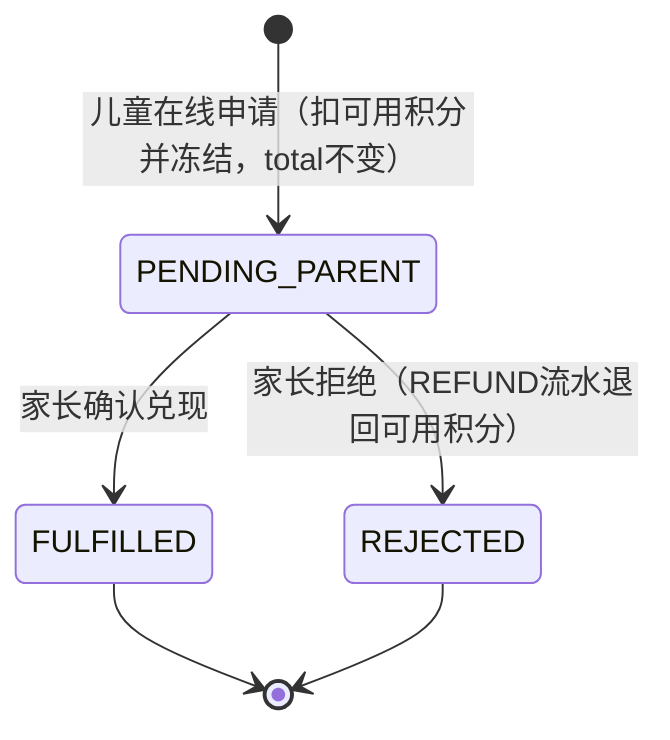

| 环节 | 规则 |
| --- | --- |
| 目录 | `store_items` 本期**只含 `reward_voucher`**；标题与分值由家长端自定义，默认 500 分/张 |
| 申请 | 仅**在线**；校验在线、`available >= cost`、二次确认；写 `PURCHASE` 流水（`deltaTotal=0`、`deltaAvailable=-cost`） |
| 冻结 | `PENDING_PARENT` 期间可用积分已扣减，儿童 UI 显示“已请爸爸妈妈确认” |
| 确认 | 家长 Access Token + 幂等键 → `FULFILLED` |
| 拒绝 | `REJECTED` + `REFUND` 流水退回可用积分（`deltaTotal=0`），**累计积分与等级不受影响** |
| 防误触 | 申请弹二次确认并展示剩余可用积分；同一券重复申请由幂等键拦截 |
| 明确不做 | 装扮/主题/道具/加倍卡/免扣卡/跳过卡、永久拥有权、库存、单日 5 次兑换限制——均属 V1.1 商城能力 |

接口层保持 `reward_service` 与 `store_service` 分离：本期只注册 `rewards.py` 路由，`store.py`/`store_service.py` 仅留空壳与 V1.1 标注，**不注册路由、不实现逻辑**。

---

## 6. 关键接口 API 设计

### 6.1 通用约定

- Base URL：`/v1`；HTTPS only；`Content-Type: application/json`。
- 成功/失败统一结构：

```json
{
  "code": "OK",
  "data": {},
  "message": "success",
  "requestId": "01J..."
}
```

- HTTP 状态表达传输结果，`code` 表达领域原因，如 `AUTH_PIN_LOCKED`、`POINTS_DAILY_CAP_REACHED`、`PRACTICE_SET_INVALID`。
- 写接口均接受 `Idempotency-Key` header；时间为 ISO 8601 UTC；金额/积分均为整数。
- 列表使用游标 `cursor`，不使用页码避免新增流水导致重复。

### 6.2 鉴权方案

| 场景 | 方案 |
| --- | --- |
| 家长登录 | `手机号 + 6位短信验证码`；验证码 5 分钟、同手机号 60 秒一次、每日上限；验证后 Access JWT 15 分钟 + HttpOnly/Secure/SameSite=Lax 旋转 Refresh Cookie 7 天。 |
| 儿童在线登录 | `profileId + 4位 PIN`；Argon2id 校验；5 次失败锁 1 分钟，Redis 与数据库状态结合；成功签发儿童 scope Token。 |
| 本机快速进入 | 家长显式允许后保存服务端签名 `offlineLease`（≤7天）和最小档案；离线仅开放学习/练习，**不开放奖励券申请、家长设置、跨设备修改**。 |
| Token 刷新 | Refresh Token 每次使用即轮换，旧 token 重用则撤销会话族；Access 只放 `sub/role/familyId/scopes/exp`，不放手机号。 |
| PIN 重置 | 仅家长 Access Token 可调用；重置后撤销儿童旧会话和离线租约。 |
| 迁移码 | 家长授权生成 6 位码，10 分钟、一次性；输入端仍需家长 OTP 或安全确认，不能只靠低熵码长期恢复。 |

> Web 离线无法安全保护低熵 4 位 PIN；本地 5 次锁定只防误操作，不应宣称等同服务端强认证。离线租约只暴露最小化、低风险的练习数据。

### 6.3 接口清单

| 方法与路径 | 权限 | 用途 |
| --- | --- | --- |
| `POST /auth/parent/otp:request` | 公开+限流 | 请求家长验证码 |
| `POST /auth/parent/otp:verify` | 公开+限流 | 注册/登录家长 |
| `POST /auth/children/login` | 公开+限流 | 儿童头像+PIN 登录 |
| `POST /auth/token:refresh` | Refresh Cookie | 轮换 Token |
| `POST /auth/logout` | 已登录 | 撤销会话 |
| `POST /auth/migration-codes` / `POST /auth/migration-codes:consume` | 家长 / 公开+校验 | 生成/使用 10 分钟迁移码 |
| `GET /parents/me/children` | 家长 | 本家庭儿童列表 |
| `POST /parents/me/children` | 家长 | 代建儿童账号，最多 5 个 |
| `PATCH /parents/me/children/{id}` | 家长 | 昵称、头像、年级 |
| `POST /parents/me/children/{id}/pin:reset` | 家长 | 重置 PIN 并撤销旧租约 |
| `GET /knowledge-points?grade=1` | 儿童/家长 | 知识点列表和版本 |
| `GET /knowledge-points/{code}` | 儿童/家长 | 详情、特例、动画清单 |
| `GET /knowledge-points/{code}/hint-templates` | 儿童 | 下载版本化提示模板供离线使用 |
| `PUT /learning/progress/{kpCode}` | 儿童 | 幂等写学习中/小测结果/掌握 |
| `POST /practice/sets` | 儿童 | 登记本地生成题组元数据与题目 |
| `POST /practice/sets/{clientSetId}/answers` | 儿童 | 批量提交答题记录 |
| `POST /practice/sets/{clientSetId}:complete` | 儿童 | 完成/中退结算与任务更新 |
| `GET /practice/questions/{id}/hints/{level}` | 儿童 | 在线兜底读取提示；正常练习读本地预计算提示 |
| `GET /points/account` | 儿童/家长 | 权威累计/可用积分、等级、版本、**`lastSyncAt`（H-15 主指标，C-4）** |
| `GET /points/sync-status` | 儿童/家长 | H-15 视图数据：`lastSyncAt`（服务端权威）+ `pendingPoints`/`pendingCount`（**仅本机，跨设备返回 `null` 而非 0**） |
| `GET /points/ledger?cursor=` | 儿童/家长 | 180 天积分明细 |
| `POST /points/ledger:sync` | 儿童 | 批量补登离线事件 |
| `POST /checkins` | 儿童 | 服务端日期签到 |
| `GET /daily-tasks?date=` | 儿童/家长 | 今日任务状态 |
| `GET /badges` | 儿童/家长 | 徽章列表 |
| `GET /rewards/vouchers` | 儿童/家长 | 家长自定义的现实奖励券目录（**本期唯一消费类型**） |
| `POST /rewards/vouchers/{sku}:apply` | 儿童在线 | 申请奖励券：扣可用积分 + 冻结，进入 `PENDING_PARENT` |
| `GET /rewards/redemptions?status=` | 儿童/家长 | 申请/兑现记录与状态 |
| `POST /parent/rewards/{id}:confirm` | 家长 | 确认兑现（`FULFILLED`）；拒绝则 `REJECTED` 并退回可用积分 |
| `PUT /parent/rewards/vouchers` | 家长 | 自定义奖励券标题与分值（默认 500 分） |
| `GET /parent/settings/{userId}` | 家长 | 读取管控 |
| `PUT /parent/settings/{userId}` | 家长 | 更新时长/夜间/组长/声音 |

> **本期不注册（V1.1/P2）**：`GET /store/items`、`POST /store/purchases`（虚拟商品/装扮/主题/道具，U-11 → V1.1）；任何 `/parent/report*`（学习报告、错题分析、PDF，V1.1）；任何老师端/班级接口（P2）。
> **无支付链路**：首版免费（G-14），全部接口不涉及真实货币、不接支付网关、无计费 SDK。

### 6.4 关键请求/响应示例

**家长代建儿童账号**

```http
POST /v1/parents/me/children
Authorization: Bearer <parentAccess>
Idempotency-Key: parent-create-child:01J...

{
  "nickname": "快乐的小竹子",
  "avatarId": "panda_03",
  "grade": 1,
  "pin": "2468",
  "privacyConsentVersion": "2026-10-07"
}
```

```json
{
  "code": "OK",
  "data": {"id":"a4...","nickname":"快乐的小竹子","avatarId":"panda_03","grade":1},
  "message": "创建成功",
  "requestId": "01J..."
}
```

**儿童登录**

```http
POST /v1/auth/children/login

{"profileId":"a4...","pin":"2468","installInstanceId":"random-app-uuid"}
```

```json
{
  "code":"OK",
  "data":{
    "accessToken":"ey...",
    "expiresIn":900,
    "offlineLease":"signed-minimal-lease",
    "profile":{"id":"a4...","nickname":"快乐的小竹子","grade":1,"avatarId":"panda_03"}
  },
  "message":"欢迎回来",
  "requestId":"01J..."
}
```

**创建本地题组记录**

```http
POST /v1/practice/sets
Authorization: Bearer <childAccess>
Idempotency-Key: set:local_01J...

{
  "clientSetId":"local_01J...",
  "mode":"MIXED",
  "ops":["ADD","SUB"],
  "level":2,
  "seed":"g1-01:01J...",
  "generatorVersion":"1.0.0",
  "contentVersion":"2026.10.1",
  "startedAt":"2026-10-07T10:00:00Z",
  "questions":[
    {"ordinal":1,"kpCode":"G1-03","op":"ADD","operands":{"a":3,"b":2},"expectedAnswer":{"value":5},"fingerprint":"sha256..."}
  ]
}
```

**答题批量提交/完成**

```json
{
  "answers":[
    {"ordinal":1,"userAnswer":{"value":5},"isCorrect":true,"hintLevel":0,"comboKept":true,"attemptCount":1,"elapsedMs":4200},
    {"ordinal":2,"userAnswer":{"value":9},"isCorrect":true,"hintLevel":2,"comboKept":false,"attemptCount":3,"elapsedMs":9800},
    {"ordinal":3,"userAnswer":null,"isCorrect":false,"hintLevel":3,"comboKept":false,"attemptCount":3,"elapsedMs":15000}
  ]
}
```

> 说明：`hintLevel=2` 时 `isCorrect` 仍为 `true` 且基础分 +1，但 `comboKept=false` 表示连对中断；`hintLevel=3` 时 `isCorrect=false`（计未答对）并入错题本。服务端按此证据重算，不采信客户端分值。

```http
POST /v1/practice/sets/local_01J...:complete
Idempotency-Key: complete:local_01J...

{"status":"COMPLETED","correctCount":8,"durationMs":164000,"comboEvidence":[{"streakId":"s1","fromOrdinal":1,"toOrdinal":5,"reached":5,"alreadyAwarded":2,"claimed":3,"cardUsed":false}]}
```

**提示兜底**

```json
{
  "code":"OK",
  "data":{
    "templateId":"make-ten-v2",
    "level":1,
    "nodes":[{"kind":"text","value":"先凑成10，再算剩下的～"}],
    "contentVersion":"2026.10.1"
  },
  "message":"我们一起试试",
  "requestId":"01J..."
}
```

**积分批量补登**

```http
POST /v1/points/ledger:sync
Authorization: Bearer <childAccess>
Idempotency-Key: batch:01J...

{
  "clientBatchId":"01J...",
  "baseServerVersion":35,
  "events":[
    {
      "idempotencyKey":"installA:01J1",
      "type":"ANSWER_CORRECT",
      "bizId":"localSet1:1",
      "clientTs":"2026-10-07T10:00:04Z",
      "payload":{"clientSetId":"localSet1","ordinal":1,"hintLevel":0,"comboKept":true,"generatorVersion":"1.0.0"}
    }
  ]
}
```

```json
{
  "code":"OK",
  "data":{
    "results":[{"idempotencyKey":"installA:01J1","status":"APPLIED","actualPoints":1,"ledgerId":"9b..."}],
    "account":{"totalPoints":321,"availablePoints":271,"level":3,"version":36,"lastSyncAt":"2026-10-07T10:00:06Z"},
    "serverTime":"2026-10-07T10:00:06Z"
  },
  "message":"小星星已同步",
  "requestId":"01J..."
}
```

**签到**

```http
POST /v1/checkins
Idempotency-Key: checkin:<userId>:2026-10-07

{}
```

```json
{
  "code":"OK",
  "data":{"date":"2026-10-07","streakDays":7,"basePoints":5,"bonusPoints":30,"account":{"totalPoints":356,"availablePoints":306,"level":3}},
  "message":"连续签到7天，太棒啦！",
  "requestId":"01J..."
}
```

**现实奖励券申请（本期唯一消费路径，须在线）**

```http
POST /v1/rewards/vouchers/voucher_park:apply
Authorization: Bearer <childAccess>
Idempotency-Key: reward-apply:01J...

{"sku":"voucher_park","expectedCost":500}
```

```json
{
  "code":"OK",
  "data":{
    "redemptionId":"r9...",
    "status":"PENDING_PARENT",
    "cost":500,
    "account":{"totalPoints":856,"availablePoints":306,"level":3},
    "hint":"已请爸爸妈妈确认啦～"
  },
  "message":"申请成功，等爸爸妈妈确认哦",
  "requestId":"01J..."
}
```

服务端忽略客户端价格做结算，只用 `expectedCost` 检测家长改价并返回 `REWARD_PRICE_CHANGED`，避免误申请。

**家长确认 / 拒绝**

```http
POST /v1/parent/rewards/r9...:confirm
Authorization: Bearer <parentAccess>
Idempotency-Key: reward-confirm:r9...

{"action":"REJECT","reason":"这周已经去过公园啦"}
```

```json
{
  "code":"OK",
  "data":{"redemptionId":"r9...","status":"REJECTED","refundedPoints":500,"account":{"totalPoints":856,"availablePoints":806,"level":3}},
  "message":"已拒绝并退回可用积分",
  "requestId":"01J..."
}
```

规则：申请即扣 `availablePoints`（冻结），`totalPoints` 永不减少（等级不降）；确认则 `FULFILLED`；拒绝则写 `REFUND` 流水退回可用积分。同一 `redemptionId` 的确认/拒绝必须幂等，重复请求返回原结果。

---

## 7. 视觉与体验规范的技术落地

### 7.1 Design Token

```json
{
  "color": {
    "brand": "#FF8A3D",
    "learn": "#4CC9F0",
    "correct": "#2ECC71",
    "grass": "#7BD389",
    "points": "#FFD166",
    "divide": "#FF6B9D",
    "background": "#FFF9F0",
    "surface": "#FFFFFF",
    "textPrimary": "#3D2C1E",
    "textSecondary": "#8A7A6B",
    "mistake": "#FF9F68",
    "danger": "#FF7A7A",
    "parentPrimary": "#5B7C99"
  },
  "fontSize": {"body":18,"button":20,"lesson":24,"equationMobile":48,"equationTablet":64},
  "radius": {"sm":12,"md":18,"card":24,"pill":999},
  "space": {"1":4,"2":8,"3":12,"4":16,"6":24,"8":32},
  "shadow": {"card":"0 6px 18px rgba(61,44,30,.10)","pressed":"0 2px 6px rgba(61,44,30,.12)"},
  "motion": {"press":100,"page":250,"feedback":300,"question":1200,"celebrate":1500}
}
```

```css
:root {
  --color-brand: #FF8A3D;
  --color-learn: #4CC9F0;
  --color-correct: #2ECC71;
  --color-points: #FFD166;
  --color-background: #FFF9F0;
  --color-surface: #FFFFFF;
  --color-text: #3D2C1E;
  --color-text-muted: #8A7A6B;
  --color-mistake: #FF9F68;
  --radius-card: 24px;
  --touch-min: 56px;
  --touch-recommended: 64px;
  --space-control: 12px;
  --motion-page: 250ms;
}
[data-large-text='true'] { font-size: 130%; }
[data-high-contrast='true'] { --color-text-muted: #59483a; }
@media (prefers-reduced-motion: reduce) {
  *, *::before, *::after { animation-duration: 1ms !important; transition-duration: 1ms !important; }
}
```

### 7.2 响应式布局

| 断点 | 布局 |
| --- | --- |
| `<768px` 手机 | 单列；主 CTA 固定在安全区上方；算式 ≥48px；键盘 3 列并适配 320px 宽；避免横向滚动。 |
| `768–1023px` 平板竖屏主场景 | 内容最大宽 720px；动画 16:9；算式 ≥64px；键盘和提示可上下布局。 |
| `≥1024px` 平板横屏/PC | 内容最大宽 1120px；学习页动画/说明左右分栏，答题题面/键盘左右分栏；两侧留白，不拉伸儿童控件。 |

使用 CSS Container Queries 控制功能组件内部布局，媒体查询只控制应用壳；适配 `env(safe-area-inset-*)`。平板不强制锁定方向。

### 7.3 无障碍与防误触

- 正文 ≥18px、按钮文字 ≥20px、算式 ≥48/64px；所有热区 ≥56×56px，数字键 64×64px，按钮间距 ≥12px。
- 对错用“颜色 + ✓/?/禁止图形 + 文案/音效”，绝不只靠颜色；正文/背景对比至少 4.5:1，主文字目标 7:1。
- 所有图标按钮提供中文 `aria-label`；焦点环明显；PC 数字键盘可操作；动画区提供暂停、重播、跳过。
- 提交后 500ms 去重；返回与提交物理距离 ≥100px；退出、购买、删除、管控修改二次确认。
- 默认焦点不自动拉起系统软键盘，使用自绘数字键盘；余数双输入明确朗读“商”“余数”。
- 20 分钟全屏休息层不会因刷新绕过：本地会话计时 + 服务端累计记录；离线场景由签名管控快照执行。**休息蒙层弹出时必须触发一次 pending flush（H-12(f)）**。
- **离线常驻提示（H-13）**：首页与练习页显示“现在是离线模式，你的星星先存在本机，联网后会自动飞到云端～”，不使用技术化错误文案。
- **退出确认（H-14）**：`pending > 0` 时退出弹“还有 X 颗星星没飞到云端，连上网再走吧～”，不阻断但强提示；`beforeunload`/`pagehide` 再兜底 flush（H-16）。

### 7.4 动画加载与降级

1. 首包只含 CSS/SVG 对错反馈；`lottie-react` 在进入学习或庆祝页时动态导入。
2. 动画 JSON 走内容哈希 CDN；知识详情只预取当前和下一动画；当前年级知识包可由用户在 Wi-Fi 下载。
3. Service Worker 采用 Cache First + 版本校验；资源清单记录 SHA-256，失败回退静态插画。
4. 页面隐藏暂停 Lottie；完成/卸载销毁实例；低端模式减少粒子、图层和同时运行数量。
5. 降级顺序：完整 Lottie → 简化 Lottie segment → CSS/SVG 关键帧 → 静态 SVG + 文字；无论降级均保留判题反馈。
6. “减少动效”同时尊重系统 `prefers-reduced-motion` 与应用设置；应用设置优先级更高并跨设备同步。
7. **Lottie 发布门禁（G-11，硬阈值）**：单个 Lottie JSON **≤150KB**、图层 ≤150、**禁用 MP4/GIF**、无栅格大图/表达式；60fps 资源可降采样到 30fps 但播放需稳定。交互动画（拖拽数字块、进位小旗等）用 **SVG + CSS/JS 参数化**实现，不塞进 Lottie。
8. **i18n（G-12）**：文案集中在 `src/content/`，以 key 引用；首版只提供 `zh-CN`，不做语言切换与多语言包。

---

## 8. 程序关键调用总览

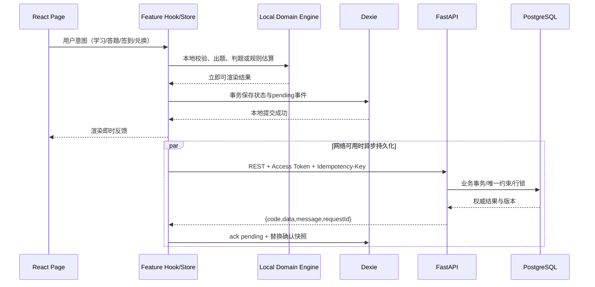

初始化顺序：`main.tsx → bootstrap(IDB迁移/SW注册/本地档案) → providers → router → Home`。关键对象由组合根创建并注入，领域引擎不得直接 import React、fetch 或 Dexie，便于单测。

---

## 9. 待明确事项与设计假设

1. **✅ 范围冲突已由 PRD v1.2 §8.4 解决**：练习完全离线（G-08）为 **P0 本期必做**；错题本 UI、积分商城、家长报告/错题分析明确为 V1.1；老师端为 P2。本设计据此收敛：见 §1.3.1 技术范围红线、§5.6（本期唯一消费路径 = 现实奖励券）、路由与接口红线。**工程不得因“接口已设计”提前实现 V1.1 页面**。
2. **✅ 已在 PRD v1.1 澄清（C-2）**：P0 保证为「**已成功同步至云端的累计积分永不丢失**」。全程离线后直接卸载/清缓存/换设备只丢失该离线期间 pending，属预期行为而非 Bug。本设计按 H-12 的 6 个时机高频 flush（含每答对 1 题、休息蒙层弹出）+ H-13/H-14/H-15/H-16 告知与兜底，目标单次离线未上报时长中位数 ≤10 分钟。
3. **✅ 已在 PRD v1.1 澄清（C-1）**：L2 **不再做半额运算**，单题基础分恒为 +1；L1/L2 差异改为 **Combo 连对是否中断**，【免扣卡】权益改为“L2 后答对保住连对”。实现见 §4.3.1 与 §5.1。
4. **家长端范围**：锁定决策只做代建、管控、现实奖励确认，因此 PRD 中报告/错题分析/PDF 导出标为 V1.1，不在首版页面实现。
5. **游客积分合并**：PRD 标 P1。若首版开放游客，合并必须限制单设备一次、校验合理上限并取得家长同意；默认 MVP 可以展示试玩但不承诺游客跨卸载保留。
6. **教研内容（PRD v1.3 Q11 已决策：无教研人力 → 开发自查）**：28 个知识点、23 个特例与提示模板**不再设教研审校环节**，由开发对照**人教版 / 北师大版**自查；每条须带 `source_ref`（教材知识点/课标条目）以便追溯。此为 **PRD §8.5 风险 R-1（高等级）**，技术侧缓解见 §12.3.1 与 §13；**V1.1 建议补教研复核**，届时凭 `source_ref` 批量过审。开发只实现 schema/渲染/校验，不能自动编造正式教学内容。
7. **音频与字体授权**：只能使用有商用授权并可离线缓存的资源；首包不内嵌大字体，优先系统圆体 fallback，品牌字体按需子集化。
8. **手机号服务商与部署地域**：短信供应商、对象存储/数据库区域、域名备案与儿童隐私合规评估尚未指定，通过适配器和环境变量隔离。
9. **账号删除**：30 日延迟删除期间账户冻结且可撤销；积分流水因审计保留期与删除权冲突需法务给出去标识化策略。

---

## Part B：任务分解

## 10. 依赖包清单

### 10.1 前端

```text
- react@^18.3.1 / react-dom@^18.3.1: UI 运行时
- typescript@^5.7.0: 严格类型
- vite@^6.1.0 / @vitejs/plugin-react-swc@^3.8.0: 构建与快速编译
- react-router-dom@^6.28.0: 路由与懒加载
- @mui/material@^6.4.0 / @emotion/react@^11.14.0 / @emotion/styled@^11.14.0: 按需可访问组件
- tailwindcss@^3.4.17 / postcss@^8.5.0 / autoprefixer@^10.4.0: 布局与 Token 工具类
- zustand@^5.0.0: 本地交互状态
- @tanstack/react-query@^5.66.0: 服务端缓存与请求状态
- dexie@^4.0.11: IndexedDB、事务与迁移
- vite-plugin-pwa@^0.21.0: Workbox/PWA
- lottie-react@^2.4.1: 按需 Lottie 播放
- seedrandom@^3.0.5: 可复现伪随机
- zod@^3.24.0: 内容/API 边界校验
- react-hook-form@^7.54.0: 家长端表单
- ulid@^2.4.0: 有序本地 ID 与幂等键
- vitest@^3.0.0 / @testing-library/react@^16.0.0: 单元与组件测试
- fast-check@^4.0.0: R1–R12 属性测试
- @playwright/test@^1.50.0: E2E 与性能冒烟
- size-limit@^11.2.0: 首包体积门禁
```

### 10.2 后端

```text
- python@3.12: 运行时
- fastapi@^0.115.0: REST API
- uvicorn[standard]@^0.34.0: ASGI 服务
- pydantic@^2.10.0 / pydantic-settings@^2.7.0: 契约与配置
- sqlalchemy[asyncio]@^2.0.37: ORM/事务
- asyncpg@^0.30.0: PostgreSQL 异步驱动
- alembic@^1.14.0: 数据库迁移
- redis@^5.2.0: OTP、锁定与限流
- argon2-cffi@^23.1.0: PIN 哈希
- PyJWT[crypto]@^2.10.0: JWT 签发校验
- cryptography@^44.0.0: 手机号字段加密
- httpx@^0.28.0: 短信供应商适配与测试客户端
- structlog@^24.4.0: 结构化去标识日志
- prometheus-client@^0.21.0: 自托管运行指标
- pytest@^8.3.0 / pytest-asyncio@^0.25.0: 测试
- hypothesis@^6.124.0: 规则/并发属性测试
- ruff@^0.9.0 / mypy@^1.14.0: 代码质量
```

版本为建议下限；锁文件提交仓库，正式开发前用兼容性测试确认最新补丁版本，不做自动跨主版本升级。

## 11. 有序任务列表（硬上限 5 项）

> 每个任务至少覆盖 3 个相关文件；按模块/层次分组，不按单文件拆分。P0 为 MVP 阻断项，P1 可在首版功能冻结前完成，P2 延后。

### T01：项目基础设施（P0，Batch 1）

- **目标**：建立前后端可运行骨架、依赖、严格检查、Design Token、PWA/容器与入口；空应用可构建、启动、通过健康检查。
- **源文件**：
  - `frontend/package.json`, `frontend/vite.config.ts`, `frontend/tsconfig.json`, `frontend/tailwind.config.ts`, `frontend/index.html`
  - `frontend/src/main.tsx`, `frontend/src/app/App.tsx`, `frontend/src/app/router.tsx`, `frontend/src/app/providers.tsx`
  - `frontend/src/styles/tokens.css`, `frontend/src/styles/globals.css`
  - `backend/pyproject.toml`, `backend/app/main.py`, `backend/app/config.py`, `backend/app/db.py`
  - `infra/docker-compose.yml`, `infra/nginx.conf`, `infra/env.example`, `infra/ci.yml`
- **依赖**：无
- **验收**：本地一条命令启动；`/health` 正常；前端路由可访问；lint/typecheck/test/build CI 成功；size-limit 已配置。

### T02：领域数据层与离线基础（P0，Batch 2）

- **目标**：实现正式 schema、迁移、领域类型、Dexie、本地仓储、知识包 schema 和可复现题目/提示引擎；为前后端并行开发提供稳定契约。
- **源文件**：
  - `backend/app/domain/enums.py`, `backend/app/domain/models.py`, `backend/app/domain/schemas.py`, `backend/app/domain/point_rules.py`
  - `backend/app/migrations/versions/0001_core_schema.py`, `0002_points_rules_store.py`
  - `frontend/src/domain/user.ts`, `learning.ts`, `practice.ts`, `points.ts`
  - `frontend/src/offline/db.ts`, `repositories.ts`, `cachePolicy.ts`
  - `frontend/src/content/schemas.ts`, `fallback.zh-CN.json`
  - `frontend/src/features/practice/engine/prng.ts`, `ranges.ts`, `generator.ts`, `validators.ts`, `adaptive.ts`, `judge.ts`, `hintEngine.ts`, `generator.worker.ts`
  - `frontend/src/tests/generator.property.test.ts`
- **依赖**：T01
- **验收（含阻断项）**：迁移可升降；**服务端 14 张表**约束正确（`questions.hint_level` 语义 + `combo_kept`、`question_sets.difficulty_level`）外加 5 张支持表（`point_rules`/`point_daily_counters`/`store_items`/`redemptions`/**`hint_templates`**）；本地 `pending_ledger` 结构与索引正确且**不进服务端**；连对归零纯函数单测（无提示/L1 累加、L2 归零、免扣卡保住、L3 归零且 `isCorrect=false`）全过；10,000 种子属性测试全过；题组 ≤150ms 基准达标；Dexie 升级不丢 pending。
- **🔴 阻断项 B-1（R4 = P0 中的 P0，不过则整批不通过）**：`validators.ts` 中的 R4 校验必须通过下列单测清单，任一失败即任务不通过（对应 PRD 最高风险 R-1，因为无教研审校时，**题目本身不越界是最后兜底**）：

  | # | 用例 | 期望 |
  | --- | --- | --- |
  | R4-1 | `a ÷ 0`（任意被除数、任意年级/难度） | 生成被拒 / 永不进入题组 |
  | R4-2 | `0 ÷ 0` | 生成被拒 |
  | R4-3 | 被减数 < 减数（如 `3 − 5`） | 生成被拒（不出现负数结果） |
  | R4-4 | 余数 ≥ 除数（如 `14 ÷ 4 = 2…6`） | 生成被拒；余数必须 `0 ≤ r < divisor` |
  | R4-5 | 超出年级数值范围（一年级出现 `a+b>20`、三年级出现四位数以上） | 生成被拒 |
  | R4-6 | 超前概念（一年级出乘法/除法、二年级出余数除法、三年级出负数或小数） | 生成被拒（按年级白名单校验 `op` 与题型） |
  | R4-7 | 边界值：`a − b = 0`（合法，不得误杀）、`0 ÷ 5 = 0`（合法）、`14 ÷ 4 = 3…2`（合法）、`9 ÷ 9 = 1`（合法） | 允许通过 |
  | R4-8 | 属性测试：每个（年级 × 模式 × 难度）跑 10,000 种子，**断言上述禁止模式出现次数为 0** | 0 命中 |

  实现要求：R4 校验独立成 `assertR4(question, config)` 纯函数，在**候选生成后、入组前**与**整组校验时**各调用一次（双重卡口）；不使用 try/catch 静默吞掉失败。
- **🔴 阻断项 B-2**：`hint_templates` 与 `special_cases` 的 `source_ref` 校验 —— DDL 非空约束 + CI 内容校验 + 后端启动 fail-fast 扫描，三者齐备；缺失 `source_ref` 的模板/特例卡**不得上线**。

### T03：云端鉴权、积分与业务 API（P0，Batch 3A，可与 T04 并行）

- **目标**：完成家长/儿童鉴权、知识进度、题组结果、积分事务与同步、签到任务徽章、**现实奖励券消费（本期唯一）**、家长管控 API。**不实现**商城购买、报表、老师端接口。
- **源文件**：
  - `backend/app/api/router.py`, `deps.py`, `api/routes/auth.py`, `children.py`, `learning.py`, `practice.py`, `points.py`, `retention.py`, `rewards.py`, `parent_settings.py`（**`store.py` 仅留 V1.1 空壳，不注册路由**）
  - `backend/app/services/auth_service.py`, `child_service.py`, `learning_service.py`, `practice_service.py`, `points_service.py`, `sync_service.py`, `retention_service.py`, `reward_service.py`, `content_startup_check.py`
  - `backend/app/repositories/users.py`, `learning.py`, `practice.py`, `points.py`
  - `backend/app/security/tokens.py`, `pin.py`, `crypto.py`
  - `backend/tests/test_points_idempotency.py`, `test_points_caps.py`, `test_auth_lockout.py`, `test_sync_conflicts.py`, `test_retention.py`
- **依赖**：T01、T02
- **验收**：OpenAPI 契约齐全；并发重复请求只记一笔；每日/子项上限正确；账户/流水/计数原子提交；5 次 PIN 锁定；多端 pending 并集收敛；**C-1 规则正确**：`hintLevel∈{0,1,2}` 均 +1 且 `hintLevel=2&&!comboKept` 不产生 Combo、`hintLevel=3` 记 `is_correct=false` 仅发 `L3_COMPLETED`、`comboKept` 优先于 `hintLevel` 判定；【不放弃】徽章只统计 `hint_level∈{1,2}`；**启动 fail-fast 校验**：`hint_templates`/`special_cases` 存在 `source_ref` 缺失或已发布知识点无模板时，服务**拒绝启动**。

### T04：儿童端、家长端与交互闭环（P0/P1，Batch 3B，可与 T03 并行）

- **目标**：实现本机快进、首页成长树、学习/特例/小测、练习/三级提示/结算、积分显示、签到任务、家长代建与管控、**现实奖励券申请与家长确认/拒绝**。**不实现**积分商城页、错题本页、家长报告页（V1.1）与老师端（P2）。
- **源文件**：
  - `frontend/src/features/auth/*`, `home/*`, `learn/*`, `practice/*`
  - `frontend/src/features/points/*`, `retention/*`, `rewards/*`, `parent/*`, `settings/*`
  - `frontend/src/shared/ui/*`, `shared/api/*`, `shared/audio/audioManager.ts`, `shared/utils/idempotency.ts`
  - `frontend/src/offline/syncCoordinator.ts`, `service-worker.ts`
- **依赖**：T01、T02；使用 mock server 与 T03 并行
- **验收**：连对判定单测与 E2E 必须断言 C-1 核心收益点（重构最易写错处，**不得只靠人工回归**）：① `hintLevel=2 且无免扣卡` → 基础分仍 +1、`streak` 归零、`comboKept=false`，且本题无法触发 3/5/10 Combo；② `hintLevel=2 且持有免扣卡` → 基础分仍 +1、`streak` 继续累加、`comboKept=true`，Combo 正常发放；③ `hintLevel∈{0,1}` → `streak+1`、`comboKept=true`；④ `hintLevel=3` → `isCorrect=false`、`streak=0`、仅发 `L3_COMPLETED`；⑤ 断言中不得引用 `difficulty_level` 替代 `hintLevel`（命名回归）。本机快进、成长树、学习/小测、三级提示、结算页、签到任务、家长代建与管控按原标准验收；**H-12 六个 flush 时机全部接通**（尤其是“每答对 1 题”与“20 分钟休息蒙层”），H-13 离线提示条、H-14 退出提醒、H-15 家长端“上次同步时间 + 待同步积分”、H-16 `pagehide`/Background Sync 兜底均已实现。
- **🔴 阻断项 B-1（继承 T02，E2E 层面复验）**：练习页 E2E 必须断言**真实 UI 上永不出现** R4 禁止题型 —— 遍历全部（年级 × 模式 × 难度）组合各生成 10 组题，断言：无 `÷0`、无 `0÷0`、无被减数 < 减数、无余数 ≥ 除数、无超年级数值、无超前概念（一年级不出乘除等）；**任一命中即本任务不通过**。
- **🔴 阻断项 B-2（继承 T03）**：提示面板展示的每条 L1/L2 文本必须可追溯到 `sourceRef`（调试面板或数据属性可见），**运行时不得硬编码拼串**；缺 `sourceRef` 的模板在构建期即被拦截。

### T05：端到端集成、性能安全与发布（P0，Batch 4）

- **目标**：前后端联调、离线/多端/异常演练、体积与动画性能门禁、生产部署与备份恢复验证；P1 UI 不得阻塞 P0 发布。
- **源文件**：
  - `frontend/src/tests/pointsSync.test.ts`, `practice.e2e.spec.ts`
  - `backend/tests/test_sync_conflicts.py`, `test_points_idempotency.py`, `test_retention.py`
  - `frontend/vite.config.ts`, `frontend/src/offline/service-worker.ts`
  - `infra/ci.yml`, `infra/nginx.conf`, `infra/docker-compose.yml`, `backend/Dockerfile`
- **依赖**：T03、T04
- **验收**：**H-6 目标场景（此前已联网同步过的换设备/重装/清缓存）完整恢复**；断网完成整组并于联网 5s 内补登；重复/乱序/超时重试不重复；离线未上报时长中位数打点 ≤10 分钟；**C-1 端到端断言**：L2 无卡 streak 归零/免扣卡 streak 累加、L3 计入错题本且只发鼓励分、服务端复核 `comboKept` 后结果与客户端不一致时以服务端为准；**H-15 双数据源断言**：同设备展示 `lastSyncAt`+`pendingPoints`、跨设备只展示 `lastSyncAt` 且 `pendingPoints` 返回 `null` 不显示 0、三档文案正确；**范围红线断言**：路由表中不存在 `/store`、`/parent/report`、`/teacher/*`，依赖清单中**无支付/TTS/PDF/i18n 运行时库**，全部 Lottie 通过 ≤150KB 门禁且无 MP4/GIF 资源；首包 ≤300KB gzip；首题 P95 ≤1s、反馈 ≤300ms、动画 ≥50fps；CSP/HTTPS/隐私检查通过；备份恢复演练有记录。
- **范围红线检查（CI 建议加为静态检查项）**：① 无 `teacher/class/assignment` 表与路由；② 无商城/报表/错题本 UI 路由；③ `store_items` 只含 `reward_voucher`；④ 无支付/广告/追踪/语音依赖；⑤ 文案 key 化但只有 `zh-CN`。

### 11.1 Batch 并行关系

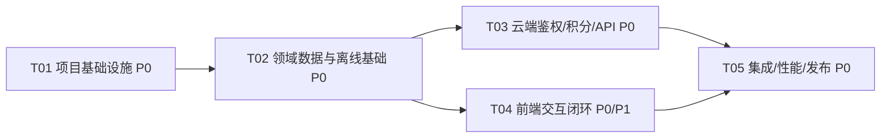

- Batch 1：T01。
- Batch 2：T02。
- Batch 3：T03 与 T04 并行，契约冻结后分别实现；内容团队可同时产出知识包与 Lottie。
- Batch 4：T05。
- **可延后到 V1.1**：积分商城（装扮/主题/道具/加倍卡/免扣卡/跳过卡）、错题本 UI 与错题重练、家长学习报告/错题分析/PDF 导出、语音朗读（再评估）、`device_sync_heartbeat`、完整 i18n。
- **已排除/P2**：老师端与班级体系、任何排行榜、多语言实际翻译、订阅/内购/广告、App 打包（仅预留能力）、MP4/GIF 动画。
- **本期不可延后**：本地出题/判题/三级提示（G-08 已升 P0）、积分云端持久化与离线记账/补登、现实奖励券（唯一消费出口）、家长端 3 件事、响应式 Web 三端。

---

## 12. Shared Knowledge（跨文件约定）

### 12.1 命名与目录

- TypeScript：组件/类 `PascalCase`，函数/变量 `camelCase`，常量 `UPPER_SNAKE_CASE`；Python 遵循 PEP 8；数据库 `snake_case`。
- 业务 ID 使用 UUID/ULID；用户可见知识点用稳定 `G1-01`；枚举值用大写字符串；不得把中文文案当业务判断条件。
- 组件只放渲染；跨页面业务放 feature service/hook；纯领域代码禁止依赖 React、网络和数据库。
- 每个 feature 的公开入口通过 `index.ts`，禁止跨 feature 深层 import；共享模块不得反向依赖 feature。

### 12.2 API、时间与错误

- 所有 API 返回 `{code,data,message,requestId}`；错误也保持相同结构，`data` 可含可公开字段级错误。
- 所有时间持久化为 UTC ISO 8601；签到/日上限由服务端按 `settings_parent.timezone` 转换成业务日。
- 写接口必须有 `Idempotency-Key`；客户端重试必须复用原键，不能重新生成。
- 前端将异常分为 `ValidationError/AuthError/OfflineError/ConflictError/ServerError`；儿童文案映射集中维护，不显示堆栈、HTTP 500 或“失败”。

### 12.3 积分与练习

- `totalPoints` 只增不减决定等级；`availablePoints` 获取增加、消费减少；页面禁止只写“积分”而不标注语义。
- 服务端是账户权威；IndexedDB `confirmedSnapshot` 不能包含 pending；UI 可显示 `syncing` 标志。
- 客户端不上报可信积分数，只上报事件和证据；所有规则由服务端重算。
- 练习引擎以 `seed + generatorVersion + config` 为输入必须确定性；版本发布后不可改变相同版本行为。
- 答题、判题、三级提示与当前组结算不得依赖网络；**现实奖励券申请、签到、家长设置必须在线**。
- **R4 是 P0 中的 P0（对应 PRD 最高风险 R-1）**：R4 校验为**阻断性验收项**，不过则整批不通过；`assertR4()` 必须在候选入组前与整组校验时各调用一次，禁止用 try/catch 静默忽略。R4 单测清单见 T02 验收表（R4-1 ~ R4-8），E2E 复验见 T04。

### 12.3.1 提示模板与内容文案约定（PRD v1.3 §4.2.5 硬约束）

1. **禁止硬编码拼串**：任何面向儿童的提示/讲解文案**只能来自 `hint_templates` 表或带版本内容包**，代码里不得出现 `"先把 5 分出 1 给 9…"` 之类的字面量拼接；模板只允许通过 `HintToken` 参数化渲染。
2. **`source_ref` 必填**：每条 L1/L2 提示模板与每条特例卡必须携带 `source_ref`（教材知识点 / 课标条目，如 `人教版二上·表内除法（一）`）+ `curriculum`（RJ/BSD）+ `reviewer`（开发自查人）。**无 `source_ref` 不得上线**。
3. **三层门禁**：DB `NOT NULL` + 非空 CHECK → CI 内容校验（`lint:content`）→ 后端启动 fail-fast 扫描，缺一不可。
4. **可追溯透出**：`HintBundle` 携带 `sourceRef`，错题回看与 V1.1 教研复核可按 `source_ref` 批量定位。
5. **自查口径**：无教研人力（Q11），开发对照**人教版 / 北师大版**自查；特例卡统一「❌错误说法 → ✅正确说法 → 🎬动画 → 💡口诀」四段式以降低歧义；V1.1 补教研复核时凭 `source_ref` 快速过审。
6. **禁止生成式 AI 在线造提示**：运行时不调用任何 LLM 生成讲解或提示内容。

### 12.4 日志、指标与隐私

- JSON 日志字段：`timestamp, level, service, requestId, route, code, latencyMs`；`userId` 使用每日轮换 HMAC 假名；不记录手机号、PIN、Token、儿童昵称、完整答案内容。
- 不接第三方追踪 SDK；仅发送自有后端匿名聚合运行指标。产品行为埋点必须通过家长同意与数据最小化评审。
- 安全头：CSP、HSTS、`X-Content-Type-Options: nosniff`、`Referrer-Policy: no-referrer`；Lottie/知识资源域名白名单。
- 敏感配置只从密钥管理/环境变量读取；`.env` 不进仓库。

### 12.5 测试共同约定

- 单元测试覆盖领域规则；API 测试使用真实 PostgreSQL 事务，不用 SQLite 替代锁/约束语义。
- 固定时间与随机种子；禁止依赖真实当前日期造成签到测试不稳定。
- 关键回归矩阵：在线/离线、首登/回登、手机/平板/PC、减少动效、重复提交、乱序同步、跨日、日上限、多端同时离线、**L2 连对中断、免扣卡生效、L3 计未答对、每答对一题增量上报、休息蒙层 flush、pagehide 兜底、H-15 跨设备隐藏 pending**。
- 命名回归：`question_sets.difficulty_level` 与 `questions.hint_level` 不得互串；代码 review 与测试断言均需覆盖该点，避免把提示级别当难度写入。
- **C-1 四条断言（无提示/L1、L2 无卡、L2 有卡、L3）必须同时存在于单测、API 集成测试和 E2E**，任何重构后全绿才算通过。
- **R4 八条断言（R4-1 ~ R4-8，见 T02 验收表）必须存在于单测 + 属性测试 + E2E**，属阻断项：任一禁止模式出现即判定不通过，不得“先上线后修”。
- **`source_ref` 断言**：内容 CI 与后端启动校验必须覆盖“模板/特例卡缺失 `source_ref` 即失败”；该用例需有正向（通过）与反向（拒绝启动）两条测试。
- “视觉验收”只做必要的响应式和可操作冒烟；代码完成后以构建、功能冒烟和关键性能指标为准。

---

## 13. 风险清单与应对

| 风险 | 概率/影响 | 应对 |
| --- | --- | --- |
| Lottie 资源过大或低端机掉帧 | 中/高 | **G-11 门禁：单文件 ≤150KB、图层 ≤150**，无 MP4/GIF；发布流水线校验并拒绝超标资源；按需懒加载、静态 SVG 降级、同屏单动画。 |
| 未同步离线积分在卸载后丢失 | 低/高 | **已由 PRD v1.1 界定为预期行为**：保证“已同步云端积分永不丢失”；H-12 六点高频 flush（含每答对1题、休息蒙层）、H-13/H-14/H-15/H-16 告知与兜底，目标中位数 ≤10 分钟。 |
| Combo 中断规则实现偏差 | 中/中 | §4.3.1 表格 + 伪代码 + 服务端规则 `COMBO v2` 双重约束；E2E 覆盖 L2/免扣卡/L3 三种结局。 |
| `difficulty_level` 与 `hint_level` 混淆 | 中/高 | 字段重命名 + DDL 注释 + 单测/评审清单禁用 `level` 单名字段。 |
| 跨设备把 `pendingPoints` 显示为 0 | 中/高 | C-4：跨设备返回 `null` 并隐藏卡片；E2E 断言不得出现 0；文案由服务端 `lastSyncAt` 三档兜底。 |
| `device_sync_heartbeat` 被误当成权威 | 低/中 | 首版不实现；若 V1.1 引入必须保留“未知”状态并回落到 `lastSyncAt`，文案不得暗示从未联网设备已同步。 |
| 多端重复/乱序流水 | 中/高 | 用户+幂等键唯一、业务唯一约束、账户行锁、批量逐条状态、服务端权威快照。 |
| 题目生成陷入重试或分布偏斜 | 中/中 | 配额袋、80 次上限、确定性备用池、10,000 种子属性测试与分布测试。 |
| 4 位 PIN 被穷举 | 中/高 | Argon2id、5 次锁定、IP/账号限流、可信设备租约、家长可撤销；不把本地 PIN 当高强度认证。 |
| 客户端伪造积分事件 | 中/高 | 不接收 delta、服务端规则重算、seed/version 复核、子项/总上限、异常审计。 |
| **R-1 数学内容表述偏差**（PRD v1.3 §8.5 登记，**高**等级：无教研人力，Q11 改为开发自查，面向 6–9 岁儿童误概念影响深远） | 中/**高** | 技术侧五项缓解：① **R4 引擎硬拦截**（超前概念/负数/÷0/0÷0/余数≥除数不依赖文案，见 T02 阻断项 B-1）；② **提示模板 `source_ref` 可追溯**（`hint_templates` + `special_cases.source_ref`，DB 非空 + CI 校验 + 启动 fail-fast 三层门禁，见 §12.3.1）；③ **结构化模板而非硬编码拼串**，便于批量复核与回滚；④ **内容版本化**（`contentVersion` + git 版本），发现问题可一键回滚；⑤ **禁用生成式 AI 在线造提示**，V1.1 凭 `source_ref` 快速补教研复核。 |
| 内容/提示文案错误 | 中/高 | schema + 静态校验 + **开发对照人教版/北师大版自查 + `source_ref` 标注** + 内容版本回滚；禁用生成式 AI 在线提示。 |
| MUI/动画库突破 300KB | 中/中 | 按需 import、路由拆包、Lottie 动态导入、size-limit 阻断、避免重复日期/工具库。 |
| PWA 在 iOS 后台同步能力有限 | 高/中 | 不依赖 Background Sync 作为唯一通道；前台启动/online/题组完成均主动 flush。 |
| 儿童隐私/日志泄露 | 低/极高 | 数据最小化、字段加密、去标识日志、无第三方追踪、删除/导出流程与合规评审。 |

---

*文档结束。实现前先冻结 OpenAPI、内容包 schema、积分规则 v2 与题目生成器 v1；任何积分语义或生成规则变更必须提升版本并补迁移/回归测试。*

---

## 修订记录

| 版本 | 日期 | 作者 | 变更 |
| --- | --- | --- | --- |
| v1.0 | 2026-10-07 | 高见远 · 架构师 | 首版系统设计、数据模型、交互流程、API、体验规范与 5 项任务分解 |
| v1.1 | 2026-10-07 | 高见远 · 架构师 | 对齐 PRD v1.1：**C-1** 取消 L2 半额逻辑，单题基础分恒 +1，差异改为 Combo 连对中断（`combo_kept` 字段 + `COMBO v2` 规则 + 免扣卡新权益 + L3 计未答对）；**C-2** 明确“已同步云端积分永不丢失”边界并落地 H-12~H-16 的 flush/告知/兜底（§4.5、§5.4、§7.3）；**C-3** 14 张服务端表 + 1 张本地 `pending_ledger` 落地；新增 `difficulty_level` / `hint_level` 术语消歧与相应风险项 |
| v1.2 | 2026-10-07 | 高见远 · 架构师 | 对齐 PRD v1.1 **C-4**：新增 §5.5 H-15 双数据源设计（`lastSyncAt` 服务端权威 / `pendingPoints` 仅本机且跨设备隐藏不显示 0）、新增 `GET /points/sync-status`、裁决 `device_sync_heartbeat` 为 V1.1（含固有限界）；按产品请求在 T04/T05 与测试约定中固化 C-1 四条回归断言（无提示/L1、L2 无卡、L2 有卡、L3） |
| v1.3 | 2026-10-07 | 高见远 · 架构师 | 对齐 PRD **v1.2**（Q1/Q2/Q3/Q4/Q6 决策 + G-08 升 P0 + G-10~G-14 + §8.4 范围红线）：新增 §1.3.1 技术范围边界（与 PRD §8.4 逐条对齐）与 G-10 单代码库约束（禁 Electron/原生强依赖）；积分商城标 V1.1，新增 §5.6 本期唯一消费路径（现实奖励券：申请冻结 → 家长确认/拒绝退款）；文件树 `store/*` → `rewards/*`，`store.py`/`store_service.py` 仅留 V1.1 空壳；路由与接口红线（无 `/store`、`/parent/report`、`/teacher/*`）；G-11 Lottie ≤150KB 门禁 + 200MB 缓存等效换算；G-12 仅保留 i18n key；明确无支付、无 TTS、无 PDF、无老师/班级表；T03/T04/T05 与 Batch 说明同步收敛 |
| v1.3（PRD v1.3 增补） | 2026-10-07 | 高见远 · 架构师 | 对齐 PRD **v1.3**：① 新增 `hint_templates` 表与 `special_cases.source_ref`（DDL + ER 图 + 类图），`source_ref` 为教材知识点/课标条目，**DB 非空 + CI 内容校验 + 后端启动 fail-fast** 三层门禁；提示改为表驱动、**禁止硬编码拼串**（§4.4.1、§12.3.1）；② **R4 提为「P0 中的 P0」阻断性验收项**，新增 R4-1 ~ R4-8 单测清单（`÷0`、`0÷0`、被减数<减数、余数≥除数、超年级范围、超前概念 + 合法边界 + 属性测试），T02/T04 标注 B-1、B-2 阻断项；③ §13 登记 PRD 高风险 **R-1** 及五项技术侧缓解；④ §9 第 6 条同步为「Q11 开发自查 + R-1」 |

*文档结束。实现前先冻结 OpenAPI、内容包 schema、积分规则 v2 与题目生成器 v1；任何积分语义或生成规则变更必须提升版本并补迁移/回归测试。*
