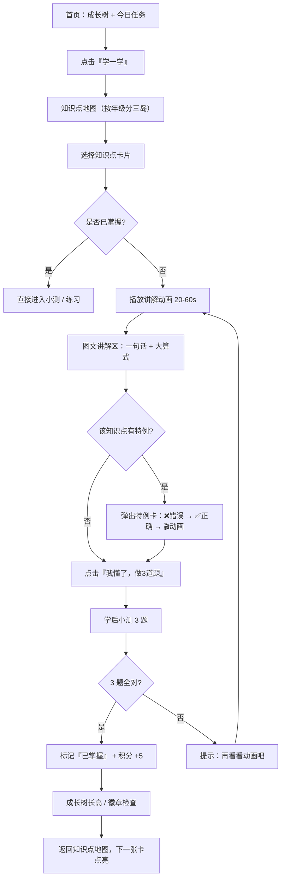
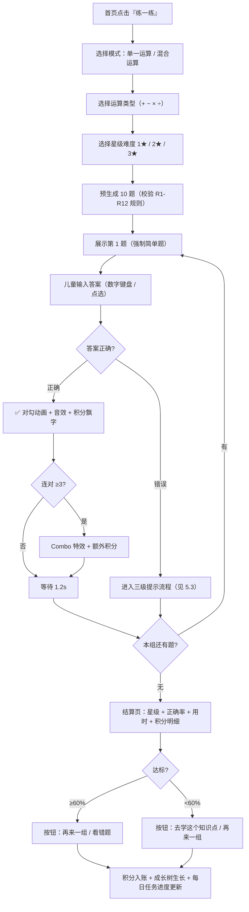
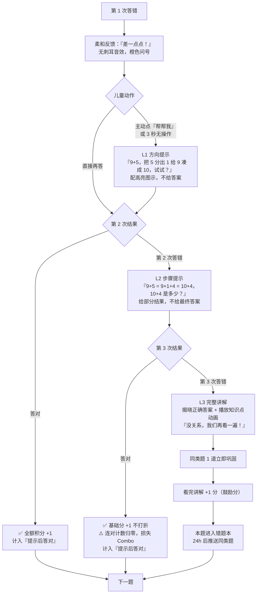
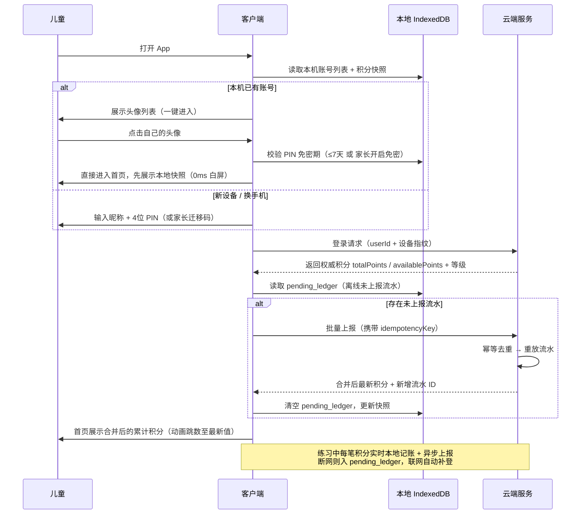
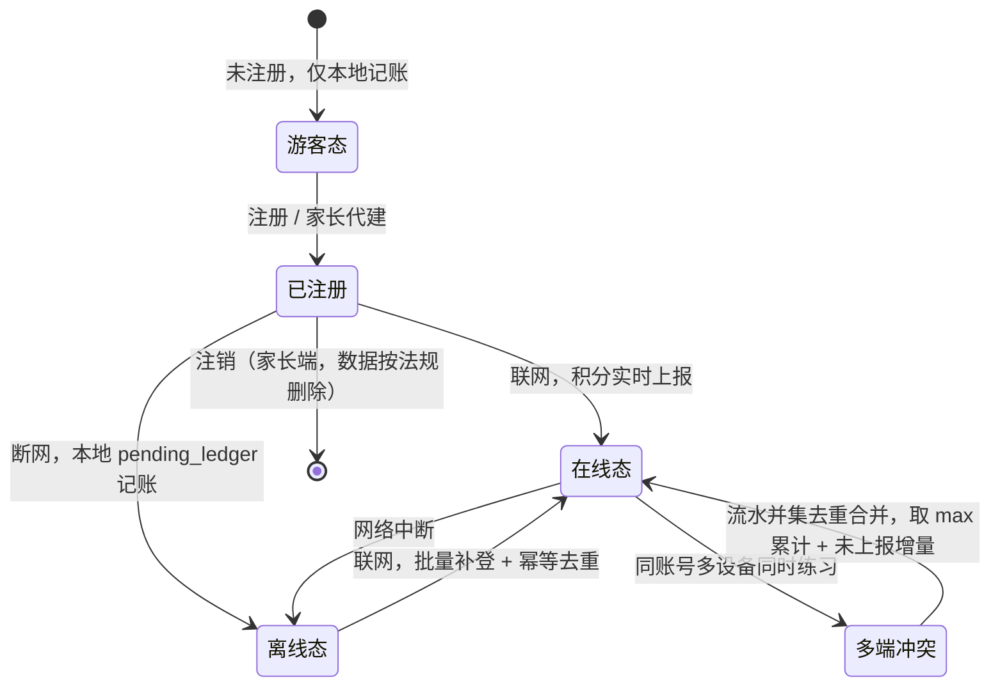

# 小学数学乐园 · 产品需求文档（PRD）

| 项目 | 内容 |
| --- | --- |
| 文档名称 | 小学数学乐园（暂定名 / KidsMath）产品需求文档 |
| 版本号 | **v1.3**（范围已锁定：Q1–Q7、Q11 已决策；含架构评审语义澄清 C-1 ~ C-4） |
| 日期 | 2026-10-07（v1.2 修订同日） |
| 作者 | 许清楚 · 产品经理 |
| 状态 | 待评审 |
| 目标用户 | 小学一年级至三年级儿童（6–9 岁）+ 家长 / 老师（间接用户） |
| 技术栈建议 | **响应式 Web：Vite + React + MUI + Tailwind CSS**（Q1 决策），预留 Capacitor 打包，首版不打包 App；云端账号体系（Q2 决策） |
| 项目代号 | `kids_math` |

> **一句话定位**：一款面向 6–9 岁儿童的「动画学概念 + 游戏化练习 + 积分成长」数学启蒙软件，让孩子 3 步内开始练习，答错不掉队，积分永不丢失。

---

## 1. 产品目标与定位

### 1.1 产品定位

**一句话定位**：用卡通动画讲清加减乘除，用游戏化积分激励练习，让 6–9 岁孩子每天愿意主动练 10 分钟数学。

**产品边界**：

- ✅ 做：四则运算的概念讲解、随机出题练习、积分成长体系、家长进度查看
- ❌ 不做：超前教学（四年级以上内容）、社交聊天、陌生人排行榜、任何形式的付费诱导

### 1.2 目标用户画像

#### A. 核心用户：儿童（6–9 岁，小学一至三年级）

| 维度 | 描述 |
| --- | --- |
| 认知水平 | 具象思维为主，抽象符号理解力弱；依赖图形、实物、故事理解数字 |
| 识字量 | 一年级约 300–500 字，三年级约 1600 字；**界面文字必须极少，以数字、图形、图标为主** |
| 操作能力 | 手指点击精度低（误差 ±10px），拖拽不熟练，打字慢且不熟练 |
| 注意力 | 单次专注约 10–20 分钟，需要高频正反馈维持兴趣 |
| 心理特征 | 渴望被表扬，失败易挫败放弃；对卡通形象、收集、装扮、养成有强兴趣 |
| 使用设备 | 主要为家长手机 / 平板，屏幕 7–11 英寸居多 |

#### B. 间接用户一：家长（28–45 岁）

| 维度 | 描述 |
| --- | --- |
| 核心诉求 | 孩子别沉迷、有效果、自己少操心；想看到"练了多少、错在哪" |
| 使用频率 | 每周 1–3 次，每次 3–5 分钟 |
| 关键需求 | 学习报告、时长管控、积分奖励的"现实兑现"（如兑换看动画片时间） |

#### C. 间接用户二：老师（25–50 岁，1–3 年级数学教师）

| 维度 | 描述 |
| --- | --- |
| 核心诉求 | 课堂/课后统一布置练习、查看班级掌握情况 |
| 使用频率 | 每周 1–5 次 |
| 关键需求 | 按知识点布置题组、班级正确率热力图、错题分布 |

### 1.3 核心价值主张

| 编号 | 价值主张 | 对应功能 |
| --- | --- | --- |
| V1 | **看得懂**：把抽象的运算规则变成看得见的动画，孩子自己就能学会 | 概念学习动画（每个知识点 1 个 30–60s 动画） |
| V2 | **练得动**：题目随机不重复，答错有台阶式提示，不会卡住放弃 | 随机出题 + 三级提示机制 |
| V3 | **愿意来**：积分 + 签到 + 成长树 + 徽章，形成每日回访习惯 | 积分与留存体系 |
| V4 | **丢不了**：累计积分永久保留，换设备、卸载重装都不丢 | **P0 硬约束：积分云端持久化 + 本地离线记账** |
| V5 | **家长放心**：时长可控、无社交、无广告、数据最小化采集 | 防沉迷护眼 + 儿童隐私保护 |

### 1.4 成功指标

| 层级 | 指标 | 目标值（上线 3 个月） | 说明 |
| --- | --- | --- | --- |
| 北极星 | 周活跃儿童用户（WAU） | 注册用户 ≥ 1000 时 WAU ≥ 400 | 主指标 |
| 活跃 | 周留存率（W1） | ≥ 45% | 首次使用后第 7 天仍使用 |
| 活跃 | 月留存率（M1） | ≥ 30% | |
| 活跃 | 日均启动次数 | ≥ 1.5 次/活跃日 | |
| 时长 | 日均练习时长 | 8–15 分钟（健康区间） | 超过 20 分钟应触发休息 |
| 时长 | 日均练习题量 | ≥ 20 题 | |
| 效果 | 首次答对率 | 60%–80%（合理区间，过高说明题太简单） | |
| 效果 | 同知识点 7 日后正确率提升 | ≥ +15 个百分点 | 衡量学习效果的核心指标 |
| 效果 | 知识点覆盖率 | 活跃用户人均学完 ≥ 8 个知识点 | |
| 留存机制 | 次日签到率 | ≥ 50% | |
| 留存机制 | 连续签到 ≥7 天用户占比 | ≥ 20% | |
| 体验 | 答题页首题渲染耗时 | P95 ≤ 1.5s | |
| 体验 | 崩溃率 / 白屏率 | ≤ 0.3% | |
| 体验 | 单组练习中途放弃率 | ≤ 15% | |

---

## 2. 用户故事

> 格式：As a [角色], I want [功能] so that [价值]

### 儿童侧

| # | 用户故事 | 优先级 |
| --- | --- | --- |
| US-1 | 作为一个 6 岁的一年级学生，我想看小熊猫用苹果演示"3 个苹果加 2 个苹果"，这样不用大人教我也能明白加法是什么意思 | P0 |
| US-2 | 作为一个 7 岁的二年级学生，我想看到"为什么 5 ÷ 0 是不行的"的动画，这样我就不会在考试里掉进这个坑 | P0 |
| US-3 | 作为一个 8 岁的三年级学生，我想在平板上直接点数字键盘算出 36 ÷ 5 的余数，这样不用打字就能做除法 | P0 |
| US-4 | 作为一个学生，我想每次打开都有不一样的新题目，这样反复练习也不会觉得无聊 | P0 |
| US-5 | 作为一个学生，我做错的时候想要先看一点小提示、再看更详细的讲解，这样我不会因为做不出来而哭鼻子 | P0 |
| US-6 | 作为一个学生，我想答对的时候有小星星飞进我的存钱罐并听到"叮"的声音，这样我觉得自己很棒 | P0 |
| US-7 | 作为一个学生，我想每天打开软件领签到积分，看着我的小树一天天长高，这样我想天天来看它 | P1 |
| US-8 | 作为一个学生，我想用攒的积分给我的小熊猫换一顶宇航员帽子，这样我的伙伴会变得独一无二 | P1 |
| US-9 | 作为一个学生，我昨天换了妈妈的手机登录，我想看到我的积分和昨天一样多，这样我的努力不会白费 | **P0（硬约束）** |
| US-10 | 作为一个学生，我想在游戏里玩了 20 分钟后被提醒"该休息啦"，这样妈妈不会骂我 | P1 |

### 家长 / 老师侧

| # | 用户故事 | 优先级 |
| --- | --- | --- |
| US-11 | 作为家长，我想用手机号创建孩子的账号并选好年级，这样孩子打开就能做适合他水平的题 | P0 |
| US-12 | 作为家长，我想每周看到"孩子练了多少题、正确率多少、哪些知识点总错"，这样我知道该重点辅导哪里 | **P1 · V1.1**（Q3 决策延后） |
| US-13 | 作为家长，我想设置每天最多玩 20 分钟且晚上 9 点后不能用，这样我不用担心孩子沉迷和视力 | P1 · 本期必做 |
| US-14 | 作为家长，我想把孩子的积分兑换成"周末去公园"这样的现实奖励，这样积分变成真实的激励 | **P1 · 本期必做**（Q3 决策，原 P2 升格） |
| US-15 | 作为老师，我想一键给全班布置"表内除法 10 题"，这样不用一个个发题目 | **P2 · 首版不做**（Q4 决策） |
| US-16 | 作为老师，我想看到班级每个知识点的正确率热力图，这样我明天讲课知道该重点讲什么 | **P2 · 首版不做**（Q4 决策） |

---

## 3. 需求池（P0 / P1 / P2）

> P0 = 必须有（不做则产品不成立）；P1 = 应该有（显著影响体验与留存）；P2 = 可以有（锦上添花）
>
> **⚠️ v1.2 范围标注说明**：优先级列中出现 **「· 本期必做」** 表示首版（MVP）范围；**「· V1.1」** 表示下一版；**「· 首版不做」** 表示已明确排除。**未带后缀的 P0/P1 即默认属于本期范围**。工程排期请以 §8.4「本期范围红线」为准，不要自行纳入 V1.1/P2 项。

### 3.1 概念学习模块

| ID | 需求 | 优先级 | 验收标准 |
| --- | --- | --- | --- |
| C-01 | 知识点树：按年级分层展示加 / 减 / 乘 / 除知识点 | P0 · 本期必做 | 一/二/三年级共 ≥ 28 个知识点，每个有独立页面 |
| C-02 | 图文讲解区：卡通插画 + ≤30 字文案 + 大号数字算式 | P0 · 本期必做 | 单页文字量 ≤ 30 字；算式字号 ≥ 40px |
| C-03 | 动画演示：每个知识点 1 段 20–60s 动画，可暂停/重播 | P0 · 本期必做 | 动画首帧加载 ≤ 1s；支持重播、跳过；**用 Lottie + SVG/CSS，禁用 MP4/GIF（G-11）** |
| C-04 | 特例/易错点专页：除数不为 0、乘 0 得 0 等 23 条 | P0 · 本期必做 | 每条含「错误说法 → 正确说法 → 动画演示 → 口诀」四段式；**文案由开发对照人教版/北师大版教材口径自查（Q11 决策，无教研审校）**，每条须注明对应教材知识点/课标条目；**风险见 §8.5 R-1** |
| C-05 | 学后小测：看完动画做 3 道 super simple 题 | P0 | 3 题全对才算"已掌握"，否则可重看 |
| C-06 | 知识点掌握状态：未学 / 学习中 / 已掌握 | P0 | 状态持久化，跨设备一致 |
| C-07 | 「反过来想想」交互：拖动数字块演示加法交换律等 | P1 | 拖拽成功率 ≥ 95%（热区 ≥ 64px） |
| C-08 | 语音朗读讲解（可选开关） | **P1 · 首版不做**（Q8 决策，V1.1 再评估） | 不做 TTS、不做语音答题 |
| C-09 | 知识点搜索 / 家长端按知识点直达 | **P2 · 首版不做** | — |
| C-10 | 讲解动画离线缓存 | P1 · 本期必做 | 已学过的知识点动画在无网时可播放（配合 G-08 离线 P0） |

### 3.2 测试练习模块

| ID | 需求 | 优先级 | 验收标准 |
| --- | --- | --- | --- |
| E-01 | 练习模式选择：单一运算 / 混合运算 | P0 | 两种模式各 3 步内可进入 |
| E-02 | 难度分级（L1 简单 / L2 普通 / L3 挑战） | P0 | 难度与年级、历史正确率联动 |
| E-03 | 随机出题引擎 | P0 | 数值范围符合年级；组内零重复；相邻题不连续同模式 |
| E-04 | 儿童友好答题输入：大号数字键盘 + 点选 | P0 | 键盘按键 ≥ 64×64px；支持余数题双输入框 |
| E-05 | 答对反馈：动画 + 音效 + 积分飘字 | P0 | 反馈在点击后 ≤ 300ms 内启动 |
| E-06 | 答错三级提示机制（L1 → L2 → L3） | P0 | 三级提示覆盖率 100%（每道题至少支持 L1） |
| E-07 | 题目组：每组 10 题 | P0 | 支持中途退出（已得分保留，不扣分） |
| E-08 | 结算页：星级 + 正确率 + 用时 + 积分 + 错题入口 | P0 | 结算页展示"再来一组"和"看看错题"两个主按钮 |
| E-09 | 错题本与错题重练 | **P1 · V1.1** | 错题自动入本；重练答对移除并 +2 分。**首版不做**（仅结算页保留"错题回顾"入口占位） |
| E-10 | 连对 Combo 特效 | P1 | 连对 3/5/10 题触发不同强度特效 |
| E-11 | 限时挑战模式（可选，非强制） | **P2 · 首版不做** | 默认关闭，家长端可开启 |
| E-12 | 老师布置的题组任务 | **P2 · 首版不做**（Q4 决策） | 依赖老师端与班级体系，整体延后 |

### 3.3 用户与积分系统

| ID | 需求 | 优先级 | 验收标准 |
| --- | --- | --- | --- |
| U-01 | 儿童账号：昵称 + 内置卡通头像 + 4 位数字密码 | P0 | 注册流程 ≤ 3 步；不支持上传真实照片 |
| U-02 | 家长账号：手机号 + 验证码，可创建管理多个儿童账号 | P0 | 单家长最多绑定 5 个儿童账号 |
| U-03 | 本机快速进入（头像列表一键登录） | P0 | 点击头像 → 直接进入，≤ 1 步 |
| U-04 | **积分获取与记分引擎** | P0 | 见 §4.3.2 具体数值表 |
| U-05 | **累计积分永久保留、跨设备一致（P0 硬约束）** | **P0** | 卸载重装 / 换设备 / 清缓存后累计积分不丢失 |
| U-06 | 积分流水明细（积分从哪里来、花到哪里去） | P0 | 明细保留 ≥ 180 天 |
| U-07 | 每日签到 + 连续签到奖励 | P1 | 签到日历可视化，断签有补救卡（P2） |
| U-08 | 每日任务（3 个 / 天） | P1 | 全部完成额外 +10 分 |
| U-09 | 成就徽章体系（≥ 12 枚） | P1 | 达成即时弹窗 + 积分发放 |
| U-10 | 等级 / 成长树（8 级） | P1 | 等级由**累计积分**决定，视觉随等级变化 |
| U-11 | 积分商城：装饰 / 主题 / 道具兑换 | **P1 · V1.1** | 消费只减可用积分，不影响累计积分。**首版不做**（积分只进不出，避免本期复杂度） |
| U-12 | 家长端现实奖励券（500 分/张，家长确认兑现） | **P1 · 本期必做**（Q3 决策） | 儿童申请 → 家长端确认/拒绝；属本期家长端 3 件事之一 |
| U-13 | 防沉迷：单次 20 分钟休息提醒 | **P1 · 本期必做**（Q3 决策） | 到时全屏蒙层，需休息 5 分钟或家长密码解锁 |
| U-14 | 护眼：夜间时段限制 + 亮度/暗色模式提示 | **P1 · 本期必做**（Q3 决策） | 21:00–08:00 默认进入休息模式 |

### 3.4 通用体验

| ID | 需求 | 优先级 | 验收标准 |
| --- | --- | --- | --- |
| G-01 | 卡通可爱视觉体系（色板 / 吉祥物 / 圆角 / 插画） | P0 | 见 §6 |
| G-02 | 字号与热区规范（正文 ≥18px，热区 ≥56px） | P0 | 全量页面走查达标 |
| G-03 | 音效策略（可全局关闭，记忆开关） | P1 | 默认音量 50%，设置持久化 |
| G-04 | 儿童友好错误文案（不打压式） | P0 | 见 §6.7 文案表 |
| G-05 | 无障碍：大字号模式 / 高对比 / 减少动效 / 非色彩区分对错 | P1 | 4 项开关均在设置页 |
| G-06 | 防误触：关键操作二次确认、按钮间距 ≥12px | P0 | — |
| G-07 | 多端适配（平板 / 手机 / PC Web 响应式） | P0 | 断点 768 / 1024；平板竖屏为主场景 |
| G-08 | **离线可用：练习完全可离线 + 已缓存知识点** | **P0**（Q2 决策升格） | 断网可完成一组练习（本地出题/判题/三级提示）并本地记账；见 §7.4 |
| G-09 | 儿童隐私合规（最小化采集 + 家长同意） | P0 | 见 §7.3 |
| **G-10** | **响应式 Web 单代码库 + 预留 Capacitor 打包能力**（Q1 决策） | **P0** | 手机/平板竖屏/PC 一套代码；不引入浏览器专有强依赖、不调用原生 API；首版不打包 App |
| **G-11** | **动画形式：Lottie JSON 为主 + SVG/CSS 交互动画补充，禁用 MP4/GIF**（Q6 决策） | **P0** | 单个 Lottie 文件 ≤ 150KB，按需懒加载；交互动画用 SVG+CSS/JS 实现以便参数化 |
| **G-12** | **首版仅简体中文**（预留 i18n key，不实际翻译）（Q10 决策） | P0 | 文案集中管理，不硬编码 |
| **G-13** | **不做任何排行榜 / 无社交功能**（Q5 决策） | P0 | 全站无排名、无对比、无分享入口 |
| **G-14** | **首版免费，无订阅/内购/广告**（Q12 决策） | P0 | 积分商城亦不涉及真实货币 |

---

## 4. 功能详述

### 4.1 概念学习模块

#### 4.1.1 知识点清单（按年级分层）

> 每个知识点 = 1 个学习卡片 = 「一句话讲清 + 一张大插画 + 一段动画 + 3 道小测」

##### 一年级（20 以内加减法）

| ID | 知识点 | 一句话讲解（≤20 字） | 动画"演什么" |
| --- | --- | --- | --- |
| G1-01 | 数与量的对应（1–20） | 数字就是东西的个数 | 小熊猫把 7 颗草莓一颗颗放进盘子，盘子上方浮现数字"7"，草莓与数字一一连线高亮 |
| G1-02 | 加法的意义（合并/添加） | 合在一起，用加法 | 左边 3 只小鸟飞到右边 2 只小鸟身边，中间出现"+"号合并成 5 只，小鸟叫一声 |
| G1-03 | 10 以内加法 | 数着数着往后数 | 数轴上小青蛙从 3 出发，向前跳 4 格到 7，每跳一格响一声 |
| G1-04 | 20 以内进位加法（凑十法） | 先凑成 10，再加剩下 | 9+5：5 个小球分成 1 和 4，1 个滚进"10 号房子"装满 10，剩下 4 个跟在后面 → 14 |
| G1-05 | 减法的意义（拿走/剩余/比较） | 拿走一些，用减法 | 盘子里 6 块饼干，小熊猫吃掉 2 块（饼干变小飞走），剩 4 块 |
| G1-06 | 10 以内减法 | 往回数 | 数轴上小青蛙从 8 出发，向后跳 3 格到 5 |
| G1-07 | 20 以内退位减法（破十法） | 拆开 10，先减再合 | 13-8：13 拆成 10 和 3，先从 10 里拿走 8 剩 2，2 和 3 合起来 = 5 |
| G1-08 | 加减法互为逆运算 | 加法倒过来就是减法 | 3+4=7 动画正放，再倒放成 7-4=3，画面倒带特效 + 时光倒流音效 |
| G1-09 | 0 的加减法 | 加 0 减 0 还是自己 | 小熊猫手里有 5 颗糖，加 0 颗（空袋子飞过来什么也没掉出来）→ 还是 5 颗 |
| G1-10 | 连加连减 / 加减混合 | 从左往右，一步步算 | 2+3+4：气球一个个飞上来黏成一串，每加一个更新总数 |

##### 二年级（表内乘除法 + 100 以内加减）

| ID | 知识点 | 一句话讲解 | 动画"演什么" |
| --- | --- | --- | --- |
| G2-01 | 乘法的意义（相同加数求和） | 几个几相加，用乘法 | 3 组每组 4 个苹果，3 个"4"飞到一起合并旋转，变成 "3×4"，再展开成 12 个苹果排成 3 行 4 列方阵 |
| G2-02 | 乘法算式与各部分名称 | 因数 × 因数 = 积 | 算式上"因数""因数""积"三个标签依次弹跳点亮，配图案印章 |
| G2-03 | 2–6 的乘法口诀 | 口诀是算乘法的快办法 | 口诀转盘旋转停在"四六二十四"，同时 4 行 6 列的点阵高亮出 24 个点 |
| G2-04 | 7–9 的乘法口诀 | 大数口诀也能背 | 同上，配"九九歌"节奏音效，点阵逐行补齐 |
| G2-05 | 0 和 1 的乘法 | 乘 0 变没有，乘 1 不变 | 5×0：5 个盘子每个 0 个苹果，全部盘子空空摇晃；5×1：每个盘子 1 个，还是 5 个 |
| G2-06 | 乘法交换律（初步） | 交换位置，积不变 | 3×4 的方阵整体旋转 90° 变成 4×3，点数仍是 12，两侧等号亮起 |
| G2-07 | 100 以内加减法（竖式初步） | 相同数位要对齐 | 个位小人和十位小人站成两列，个位相加满 10 时，10 个"1"合并成 1 个"十"飞到十位列 |
| G2-08 | 除法的意义（平均分） | 分成一样多，用除法 | 12 块蛋糕分给 3 只小动物：一圈圈分配，每只拿到 4 块，最后三堆一样高，天平平衡 |
| G2-09 | 包含除（每几个分一份） | 按每组几个来分 | 12 块饼干，每 4 块装一袋，装了 3 袋，袋子依次封口弹出 |
| G2-10 | 用乘法口诀求商 | 想乘法，算除法 | 24÷6：出现"？×6=24"，口诀转盘转到"四六二十四"，商 = 4 弹跳出现 |
| G2-11 | 乘除互为逆运算 | 乘法倒过来就是除法 | 3×4=12 的方阵动画倒放：12 个点被分成 3 组每组 4 个 |

##### 三年级（多位数加减、一位数乘除多位数、余数初步）

| ID | 知识点 | 一句话讲解 | 动画"演什么" |
| --- | --- | --- | --- |
| G3-01 | 万以内加减法（竖式、进位退位） | 从个位算起，满十进一 | 竖式小人排队，个位相加超 10 时，一个小"1"举着旗子跑到十位头顶；退位时十位小人借出一个"10"拆成 10 个"1" |
| G3-02 | 加减法验算 | 用逆运算检查结果 | 算完 456+278=734，动画倒放做 734-278，回到 456 打勾 |
| G3-03 | 一位数乘两位数/三位数（竖式） | 分别乘每一位，再相加 | 3×24：先 3×4=12（个位写 2 进 1），再 3×2=6 加进位 1 = 7，进位小旗逐级飞 |
| G3-04 | 一位数除两位数/三位数（竖式） | 从高位除起，余数落下来 | 48÷4：十位 4÷4=1，个位 8÷4=2，"落下来"动画：数字沿竖线滑下 |
| G3-05 | 有余数的除法 | 分不完，剩下的叫余数 | 14 个苹果每 4 个装一袋，装满 3 袋，手里剩 2 个装不满一袋 → 14÷4=3……2 |
| G3-06 | 余数一定小于除数 | 余数比除数大，还能再分 | 反例动画：余数 5 比除数 4 大，小熊猫把 5 个又装了一袋 → 说明"还没分完" |
| G3-07 | 0 在四则运算中的特性（综合） | 0 很特别，要小心 | 四个小剧场快剪：+0 / -0 / ×0 / ÷0（÷0 出现红色禁止牌） |
| G3-08 | 混合运算顺序（先乘除后加减、括号优先） | 先算括号，再乘除，最后加减 | 算式中乘除部分先戴上"先算"皇冠发光，加减排队等待；有括号时括号像小房子先被打开 |

#### 4.1.2 特例 / 易错点清单（**必做，P0**）

> 每条特例独立成卡，统一结构：**❌ 错误说法 → ✅ 正确说法 → 🎬 动画解释 → 💡 记忆口诀**

| ID | 年级 | 特例 / 易错点 | 正确概念 | 动画解释 | 记忆口诀 |
| --- | --- | --- | --- | --- | --- |
| S-01 | 二下/三上 | **除数不能为 0** | 0 不能做除数，算式没有意义 | 6÷0：要把 6 个苹果分给 0 个人，画面里没有小朋友，苹果悬在半空掉不下来 → 弹出🚫禁止牌"分不了" | 除数是 0，算式不成立 |
| S-02 | 三年级 | **0 ÷ 0 也不行** | 0÷0 仍然无意义（不是 0，也不是 1） | 0 个苹果分给 0 个人，画面全空，出现问号云 | 见到 0÷0，直接说不行 |
| S-03 | 二年级 | **任何数 × 0 = 0** | a × 0 = 0 | 5 个盘子每个装 0 颗糖 → 一共 0 颗，盘子空空晃 | 乘 0 全清空 |
| S-04 | 二年级 | **0 × 任何数 = 0**（交换律同样成立） | 0 × a = 0 | 0 个盘子每个装 5 颗 → 一个盘子都没有 | 前后都为 0 |
| S-05 | 一年级 | **任何数 + 0 = 原数** | a + 0 = a | 5 颗糖加一个空袋子 | 加 0 不变样 |
| S-06 | 一年级 | **任何数 − 0 = 原数** | a − 0 = a | 拿走 0 颗，手里的糖一颗没少 | 减 0 也不变 |
| S-07 | 一年级 | **减法中被减数 ≥ 减数（不出现负数）** | 低年级题目保证 a ≥ b，结果 ≥ 0 | 3−5：想拿走 5 颗但只有 3 颗，小熊猫摊手 → 出现"这道题我们还没学到哦"友好提示 | 小的减大的，还没学到 |
| S-08 | 一年级 | **0 做被减数（0 − a）暂不出题** | 同上，避免出现负数 | — | — |
| S-09 | 一年级 | **加法交换律 a+b = b+a** | 交换加数位置，和不变 | 3+2 与 2+3 两组方块互换位置，总数都是 5，天平平衡 | 加法换位置，和不变 |
| S-10 | 一年级 | **减法没有交换律（易错！）** | a − b ≠ b − a（当 a≠b） | 5−3=2 与 3−5，后者出现摊手动画 → 明确"减法不能随便换" | 减法换位会出错 |
| S-11 | 二年级 | **乘法交换律 a×b = b×a** | 交换因数位置，积不变 | 3×4 方阵旋转 90° 成 4×3，点数不变 | 乘法换位置，积不变 |
| S-12 | 二年级 | **除法没有交换律（易错！）** | a÷b ≠ b÷a | 12÷3=4 与 3÷12，后者出现🚫"分不了这么多份" | 除法换位会出错 |
| S-13 | 二下 | **乘除互逆** | a×b=c ⟺ c÷a=b ⟺ c÷b=a | 三个数字三角形互相推导，箭头循环 | 乘法除法是一家 |
| S-14 | 二下 | **加减互逆** | a+b=c ⟺ c−a=b | 加法动画正放后再倒放 | 加法减法倒着走 |
| S-15 | 三年级 | **余数 < 除数** | 余数必须小于除数，否则还没分完 | 14÷4 若余 5：5 比 4 大，再装一袋 → 说明错 | 余数大过除数，一定算错 |
| S-16 | 三年级 | **余数可以是 0（整除）** | 余数为 0 表示正好分完 | 12÷4=3 余 0，袋子全装满，手上空空的 | 正好分完余 0 |
| S-17 | 二年级 | **1 × 任何数 = 原数** | a × 1 = a | 1 排 6 个苹果 | 乘 1 不变样 |
| S-18 | 二年级 | **任何数 ÷ 1 = 原数** | a ÷ 1 = a | 6 个苹果全给 1 个小朋友 | 除以 1 还是自己 |
| S-19 | 二下 | **0 ÷ 非 0 数 = 0** | 0 ÷ a = 0（a≠0） | 0 个苹果分给 5 个人，每人 0 个 | 0 来分，每人 0 |
| S-20 | 三年级 | **进位/退位别忘了 ±1** | 满十进一、退一当十 | 进位小"1"举旗飞行动画，忘记时数字变红抖动提示 | 进位退位别忘 1 |
| S-21 | 二年级 | **竖式数位要对齐** | 个位对个位、十位对十位 | 数位小人排队，错位时小人滑一跤 | 数位对齐才算对 |
| S-22 | 三年级 | **混合运算先乘除后加减** | 无括号时先算乘除 | 乘除戴上"先算"皇冠 | 先乘除，后加减 |
| S-23 | 三年级 | **括号最优先** | 有括号先算括号里的 | 括号像小房子被优先打开 | 括号里的先算 |

#### 4.1.3 知识点页面结构（UI 设计草案）

```
┌──────────────────────────────────────┐
│  ← 返回        [知识点名：加法的意义]     │  ← 顶部栏 56px
├──────────────────────────────────────┤
│                                      │
│         🎬 动画区（16:9，主角区）        │  ← 主视觉，占屏 45%
│         [ ▶播放   ↻重播 ]              │
│                                      │
├──────────────────────────────────────┤
│   📖 一句话讲解（≤20字，大字）            │  ← 字号 24px
│   3 + 2 = 5                          │  ← 算式字号 48px
├──────────────────────────────────────┤
│   ⚠️ 小提醒：加法可以换位置哦            │  ← 特例卡片（若有）
├──────────────────────────────────────┤
│   [ 我懂了，做3道题 → ]   高度 64px      │  ← 主 CTA
└──────────────────────────────────────┘
```

### 4.2 测试练习模块

#### 4.2.1 练习模式与难度

| 模式 | 说明 | 适用年级 |
| --- | --- | --- |
| 单一运算 | 只出 +、−、×、÷ 中一种 | 全部 |
| 混合运算 | 两种或多种运算混合（如加减混合、四则混合） | 一（加减混合）、二（加减 + 乘除）、三（四则 + 括号） |
| 错题重练 | 从错题本抽题（P1） | 全部 |

| 难度 | 触发条件 | 参数调整 |
| --- | --- | --- |
| L1 简单 | 首次练习某知识点 / 最近正确率 < 50% | 数值范围收窄 30%，不含进位退位，限时放宽 |
| L2 普通 | 默认 | 标准数值范围 |
| L3 挑战 | 最近正确率 ≥ 85% 连续 2 组 | 数值范围扩大，加入进位/退位/余数，题干可能含两步运算 |

> **自适应逻辑**：每完成一组，按组正确率自动升降难度（≥85% 升、≤50% 降、其余维持），儿童端不出现"难度"文字，只用星星数量（1★/2★/3★）表示。

#### 4.2.2 题目随机生成规则（P0）

**数值范围表**

| 年级 | 加法 | 减法 | 乘法 | 除法 |
| --- | --- | --- | --- | --- |
| 一年级 | a,b ∈ [1,20]，a+b ≤ 20 | a ∈ [1,20]，b ∈ [1,a]，a−b ≥ 0 | 不出 | 不出 |
| 二年级 | a,b ∈ [1,99]，a+b ≤ 100 | a ∈ [1,100]，b ∈ [1,a] | a,b ∈ [1,9]（表内） | 被除数 ≤ 81，除数 ∈ [1,9]，整除 |
| 三年级 | a,b ∈ [1,9999]（按 L1/L2/L3 分 100/1000/10000 上限） | 同上，a ≥ b | 一位数 × 两位/三位数 | 除数 ∈ [1,9]，可有余数 |

**生成约束（全部必须满足）**

| 规则 | 说明 |
| --- | --- |
| R1 组内去重 | 同一组内不出现完全相同的题目（运算符 + 操作数全一致） |
| R2 结果去重 | 同一组内相同答案的题目 ≤ 3 道 |
| R3 避免连续重复 | 相邻题目的运算符组合不重复超过 2 次；同一答案不连续出现 3 次 |
| R4 避免歧义 | 不出现除数为 0；不出现结果为负的减法；不出现 0 ÷ 0 |
| R5 弱题降权 | `a×1`、`a÷1`、`a+0`、`a−0` 类"送分题"整组占比 ≤ 10%（10 题最多 1 道） |
| R6 0 结果降权 | 结果为 0 的题目（如 a−a、a×0）整组 ≤ 1 道，且不得出现在前 3 题（避免打击信心） |
| R7 首题送分 | 每组第 1 题强制为 L1 难度题，保证"开门红" |
| R8 数字可读性 | 不使用 0 开头的数字；除法结果（商、余数）均 ≤ 999 |
| R9 混合配比 | 混合模式按年级设定权重：一年级 加:减=5:5；二年级 加:减:乘:除=3:3:2:2；三年级 加:减:乘:除=2:2:3:3 |
| R10 可解性校验 | 生成后回代校验，确保答案为整数（或明确要求商+余数） |
| R11 种子可追溯 | 每组生成记录 `seed` + `generatorVersion`，便于复现与错题回看 |
| R12 性能 | 单题生成耗时 ≤ 20ms，10 题组预生成耗时 ≤ 150ms（进入练习页前预生成） |

#### 4.2.3 答题交互

| 题型 | 输入方式 |
| --- | --- |
| 加法 / 减法 / 乘法 | 大号数字键盘（0–9 + 删除 + 确定），按键 64×64px |
| 除法（整除） | 数字键盘，单输入框 |
| 除法（有余数） | 双输入框：「商 __ 余 __」，焦点自动从商跳到余数 |
| 竖式题（三年级） | 逐位输入，按数位分格 |
| 选择题（低龄辅助 / L1 难度） | 3 个大选项卡片（≥ 96px 高），点选即提交 |

- 键盘默认**数字键盘**（不弹系统字母键盘），避免输入非数字
- 输入即校验位数上限（如二年级题最多 2 位），超长不再接收并轻微抖动提示
- 提交方式：点「确定」按钮 或 输入满位后 300ms 自动提交（家长端可关闭自动提交）
- 支持"跳过本题"（跳过不扣分，该题计入错题本）

#### 4.2.4 答对反馈

| 层级 | 反馈内容 | 时长 |
| --- | --- | --- |
| 即时（≤300ms） | ✅ 绿色对勾弹跳 + 上行三音音效（C-E-G）+ 数字键盘变绿 | 300ms |
| 积分（500ms） | "+1 🌟" 飘字飞向右上角存钱罐，存钱罐弹跳、星星计数 +1 | 600ms |
| 吉祥物（800ms） | 小熊猫举手欢呼 / 翻跟头（随机 3 种之一，避免重复疲劳） | 800ms |
| Combo（连对 3/5/10） | 屏幕彩虹光波 + "连对 3 题！太厉害了"横幅 + 额外积分 | 1000ms |
| 过渡 | 自动进入下一题（1.2s 后可手动"下一题"跳过等待） | 1200ms |

#### 4.2.5 答错三级提示机制（P0，核心差异化）

> 设计理念：**先不给答案**。每一次提示都让孩子"自己再试一次"，只有第三次才揭晓答案，且揭晓时配套完整讲解动画，把"错题"变成"学习机会"。

| 级别 | 触发方式 | 提示内容 | 是否给答案 | 积分影响 |
| --- | --- | --- | --- | --- |
| **L1 方向提示** | 第 1 次答错后自动弹出，或主动点「我不会」 | 只给**方法和方向**，如"9+5，先把 5 分出 1 给 9 凑成 10，试试看？"配高亮图示 | ❌ 不给 | 不扣分，答对仍得**全额积分** |
| **L2 步骤提示** | 看完 L1 后再答错，或再点「再帮帮我」 | 给**部分拆解结果**，如"9+5 = 9+1+4 = 10+4，10+4 是多少？" | ❌ 不给最终答案 | 本题基础分**不打折仍为 +1**，但**连对（Combo）计数中断归零** → 损失 Combo 奖励（详见 §4.3.2 澄清 C-1） |
| **L3 完整讲解** | 看完 L2 后再答错，或再点「告诉我吧」 | **揭晓正确答案 + 播放该知识点讲解动画 + 同类题 1 道立即巩固** | ✅ 给答案 | 本题**不计答对积分**，但看完讲解 +1 分（鼓励看懂） |

**补充规则**

- 三级提示每道题最多各用 1 次；L1→L2→L3 逐级解锁，不可跳级
- 使用 L1 后答对 → 计入"提示后答对"，累计 30 题解锁【不放弃】徽章
- 使用 L3 的题**写入 `wrong_book` 落库**（P1 数据层，本期做）；**错题列表页、错题重练流程、"24 小时后推送同类题巩固"均为 V1.1**，本期不做（错题本 E-09 整体延后）
- 提示文案由**知识点 ID 绑定**，每个知识点 ≥ 1 套 L1/L2 提示模板。**模板为静态配置，不得由算法实时生成**（避免生成错误表述）
- **⚠️ 模板可追溯要求（v1.3 新增，配合 Q11 决策）**：每条 L1/L2 提示模板必须携带 `sourceRef` 字段，注明其对应的**教材知识点 / 课标条目**（如"人教版二上·表内除法（一）"）。模板以结构化配置入库（非硬编码字符串），便于 V1.1 补教研复核时逐条快速过审。**无 `sourceRef` 的模板不得上线**
- 提示按钮尺寸 ≥ 64px，文案为「帮帮我」而非「提示」（更符合儿童语感）

#### 4.2.6 题目组与结算页

| 项 | 规则 |
| --- | --- |
| 组长度 | 默认 10 题（家长端可调 5 / 10 / 20） |
| 中途退出 | 允许退出；已答对的题目积分**正常结算**，未完成不计惩罚；退出时提示"已答对 X 题，积分已存好啦" |
| 进度指示 | 顶部 10 个圆点（答对绿色 ✓ / 答错橙色 ? / 未答灰色），永远可见，给孩子"快做完了"的动力 |
| 计时 | 组内计时但不显示倒计时（避免焦虑），结算页才展示用时 |

**结算页规则**

| 正确率 | 星级 | 文案 | 主按钮 |
| --- | --- | --- | --- |
| 100% | ⭐⭐⭐ | "全对啦！你是数学小天才！" | 再来一组 / 挑战更难 |
| 80%–99% | ⭐⭐ | "很棒！只差一点点～" | 看看错题 / 再来一组 |
| 60%–79% | ⭐ | "不错哦，再看两道就更好啦" | 看看错题 / 再来一组 |
| < 60% | ⭐（鼓励星） | "没关系，我们一起再看一遍！" | 去学习这个知识点 / 再来一组 |

> **永不给 0 星、永不出现"不及格""失败"字样**。结算页必含：正确率、用时、本次获得积分（含明细）、错题列表入口、"再来一组"。

### 4.3 用户与积分系统

#### 4.3.1 账号体系

| 类型 | 注册方式 | 登录方式 | 说明 |
| --- | --- | --- | --- |
| **儿童账号（主）** | ① 家长代建（推荐）② 儿童自助：选头像 → 填昵称 → 设置 4 位数字密码 | ① 本机头像列表一键进入（推荐）② 选头像 + 输入 4 位 PIN ③ 家长端切换 | 头像必须是**内置卡通头像库**（≥ 20 款），**禁止上传真实照片** |
| **家长账号** | 手机号 + 短信验证码 | 手机号 + 验证码；支持本机免密（7 天内） | 1 个家长账号可绑定最多 5 个儿童账号 |
| 老师账号 | 手机号 + 验证码 + 资质/邀请码（P2） | 同上 | 可创建班级、布置题组 |

**关键设计**

- 儿童账号**不采集真实姓名、手机号、生日、位置、通讯录**；仅存：昵称（家长可设为化名）、头像 ID、年级、PIN（加密）
- 昵称默认由系统生成可爱组合（如"快乐的小竹子"），儿童无需打字
- 4 位 PIN 输入界面为大号数字圆点，错误 5 次后锁定 1 分钟并提示"找爸爸妈妈帮忙"
- 家长可通过家长端重置儿童 PIN
- 支持「游客模式」：不注册也能练，但积分仅存本地，登录账号后**本地积分合并进账号**（P1）

#### 4.3.2 积分获取规则表（**具体数值，P0**）

> 积分分两个账户：
> - **累计积分（totalPoints）**：只增不减，决定等级与成就，**永不因消费减少**
> - **可用积分（availablePoints）**：可用于兑换，消费后减少
> - 每笔获得同时增加两个账户；每笔消费只减可用积分

| # | 行为 | 积分 | 频次 / 上限 | 计入 |
| --- | --- | --- | --- | --- |
| P-01 | 注册并完成新手引导 | **+20** | 一次性 | 累计 + 可用 |
| P-02 | 每日签到 | **+5** | 1 次 / 日 | 累计 + 可用 |
| P-03 | 连续签到第 3 天（额外） | **+10** | 每 3 天周期 | 累计 + 可用 |
| P-04 | 连续签到第 7 天（额外） | **+30** | 每 7 天周期 | 累计 + 可用 |
| P-05 | 连续签到第 30 天（额外） | **+100** | 每 30 天周期 | 累计 + 可用 |
| P-06 | 单题答对（无提示） | **+1** | ≤ 100 题 / 日 | 累计 + 可用 |
| P-07 | 单题答对（用 L1 提示） | **+1**，**连对计数继续** | 同 P-06 上限 | 累计 + 可用 |
| P-08 | 单题答对（用 L2 提示） | **+1**（基础分不打折），**连对计数中断归零** | 同 P-06 上限 | 累计 + 可用 |
| P-09 | 完成一组练习（10 题） | **+10** | ≤ 6 组 / 日 | 累计 + 可用 |
| P-10 | 一组全对（10/10） | **+10** | ≤ 6 次 / 日 | 累计 + 可用 |
| P-11 | 连对 3 题（Combo） | **+2** | ≤ 30 次 / 日 | 累计 + 可用 |
| P-12 | 连对 5 题（Combo） | **+5**（替代 P-11，不叠加） | ≤ 15 次 / 日 | 累计 + 可用 |
| P-13 | 连对 10 题（满分 Combo） | **+15**（替代前两者） | ≤ 6 次 / 日 | 累计 + 可用 |
| P-14 | 首次掌握 1 个知识点（看动画 + 小测全对） | **+5** | 每个知识点 1 次（约 28 个 → 上限 140） | 累计 + 可用 |
| P-15 | 完成一个年级全部知识点 | **+50** | 每年级 1 次 | 累计 + 可用 |
| P-16 | 看完 L3 完整讲解 | **+1**（鼓励看懂） | ≤ 10 次 / 日 | 累计 + 可用 |
| P-17 | ~~错题重练答对~~ | ~~+2~~ | **本期不生效**（错题本 E-09 延至 V1.1），V1.1 恢复 | — |
| P-18 | 每日任务①：完成 1 组练习 | **+5** | 1 次 / 日 | 累计 + 可用 |
| P-19 | 每日任务②：学习 1 个知识点 | **+5** | 1 次 / 日 | 累计 + 可用 |
| P-20 | 每日任务③：**看 1 张特例卡**（原"复习 3 道错题"，v1.3 变更） | **+5** | 1 次 / 日 | 累计 + 可用 |
| P-21 | 每日任务全部完成 | **+10** | 1 次 / 日 | 累计 + 可用 |
| P-22 | 成就徽章达成 | **+5 ～ +50**（见下表） | 每枚 1 次 | 累计 + 可用 |
| P-23 | 家长/老师点赞（"你真棒"） | **+3** | ≤ 3 次 / 日 | 累计 + 可用 |
| — | **每日可用积分获取总上限** | **200 分 / 日** | 超出后仍可练习，但不再加分（防刷 + 防沉迷） | — |

> **⚠️ 澄清 C-1（v1.1 修订）：L1 与 L2 的积分差异到底在哪里？**
>
> 单题基础分为整数 **1 分**，因此「半额 0.5 分」在整数积分体系下不可表达，v1.0 中"+0.5 向下取整、保底 +1"的计算结果仍为 +1，导致 L1 与 L2 **在积分数值上无差异**。为避免此歧义，v1.1 明确如下规则：
>
> | 提示级别 | 单题基础分 | 连对（Combo）计数 | 统计归类 | 净效果 |
> | --- | --- | --- | --- | --- |
> | 无提示答对 | +1 | **继续累加** | 独立答对 | 最优 |
> | L1 提示后答对 | +1 | **继续累加**（L1 只给方向，视为"自己想出来"） | 独立答对 | 与无提示完全一致 |
> | L2 提示后答对 | +1（不打折、不归零，遵守"儿童永不零奖励"原则） | **中断并归零** | 提示后答对 | **损失的是 Combo 奖励（+2/+5/+15）而非基础分** |
> | L3 完整讲解 | +1（鼓励分） | 中断并归零 | **计为「未答对」** + 进错题本 | 本题不计答对 |
>
> 即：**L2 的代价体现在"连对中断、拿不到 Combo 大额奖励"，而非扣减基础分**。这样既保留了"多要一次提示 → 收益下降"的梯度，又坚守"儿童永远拿到正向奖励、绝不出现 0 分"的设计底线。
>
> **Combo 归零的精确语义（架构已确认，务必按此实现）**：L2 后答对时，本题**仍判定为已答对、仍得 +1 基础分**，但结算后 `streak = 0`，**以本题作为新的计数起点**，下一题再答对才从 1 开始累计。因此 L2 这一题本身不可能触发 3/5/10 的 Combo 阈值，其损失的是后续连对的大额奖励。
>
> ```ts
> if (!isCorrect || hintLevel === 3) { streak = 0; }
> else if (hintLevel === 2 && !hasComboProtectCard) { streak = 0; comboKept = false; }
> else { streak += 1; comboKept = true; }
> ```
>
> **权威判定在服务端**：`comboKept` 由服务端版本化积分引擎复核后落库，客户端声明仅作乐观 UI 显示，不作为计分依据（免扣卡为可兑换资产，须防客户端篡改）。
>
> 对应修订：
> - 【免扣卡】权益由"L2 也拿满额积分"改为 **"使用 L2 提示后答对，连对计数不中断"**（见 §4.3.3）
> - 【不放弃】徽章条件"使用提示后答对 30 题"中的"提示"指 **L1 或 L2**，L3 不计
> - Combo 判定时，`hintLevel ∈ {0, 1}` 计入连对，`hintLevel = 2` 连对归零，`hintLevel = 3` 连对归零且计为未答对

**典型日收益测算**（一个活跃儿童）

| 场景 | 积分 |
| --- | --- |
| 签到 | 5 |
| 2 组练习（20 题全对） | 20（题）+ 20（组）+ 20（全对）+ 30（连对 combo） |
| 学 1 个新知识点 | 5 |
| 每日任务全完成 | 5+5+10 = 20 |
| **合计** | **约 115 分 / 天**（在 200 上限内） |

#### 4.3.3 积分消费 / 兑换规则

| 兑换项 | 价格（可用积分） | 类型 | 说明 |
| --- | --- | --- | --- |
| 加倍卡（下一组积分 ×2） | 30 | 消耗型道具 | 每日最多用 1 张 |
| 免扣卡（使用 L2 提示后答对，**连对计数不中断**，保住 Combo 奖励） | 20 | 消耗型道具 | 一次性 |
| 跳过卡（跳过 1 道不会的题，不进错题本） | 40 | 消耗型道具 | 每组最多 1 张 |
| 吉祥物帽子（12 款） | 50 / 款 | 永久装扮 | |
| 吉祥物服装（10 款） | 100 / 款 | 永久装扮 | |
| 场景主题（森林 / 海底 / 太空 / 云朵城） | 200 / 个 | 永久 | 解锁后学习页背景变化 |
| 伙伴角色（小兔子 / 小恐龙 / 机器人） | 300 / 个 | 永久 | 陪学角色 |
| 现实奖励券（家长端自定义，如"动画片 20 分钟""去公园"） | 500 / 张 | 需家长确认 | 儿童申请 → 家长端确认兑现 |

**消费规则**

- 消费只减 **可用积分**，**累计积分永不动摇**（等级不会因消费下降）
- 装扮 / 主题 / 伙伴为永久拥有，不退分
- 单日兑换次数 ≤ 5 次（防误触）
- 兑换需二次确认（"确定要用 100 分换这顶帽子吗？"）

> **⚠️ 澄清 C-5（v1.3 新增）：现实奖励券状态机 —— 本期唯一消费路径**
>
> 首版不做装扮商城，**唯一消费路径是现实奖励券**（U-12）。其"先冻结、后确认"的两阶段特性是普通消费没有的，明确如下（与架构 §5.6 设计一致）：
>
> | 阶段 | 状态 | 可用积分 | 累计积分 / 等级 | 儿童端展示 |
> | --- | --- | --- | --- | --- |
> | 儿童提交申请 | `PENDING` | **冻结 500**（不可用但仍显示） | 不变 | "等爸爸妈妈确认哦～" + 该笔标注"等待确认" |
> | 家长确认兑现 | `FULFILLED` | 扣除 500 | **不变** | 🎉 兑现动画 |
> | 家长拒绝 | `REJECTED` + `REFUND` | **退回 500** | **不变** | 儿童友好文案（见下） |
> | 家长 7 天未处理 | 自动 `EXPIRED` + `REFUND` | **退回 500** | **不变** | 同上 |
>
> **产品规则**：
>
> 1. **确认架构语义**：家长拒绝/超时退回的是**可用积分**，`totalPoints` 与等级**全程不受影响** —— 与价值主张 V4「累计积分永不减少」一致。✅ 认可，无需修改。
> 2. **冻结期展示必须可见**：冻结中的积分仍要显示在存钱罐里，只是标注"等待确认"（如 `1200 可用（500 等待确认）`）。**绝不能让孩子看到星星凭空消失** —— 6–9 岁儿童无法理解"冻结"，只会认为是惩罚。
> 3. **超时自动取消**：家长 **7 天**未处理自动退款并通知儿童，避免积分被无限期冻结（否则孩子会永久丢失 500 分的使用权）。
> 4. **同时最多 1 笔待确认申请**：防止积分被多笔申请大量冻结；已有 PENDING 时再次申请按钮置灰并提示"上一张还在等爸爸妈妈哦～"。
> 5. **拒绝/超时文案**（儿童友好，不打压）："这次没换成，星星已经还给你啦～下次再试试！" —— 不出现"被拒绝""失败"。

#### 4.3.4 留存机制

**① 每日签到**

- 签到日历（7 天一行，可视化连续天数）
- 每日 +5；连续 3/7/30 天额外 +10/+30/+100
- 断签重置连续天数（P2 提供"补签卡"，50 积分 / 张，每月限 2 张）
- 签到动画：小熊猫浇水，成长树长高一点

**② 每日任务（3 个 / 天，00:00 刷新）**

| 任务 | 目标 | 奖励 | 本期范围 |
| --- | --- | --- | --- |
| 练一练 | 完成 1 组练习（≥10 题） | +5 | ✅ 本期 |
| 学一学 | 学完 1 个知识点（含小测通过） | +5 | ✅ 本期 |
| 看一看 | **看 1 张特例/易错点卡**（v1.3 变更） | +5 | ✅ 本期 |
| 全部完成 | — | +10 | ✅ 本期 |

> **⚠️ v1.3 修正 —— 原任务③「改一改：复习 3 道错题」本期不可达**：错题本（E-09）已定为 V1.1，本期无错题列表与重练入口，若保留该任务会导致**「每日任务全部完成 +10」永远无法达成**（P-21 成为死奖励）。故本期任务③替换为「**看一看：看 1 张特例卡**」——
> - 特例卡本身已在本期 P0 范围（C-04），**零新增页面开发**，只需一个"已读"标记
> - 与产品核心差异化（23 条特例/易错点）强相关，引导孩子主动复习易错点
> - 保证 3 个任务全部可达，"全部完成 +10" 正常生效
> - **V1.1 错题本上线后**，将其改为「复习 3 道错题」或增设第 4 个任务

**③ 成就徽章（12 枚）**

| 徽章 | 达成条件 | 奖励积分 | 本期范围 |
| --- | --- | --- | --- |
| 🌱 初次见面 | 完成注册与新手引导 | +5 | ✅ 本期 |
| ➕ 加法小能手 | 累计答对 100 道加法 | +10 | ✅ 本期 |
| ➖ 减法小能手 | 累计答对 100 道减法 | +10 | ✅ 本期 |
| ✖️ 乘法小能手 | 累计答对 100 道乘法 | +10 | ✅ 本期 |
| ➗ 除法小能手 | 累计答对 100 道除法 | +10 | ✅ 本期 |
| 💯 满分王 | 首次 10/10 全对 | +15 | ✅ 本期 |
| 🔥 坚持之星 | 连续签到 7 天 | +30 | ✅ 本期 |
| 📚 勤学之星 | 连续练习 30 天 | +50 | ✅ 本期 |
| 🧹 错题克星 | 错题重练答对 50 道 | +20 | **⏸ V1.1**（依赖错题本，本期不发放也不占位展示） |
| 🗺️ 知识探险家 | 学完一个年级全部知识点 | +25 | ✅ 本期 |
| 💪 不放弃 | 使用提示后（L1/L2）答对 30 题 | +10 | ✅ 本期 |
| ⚡ 速度之星 | 单组用时 < 3 分钟且全对 | +15 | ✅ 本期 |

> 本期实际发放 **11 枚**（错题克星延至 V1.1）。徽章墙**不展示未生效徽章的占位灰卡**——对 6–9 岁儿童，看到一堆永远点不亮的灰卡会挫败，故只渲染已达成本期可获得的 11 枚。

**④ 等级 / 成长树（8 级，由累计积分决定）**

| 等级 | 名称 | 累计积分门槛 | 成长树视觉 | 解锁 |
| --- | --- | --- | --- | --- |
| Lv1 | 小种子 | 0 | 泥土里一颗种子 | — |
| Lv2 | 发芽啦 | 100 | 冒出两片嫩芽 | 解锁"海底"主题购买权 |
| Lv3 | 小幼苗 | 300 | 长出主干和叶子 | — |
| Lv4 | 小树苗 | 600 | 树变高，有枝丫 | 解锁伙伴购买权 |
| Lv5 | 大树 | 1000 | 茂密大树 | — |
| Lv6 | 开花了 | 1500 | 开满粉色花 | 解锁"太空"主题 |
| Lv7 | 结果子 | 2200 | 结出金色果实 | — |
| Lv8 | 小森林 | 3000 | 树周围长出小树和花草 | 全部内容解锁 |

- 成长树为**首页核心视觉**，每日签到/练习后即时生长，形成"回来看一眼"的钩子
- 升级时全屏庆祝动画 + 徽章弹窗（时长 ≤ 1.5s，可跳过）

**⑤ 召回机制（P1）**

- 连续 2 天未登录：第 3 天推送（站内 + 家长端消息）"你的小树想你啦，今天浇水能得双倍积分"
- 回归首日积分 ×1.5（仅当日，上限仍受 200 约束）

#### 4.3.5 积分持久化 —— **P0 硬约束**

> 用户明确需求："**每次登录需保留历史累计积分**"。以下为不可妥协的硬约束。

| 项 | 要求 |
| --- | --- |
| H-1 | 累计积分 `totalPoints` 与可用积分 `availablePoints` **服务端持久化**，为唯一权威数据源 |
| H-2 | 本地（IndexedDB）保存快照 + 未上报流水，**仅作缓存与离线记账**，不作为权威值 |
| H-3 | 每次登录 / 每次积分变动，均写入**积分流水表** `points_ledger`，字段：`id / userId / delta / balanceAfter / type / bizId / idempotencyKey / clientTs / serverTs` |
| H-4 | 离线时本地记账，写入 `pending_ledger`；联网后自动批量上报，服务端按 `idempotencyKey` **幂等去重**，绝不重复加分 |
| H-5 | 冲突合并规则：`totalPoints = max(本地累计快照, 服务端累计) + Σ(未上报增量)`；`availablePoints` 按流水重放计算 |
| H-6 | 换设备 / 卸载重装 / 清除缓存后，用账号重新登录，**累计积分必须完整恢复** |
| H-7 | 游客模式的本地积分，在首次登录账号时**合并进账号**（合并后清空本地游客数据） |
| H-8 | 多端同步边界：同一账号多端离线练习，取流水并集去重；**不做实时强一致**，联网后自动合并并提示"已同步最新积分"（合并延迟 ≤ 5s） |
| H-9 | 积分流水明细保留 **≥ 180 天**，家长端可查看"积分从哪来、花到哪去" |
| H-10 | 提供「账号迁移码」：6 位码 + 有效期 10 分钟，用于新设备快速恢复账号 |
| H-11 | 数据每日增量备份；任何情况下**不允许**因版本升级、缓存清理、Bug 修复导致**已同步至云端的**累计积分清零 |

**⚠️ 澄清 C-2（v1.1 修订）："永不丢失"的保证边界 —— 什么能保、什么保不了**

H-6 原文"换设备 / 卸载重装 / 清除缓存后，累计积分必须完整恢复"在字面上过于绝对，与物理约束冲突。v1.1 明确边界如下：

| 场景 | 未上报的本地 pending 流水 | 已同步云端的积分 | 结果 |
| --- | --- | --- | --- |
| 正常联网练习 | 无（实时/准实时上报） | ✅ | **完全不丢** |
| 离线练习 → 之后**恢复过一次网络** | 自动补登 | ✅ | **完全不丢** |
| 离线练习 → **全程离线** → 在本机正常登录/重启 | 保留在本机，联网后补登 | ✅ | **完全不丢** |
| 离线练习 → **全程离线** → 直接卸载 App / 清缓存 / 换设备 | ❌ **物理上无法恢复** | ✅ | **仅丢失离线期间的 pending 部分** |
| 换设备 / 卸载重装 / 清缓存（**此前已联网同步过**） | 无 | ✅ | **完全不丢**（H-6 的目标场景） |

**产品侧结论（请架构/开发按此实现）**：

1. **P0 保证的准确表述**：「**已成功同步至云端的累计积分永不丢失**」，而非"任何情况都不丢"。H-6 的适用场景限定为"此前已联网同步过"的换设备/重装/清缓存。
2. **目标**：通过缩短 pending 存活窗口，把"可能丢失的积分"压缩到**趋近于 0**。要求单次离线未上报时长中位数 ≤ 10 分钟。

**为缩小该窗口，追加以下硬约束（H-12 ~ H-16）：**

| 项 | 要求 |
| --- | --- |
| H-12 | **多触发点强制 flush**：以下 6 个时机必须尝试上报 pending：（a）每答对 1 题即时增量上报（联网时）；（b）每组练习结算页；（c）App 切后台 / 页面 `visibilitychange` 隐藏；（d）签到 / 领任务 / 兑换等所有积分变动后；（e）检测到网络恢复（`online` 事件）；（f）防沉迷 20 分钟休息蒙层弹出时 |
| H-13 | **离线状态显式告知**：离线练习期间，首页与练习页常驻一条温和提示条 —— "现在是离线模式，你的星星先存在本机，联网后会自动飞到云端～"（沿用 §6.7 儿童友好文案），避免家长/孩子误以为已同步 |
| H-14 | **退出前提醒**：若检测到 pending 流水 > 0 且用户触发退出/关闭，弹二次确认 —— "还有 X 颗星星没飞到云端，连上网再走吧～"（儿童友好文案，不阻断但强提示） |
| H-15 | **家长端同步状态**：家长端账号页展示"上次同步时间"与"待同步积分"，待同步 > 0 时提示"请让孩子的设备连一次网络"；**数据来源与跨设备限制见下方澄清 C-4** |
| H-16 | **卸载前兜底**（Web 场景）：监听 `beforeunload` / `pagehide` 尝试最后一次 flush；PWA 场景使用 Background Sync API 在恢复网络后自动补登 |

> **给架构的实现结论**：pending 丢失属于**物理不可达**场景，不是 Bug。设计上以"高频 flush + 显式告知 + 家长可见"把风险敞口压到最小，**不要求**为"全程离线后直接卸载"提供跨设备恢复能力（该能力在技术上不存在）。

> **⚠️ 澄清 C-4（v1.1 补充）：H-15「待同步积分」跨设备不可见 —— 拆成两个数据源**
>
> 架构反馈属实：服务端只能看到**已上报**的流水，看不到儿童设备本地的 pending，因此"孩子设备上还有 N 分没同步"这个数字**无法在家长的手机上权威显示**。v1.1 据此把 H-15 拆成两个独立字段，各自明确来源与可见范围：
>
> | 字段 | 数据源 | 跨设备可见 | 权威性 | 优先级 |
> | --- | --- | --- | --- | --- |
> | **上次同步时间** | 服务端 `lastSyncAt` | ✅ 可见 | ✅ 权威 | **P1（本期必做）** |
> | **待同步积分** | 本机 `pending_ledger` | ❌ **仅本机可见** | ⚠️ 仅本机准确 | **P1（本期做，限本机）** |
>
> **交互规则**：
>
> 1. **「上次同步时间」是主指标**，跨设备一律展示，文案按时间差分档：
>    - < 5 分钟前 → "积分已同步 ✓"（绿色 ✓ 图标）
>    - 5 分钟 ~ 24 小时 → "上次同步：X 分钟/小时前"
>    - > 24 小时 → "孩子的学习记录还没同步到云端，请让孩子的设备连一次网络～"
> 2. **「待同步积分」仅在家长端与儿童端处于同一台设备时展示**（此时可直接读本机 pending）；跨设备时该字段**隐藏**，不做猜测、不显示 0（显示 0 会被误读为"已全部同步"）。
> 3. 跨设备场景下，家长端只依赖"上次同步时间"做判断，足以达成 H-15 的目标（提醒家长让孩子设备联网）。
>
> **P2 备选（待架构评估成本后决定是否提至 P1）**：增设服务端「设备同步心跳」`device_sync_heartbeat`（deviceId, lastHeartbeatAt, pendingPointsSnapshot, pendingCountSnapshot），由儿童设备在任何一次联网上报时顺带写入，家长端即可跨设备显示"截至 X 时间还有 N 分待同步"。
> - **固有限界必须写在文案里**：全程未联网的设备无法上报心跳，该字段可能为"未知"，此时仍回落到"上次同步时间"文案。
> - 若架构评估实现成本 ≤ 0.5 人日，可提至 P1；否则放 V1.1。**由架构侧按成本决定，产品不强制**。

#### 4.3.6 防沉迷与护眼

| 规则 | 数值 | 交互 |
| --- | --- | --- |
| 单次时长限制 | 连续使用 **20 分钟** | 全屏暖色蒙层："小熊猫要休息眼睛啦～去窗外看看远处吧！" + 5 分钟倒计时；家长密码可提前解锁 |
| 休息时长 | **5 分钟** | 蒙层期间不能继续做题，可看知识点动画（护眼模式） |
| 每日累计上限 | **40 分钟**（家长端可设 20/30/40/60） | 达上限后当日不可再练习，可进入"只读模式"看学习记录 |
| 夜间保护 | **21:00 – 08:00**（家长可调） | 进入夜间模式：降低亮度与饱和度，提示"该睡觉啦，明天再来！" |
| 护眼提示 | 每 15 分钟 | 轻提示条（不打断）："眨眨眼，看看远处绿绿的东西～" |
| 用眼环境 | — | 检测到极暗环境（可选，需授权）时提示开灯 |

---

## 5. 交互逻辑

### 5.1 学习流程



### 5.2 练习答题流程



### 5.3 答错三级提示流程



### 5.4 登录与积分同步时序



### 5.5 积分账户状态



---

## 6. 视觉与体验设计要点（6–9 岁专项）

### 6.1 配色方案

| 用途 | 色值 | 说明 |
| --- | --- | --- |
| 主色（品牌橙） | `#FF8A3D` | 主按钮、吉祥物主色，温暖有活力 |
| 辅助色-天蓝 | `#4CC9F0` | 加法 / 学习模块 |
| 辅助色-草绿 | `#7BD389` | 减法 / 正确反馈 |
| 辅助色-暖黄 | `#FFD166` | 乘法 / 积分 / 星星 |
| 辅助色-粉 | `#FF6B9D` | 除法 / 装饰 / 徽章 |
| 背景（奶油白） | `#FFF9F0` | 全局背景，柔和不刺眼 |
| 卡片白 | `#FFFFFF` | 卡片，圆角 24px |
| 主文字 | `#3D2C1E` | 深棕（比纯黑柔和），对比度 ≥ 7:1 |
| 次要文字 | `#8A7A6B` | 对比度 ≥ 4.5:1 |
| 正确反馈 | `#2ECC71`（配 ✓） | **同时用 ✓ 图形**，不只靠颜色 |
| 错误反馈 | `#FF9F68`（柔和橙，配 ?） | **不用刺眼大红**，避免打击 |
| 警告/禁止 | `#FF7A7A` | 仅用于"除数不能为 0"等禁止场景 |

> 规则：饱和度明亮但不刺眼；背景低饱和；**任何状态都不能只靠颜色区分**，必须叠加图标（✓ / ? / 🚫）。

### 6.2 字号与点击热区规范

| 元素 | 规范 |
| --- | --- |
| 题目算式字号 | **≥ 48px**（手机）/ ≥ 64px（平板），粗体圆体 |
| 按钮文字 | **≥ 20px**，粗体 |
| 正文说明 | **≥ 18px**（默认 18–20px） |
| 讲解一句话 | **≥ 24px** |
| 最小可点击热区 | **56 × 56 px**（绝对下限） |
| 推荐热区 | **64 × 64 px**（主 CTA 高 64px，宽 ≥ 160px） |
| 数字键盘按键 | **64 × 64 px**，间距 12px |
| 相邻按钮间距 | **≥ 12px**（防误触） |
| 页面边距 | ≥ 16px |
| 单行文字量 | 儿童主界面**单行 ≤ 12 字**，整页文字 ≤ 60 字 |

### 6.3 图标与吉祥物

> **🔒 本节设定已冻结（v1.3 / Q7 用户拍板确认）**：小熊猫「数数」及四个运算伙伴的形象与命名已定稿，**美术可据此开工**。后续任何形象、配色、命名变更**必须走变更评审**（产品 + 设计 + 用户共同确认），因为改动会波及全部视觉资产（插画、动画、表情库、商城装扮）。风险见 §8.5 R-3。

| 项 | 设定 | 状态 |
| --- | --- | --- |
| 吉祥物 | **小熊猫「数数」**：圆脸大眼、戴一副写着数字的眼睛，随身背一个小算盘书包 | 🔒 已冻结 |
| 性格 | 鼓励型伙伴，永远不批评；答错时挠头说"我也算错过，我们再试试" | 🔒 已冻结 |
| 表情库 | ≥ 12 种（欢迎 / 思考 / 欢呼 / 惊讶 / 打气 / 睡觉 / 浇水 / 庆祝 / 挠头 / 举手 / 拥抱 / 挥手） | 🔒 已冻结 |
| 伙伴角色 | 小兔子「跳跳」（加法）/ 小恐龙「咕噜」（减法）/ 机器人「滴滴」（乘法）/ 小猫「分分」（除法），各运算模块配不同伙伴 | 🔒 已冻结 |
| 图标风格 | 圆角线性 + 填充 2.5px 描边，拟人化，无锐角；尺寸 24/32/48px 三档 | 可微调 |
| 运算符号 | 定制卡通字体：+ 为橙色、− 为绿色、× 为黄色、÷ 为粉色，全局一致 | 🔒 已冻结（与 §6.1 色板绑定） |
| 插画 | 扁平 + 轻拟物，2.5D 微立体，统一光源（左上） | 可微调 |

### 6.4 动效时长与反馈规范

| 场景 | 时长 | 要求 |
| --- | --- | --- |
| 点击反馈（按下态） | **≤ 100ms** | 缩放 0.95 + 轻微阴影变化 |
| 答对/答错首帧反馈 | **≤ 300ms 内启动** | 必须即时 |
| 单题内动画总时长 | 800ms – 1200ms | 可点击跳过 |
| 页面切换 | ≤ 250ms | 淡入 + 轻微上移，不做复杂转场 |
| 讲解动画 | 20s – 60s | 支持暂停 / 拖动进度 / 重播 |
| 升级 / 徽章庆祝 | ≤ 1500ms | 可跳过，不强制 |
| 帧率 | **≥ 50fps**（目标 60fps） | 低端机降级为简化动画 |
| 动效原则 | 弹性缓动（easeOutBack），**禁止线性硬切**；不做眩晕类 3D 旋转 |
| 减少动效开关 | 设置页提供，开启后关闭所有非必要动画（无障碍） |

### 6.5 音效策略

| 场景 | 音效 |
| --- | --- |
| 答对 | 上行三音（C-E-G）明亮木琴音，0.5s |
| Combo 3/5/10 | 音阶递进 + 小鼓点，强度递增 |
| 答错 | **柔和下行两音（G-E）**，无刺耳"错误"蜂鸣，0.4s |
| 点击按钮 | 轻"哒"（木质感），≤ 0.15s |
| 积分到账 | "叮" + 星星闪音 |
| 升级 / 徽章 | 短小胜利小号（≤ 1.2s） |
| 背景音乐 | 默认**关闭**；可选轻快钢琴循环，音量 ≤ 30% |
| 全局 | 默认音量 **50%**；设置页一键静音；**设置持久化跨设备同步** |
| 语音朗读 | 可选开关，普通话童声/温柔女声，讲解文字朗读 |

### 6.6 无障碍与防误触

| 项 | 措施 |
| --- | --- |
| 大字号模式 | 设置页开关，开启后全局字号 ×1.3 |
| 高对比模式 | 提高文字/背景对比至 ≥ 7:1，加粗描边 |
| 色盲友好 | 正确/错误**同时**用 ✓/✗/? 图形 + 颜色 + 动效三重区分 |
| 减少动效 | 关闭粒子、光波、连击特效，保留必要反馈 |
| 防误触-退出 | 退出练习需二次确认："现在离开吗？已答对的积分已经存好啦" |
| 防误触-兑换 | 兑换需二次确认 + 显示剩余积分 |
| 防误触-导航 | 返回按钮与提交按钮**距离 ≥ 100px**，避免误点 |
| 防误触-连点 | 提交后 500ms 内屏蔽重复点击 |
| 单手可达 | 主 CTA 位于屏幕下半部（拇指区） |
| 横竖屏 | 平板**竖屏优先**，横屏时题目居中且两侧留白 |

### 6.7 错误处理文案（儿童友好，绝不打压）

| 场景 | ❌ 禁止文案 | ✅ 采用文案 |
| --- | --- | --- |
| 答错 | "错误！""你答错了""失败" | "差一点点！再看看这里～" |
| 连续答错 | "又错了""还是不对" | "这道题有点难，我们请小熊猫帮忙！" |
| 超时未答 | "超时！""太慢了" | "别着急，慢慢想～想好了点确定" |
| 空输入提交 | "请输入答案" | "先填一个答案吧～" |
| 输入超长 | "输入非法" | "数字太长啦，擦掉一个试试" |
| 网络失败 | "网络连接失败，错误码 500" | "网络好像睡着了～已保存到本地，联网后自动同步哦" |
| 密码错误 | "密码错误" | "密码不对哦，找爸爸妈妈帮帮忙～" |
| 积分未同步 | "同步失败" | "小星星正在飞过来，等一下下～" |
| 时间到 | "时间已耗尽" | "今天玩得很棒！小熊猫要休息啦，明天见！" |
| 内容缺失 | "暂无数据" | "新的题目正在赶来，明天就有啦！" |
| 不会做的题 | "跳过" | "先放一放，等会儿再来挑战它！" |
| 低正确率结算 | "不及格""正确率过低" | "没关系，我们一起再看一遍！" |

### 6.8 家长端设计要点

> **⚠️ v1.2 范围调整（Q3 决策）**：本期家长端**只做 3 件事** —— ① 代建/管理儿童账号 ② 时长管控设置 ③ 现实奖励券兑现确认。下表中标注 **V1.1** 的项本期不做。

| 项 | 本期范围 | 设计 |
| --- | --- | --- |
| 入口 | ✅ 本期 | 儿童端右上角「家长」图标 → 需输入**家长密码 / 验证码**才能进入（防儿童自行修改设置） |
| 视觉差异 | ✅ 本期 | 家长端采用**冷静的中性配色**（白 + 蓝灰 `#5B7C99`），与儿童端形成明显区隔，让孩子一眼识别"这是大人的页面" |
| **账号管理** | ✅ **本期（第 1 件事）** | 手机号+验证码登录；创建/切换/删除儿童账号（≤5 个）、设定年级、重置 PIN、查看积分流水 |
| **管控设置** | ✅ **本期（第 2 件事）** | 每日时长上限（20/30/40/60 分钟）、单次时长、夜间时段起止、音效开关、练习组长度（5/10/20）、题目范围 |
| **奖励兑现确认** | ✅ **本期（第 3 件事）** | 自定义"现实奖励券"内容与积分价格（默认 500 分/张）；确认/拒绝儿童提交的兑换申请 |
| 同步状态 | ✅ 本期 | 展示"上次同步时间"（跨设备权威）+ "待同步积分"（仅本机），见 §4.3.5 澄清 C-4 与 H-15 |
| 首页概览卡 | ⏸ **V1.1** | 今日/本周练习时长、题量、正确率、积分变化 |
| 进度报告 | ⏸ **V1.1** | 知识点掌握度矩阵 + PDF 导出 |
| 错题分析 | ⏸ **V1.1** | 错题 Top5 知识点 + 错误类型分布 |
| 文案 | ✅ 本期 | 家长端用正常成人语言，不用卡通语气 |

---

## 7. 非功能需求

### 7.1 性能

| 指标 | 目标 |
| --- | --- |
| 首屏可交互（TTI） | ≤ 1.5s（有本地缓存）/ ≤ 3s（4G 冷启动） |
| 练习页首题渲染 | ≤ 1.0s |
| 点击响应时延 | ≤ 100ms |
| 单题生成 | ≤ 20ms；10 题组预生成 ≤ 150ms |
| 动画帧率 | ≥ 50fps（目标 60fps），低端机自动降级 |
| 积分上报接口 P95 | ≤ 500ms |
| 安装包 / 首包体积 | 首包 JS ≤ 300KB（gzip），动画资源按需懒加载 |
| 内存占用 | ≤ 200MB（移动端） |
| 崩溃率 | ≤ 0.3% |

### 7.2 兼容性

| 平台 | 支持范围 |
| --- | --- |
| 手机 Web | iOS Safari 15+ / Android Chrome 90+ / 微信内置浏览器 |
| 平板 | iPad Safari、Android 平板 Chrome（**主场景，竖屏优先**） |
| PC Web | Chrome / Edge 最新两个大版本，最小宽度 1024px |
| 响应式断点 | < 768 手机 / 768–1023 平板竖屏 / ≥ 1024 平板横屏与 PC |
| 输入 | 触屏为主；PC 支持鼠标点击 + 数字小键盘输入 |
| 桌面/移动 App | 可基于同一代码库打包（Capacitor / Electron），见 §8 待确认 |

### 7.3 数据安全与儿童隐私

| 项 | 要求 |
| --- | --- |
| 最小必要 | **仅采集**：昵称（可化名）、头像 ID、年级、PIN（加密）、积分与学习记录。**不采集**：真实姓名、手机号（儿童端）、身份证、位置、通讯录、相册、麦克风、设备标识符用于追踪 |
| 头像 | **仅内置卡通头像库**，不开放上传真实照片 |
| 家长同意 | 注册前展示《儿童个人信息保护规则》，需家长勾选同意后方可创建儿童账号 |
| 合规依据 | 遵循《个人信息保护法》《儿童个人信息网络保护规定》，对标 COPPA / GDPR-K |
| 传输 | 全链路 HTTPS（TLS 1.2+），敏感字段二次加密 |
| 存储 | PIN 使用 bcrypt/Argon2 加盐哈希；手机号脱敏存储；学习数据按 userId 隔离 |
| 家长权利 | 家长可随时查看、导出、删除儿童的全部数据；注销后 30 日内彻底删除 |
| 广告与追踪 | **无广告、无第三方追踪 SDK、无行为广告** |
| 分享 | 不提供任何对外分享/社交功能，成绩不公开 |
| 日志 | 不记录可识别儿童身份的信息 |
| 权限 | 不申请定位、通讯录、相机、麦克风权限 |

### 7.4 离线可用策略

| 能力 | 离线支持 |
| --- | --- |
| 登录 | 本机已登录账号 **PIN 免密期内可离线进入** |
| 概念学习 | 已缓存的知识点动画与图文可离线播放；未缓存的显示"联网后才能看哦" |
| 测试练习 | **完全可离线**：本地出题引擎生成题目、本地判题、本地答对/答错反馈、三级提示（提示模板随知识点包预下载） |
| 积分 | 本地记账写入 `pending_ledger`，联网后自动补登，UI 显示"已记录，联网后同步" |
| 错题本 | 本地可用 |
| 不可离线 | 首次注册、家长端报告、积分商城购买、徽章/等级跨设备校验 |
| 缓存策略 | 当前年级知识点包预下载；练习引擎代码常驻；缓存上限 200MB，LRU 淘汰 |

---

## 8. 开放问题与决策结论

> **v1.3 状态更新**：**Q1 / Q2 / Q3 / Q4 / Q6 / Q7 / Q11** 已由用户拍板；Q5 / Q8 / Q10 / Q12 由产品按建议值取默认（无需再问）；Q9 / Q13 / Q14 见 §8.3 沿用建议值，如无异议即按此执行。**全部 14 个开放问题均已收敛，本期范围已锁定。**

### 8.1 已决策（用户拍板）

| # | 问题 | **决策结论** | 对需求的影响 |
| --- | --- | --- | --- |
| **Q1** | 部署形态 | ✅ **响应式 Web 优先**：手机 / 平板竖屏 / PC 一套代码（Vite + React + MUI + Tailwind）；**预留 Capacitor 打包能力**（代码层不得引入浏览器专有强依赖、不得假定 `window` 之外的原生 API），**首版不打包 App** | 需求池新增 G-10；§7.2 兼容性要求维持 |
| **Q2** | 是否联网 | ✅ **确认走云端账号体系**。服务端为积分唯一权威源，保证 P0「已同步云端的累计积分永不丢失」（§4.3.5 H-1~H-11）。**但练习模块仍须完全可离线**（本地出题 / 判题 / 三级提示 / 本地记账），见 §7.4 | §4.3.5 全部硬约束生效；H-12~H-16 flush 策略生效；离线策略为 P0 而非 P1 |
| **Q3** | 家长端范围 | ✅ **本期只做 3 件事**：① 代建/管理儿童账号 ② 时长管控设置（单次 / 每日 / 夜间时段）③ 现实奖励券的兑现确认。<br>❌ **延后至 V1.1**：学习报告、错题分析、知识点掌握矩阵、PDF 导出 | 需求池 U-12 提至本期 P1；US-12（家长周报）、US-16 相关报告类需求标为 **V1.1**；§6.8 家长端设计要点中"进度报告 / 错题分析"标注为 V1.1 不做 |
| **Q4** | 老师端 | ✅ **首版不做，延后 P2** | US-15 / US-16、E-12、老师账号体系全部标为 **P2 / 不做**；附录 A 暂不建老师/班级相关表 |
| **Q6** | 动画形式 | ✅ **Lottie JSON 为主 + SVG/CSS 交互动画补充**；**不使用 MP4 / GIF** | 新增需求 G-11；动画资源体积纳入 §7.1 性能预算与 §7.4 缓存策略 |
| **Q7** | 吉祥物 | ✅ **确认采用小熊猫「数数」**：圆脸大眼、戴数字眼镜、背算盘书包，12+ 表情库；加/减/乘/除各配伙伴（兔子「跳跳」/ 恐龙「咕噜」/ 机器人「滴滴」/ 小猫「分分」） | **§6.3 吉祥物设定已冻结**，后续任何形象/命名变更须走**变更评审**（影响全部视觉资产） |
| **Q11** | 教研审校 | ✅ **无教研人力 → 改为「开发按课标自查」**。不设教研审校环节，由开发对照**人教版 / 北师大版**教材口径自查；每条文案与提示模板须**注明对应的教材知识点/课标条目**以便追溯与后续补审 | C-04 验收标准措辞变更；§4.2.5 补"模板可追溯"要求；**新增风险 R-1**（见 §8.5） |

### 8.2 默认结论（产品取建议值，无需再问用户）

| # | 问题 | **默认结论** | 说明 |
| --- | --- | --- | --- |
| **Q5** | 排行榜 | **不做任何排行榜**（含家庭榜、班级榜、全网榜） | 儿童隐私 + 避免攀比焦虑。产品基调是"和自己比"，成长树与徽章已提供足够成就感 |
| **Q8** | 语音 | **不做语音朗读、不做语音答题**（V1.1 再评估） | 语音朗读需 TTS 成本且对本题面价值有限（界面文字本就极少）；语音答题对 6–9 岁识别率风险高 |
| **Q10** | 多语言 | **首版仅简体中文**（代码层预留 i18n key，不实际翻译） | 工期优先 |
| **Q12** | 变现 | **首版完全免费**，不做订阅 / 买断 / 内购 | 先验证留存。注意：即使是虚拟积分商城也**不涉及真实货币**，符合 §7.3 儿童合规要求 |

### 8.3 沿用建议值（如需变更请提出）

| # | 问题 | 当前默认 | 备注 |
| --- | --- | --- | --- |
| Q9 | 积分现实价值闭环 | **做**（家长端"现实奖励券"，500 分/张，需家长确认兑现）—— 已随 Q3 决策进入本期 P1 | 已确认，非待定 |
| Q13 | 强制登录 | **允许游客模式**（不注册可练，积分存本地，登录账号后合并，H-7） | 降低首次使用门槛 |
| Q14 | 年级设定 | **家长端设定 + 系统按答题表现自动微调** | 儿童端不出现年级选择 |

### 8.4 本期（v1.2 MVP）范围红线 —— 给工程与设计的清单

**✅ 首版必须做**：儿童账号 + 家长代建 / 28 个知识点讲解（Lottie+SVG 动画）/ 23 条特例卡 / 单一+混合运算练习 / 随机出题 12 规则 / 三级提示 / 积分获取消费明细 / **累计积分云端持久化 + 离线可练** / 签到 + 每日任务 + 成长树 + 徽章 / 卡通视觉体系 + 儿童友好文案 / 防沉迷 / **家长端 3 件事**（代建账号、时长管控、奖励兑现确认）/ 响应式 Web 三端

**✅ 积分出口（已确认，v1.3）**：首版**「只进不出」** —— 不做装扮商城（U-11 保持 V1.1），儿童侧唯一出口为家长兑现的**现实奖励券**（U-12，本期 P1）。等级与成长树按累计积分晋升，不受影响。预期说明见附录 B。

**❌ 首版不做（勿自行纳入）**：老师端与班级体系（P2）／家长学习报告与错题分析（V1.1）／任何排行榜（不做）／语音朗读与语音答题（V1.1 再评估）／多语言（首版仅中文）／订阅与内购（首版免费）／App 打包（仅预留能力）／MP4 与 GIF 动画（禁用）／错题本与积分商城（V1.1）／教研审校环节（无人力，改为开发自查 → 风险 R-1）

### 8.5 风险登记（v1.3 新增）

| ID | 风险 | 等级 | 触发来源 | 缓解措施 | 责任人 |
| --- | --- | --- | --- | --- | --- |
| **R-1** | **数学内容表述偏差风险**：23 条特例卡文案与 28 个知识点的 L1/L2 提示模板**未经专业教研审校**（用户确认无教研人力，Q11 改为开发自查），存在表述不严谨、与教材口径不一致、甚至误导学生的风险 | **高**（面向 6–9 岁儿童，错误概念影响深远） | Q11 决策 | ① 开发对照**人教版 / 北师大版**教材口径自查；② 每条文案与提示模板**必须注明对应的教材知识点 / 课标条目**，便于追溯（见 §4.2.5）；③ 特例卡统一采用「❌错误说法 → ✅正确说法 → 🎬动画 → 💡口诀」四段式，降低表述歧义；④ 涉及**超前概念**（如负数、0÷0）的题目由出题引擎规则 R4 硬性拦截，不依赖文案；⑤ **建议 V1.1 补教研复核**，届时凭可追溯标注快速过审 | 产品（许清楚）跟进，开发执行自查 |
| **R-2** | **首版积分"只进不出"可能低于用户预期**：不做装扮商城，儿童侧唯一积分出口为家长兑现的现实奖励券。若家长期望"积分能换装扮"，可能影响家长端满意度 | 中 | U-11 延至 V1.1（**已经用户确认认可**，Q3 决策） | ① 已在附录 B 与本节向用户明确说明，属**已确认**决策；② 成长树与徽章提供足够的非消费型成就感；③ V1.1 优先补装扮商城 | 产品已同步说明 |
| **R-3** | **吉祥物形象冻结后的变更成本**：小熊猫「数数」已确认冻结，若美术开工后变更，全部视觉资产需返工 | 中 | Q7 决策 | §6.3 标注为**已冻结**；后续变更须走**变更评审**，由产品 + 设计 + 用户共同确认 | 产品把关 |

---

## 附录 A：核心数据模型（草案）

> **⚠️ 澄清 C-3（v1.1 修订）：下表共 14 张表**（v1.0 标题误写为"13 张"，实际列表一直为 14 张）。**以 14 张为准**，另加 1 张纯本地表 `pending_ledger`（不进服务端）。请架构按 14 + 1 设计。

**服务端表（14 张）**

| # | 表 / 实体 | 关键字段 |
| --- | --- | --- |
| 1 | `users`（儿童） | id, nickname, avatarId, grade, pinHash, parentId, createdAt, status |
| 2 | `parents` | id, phoneMasked, createdAt |
| 3 | `points_account` | userId, **totalPoints（累计，只增）**, **availablePoints（可用）**, level, updatedAt |
| 4 | `points_ledger` | id, userId, delta, balanceAfter, type, bizId, **idempotencyKey**, clientTs, serverTs |
| 5 | `knowledge_points` | id, code, grade, name, animationUrl, summary, hasSpecialCase, order |
| 6 | `special_cases` | id, kpId, wrongText, rightText, animationUrl, tip |
| 7 | `user_kp_progress` | userId, kpId, status（未学/学习中/已掌握）, masteredAt |
| 8 | `question_sets` | id, userId, mode, ops, **difficulty_level**（1/2/3）, seed, generatorVersion, totalCount, correctCount, durationMs, startedAt |
| 9 | `questions` | id, setId, expr, answer, userAnswer, isCorrect, **hintLevel（0=无提示 / 1=L1 / 2=L2 / 3=L3）**, comboKept, elapsedMs |
| 10 | `wrong_book` | userId, questionId, addedAt, removedAt, retryCorrectCount |
| 11 | `checkins` | userId, date, streakDays, rewardPoints |
| 12 | `daily_tasks` | userId, date, taskCode, progress, rewardClaimed |
| 13 | `badges` | userId, badgeCode, achievedAt, points |
| 14 | `settings_parent` | userId, dailyLimitMin, sessionLimitMin, nightStart, nightEnd, soundOn, setLength |

**纯本地表（1 张，不进服务端）**

| # | 表 | 关键字段 | 说明 |
| --- | --- | --- | --- |
| L1 | `pending_ledger`（IndexedDB） | localId, userId, delta, type, bizId, idempotencyKey, clientTs, synced | 离线未上报流水，联网后批量补登并按 `idempotencyKey` 幂等去重；上报成功后置 `synced=true` 并可清理（见 H-4、H-12） |

> **字段语义附注（配合澄清 C-1）**：`questions.hintLevel ∈ {0,1}` → 计为「独立答对」且 **Combo 连对计数继续累加**；`hintLevel = 2` → 计为「提示后答对」，本题仍为已答对、基础分仍 +1，但 **Combo 连对计数归零**（以本题为新起点，下一题答对从 1 重新累计）；`hintLevel = 3` → **固定 `isCorrect = false`**，计为「未答对」，进错题本，仅得 +1 鼓励分。使用【免扣卡】时 `hintLevel = 2` 但 `comboKept = true`，Combo 不归零。
>
> **术语消歧（架构提出，已采纳）**：`question_sets.level` 更名为 **`difficulty_level`**，避免与 `questions.hint_level` 在代码中互串。两个"level"语义完全不同 —— `difficulty_level` = 题目难度档（1/2/3 星），`hint_level` = 本题用到的提示级别（0/1/2/3）。**此为防止 Bug 的强制约定**，代码评审与测试用例中禁止混用这两个标识符。

---

## 附录 B：首版（MVP）范围 —— **v1.2 已确认（对应 §8.4 范围红线）**

> 本附录已按用户拍板结论（Q1/Q2/Q3/Q4/Q6）与产品默认值（Q5/Q8/Q10/Q12）更新，**与 §8.4 一致，以 §8.4 为准**。

**✅ 首版必须包含（8 项）**：

1. 儿童账号（昵称 + 内置卡通头像 + 4 位 PIN）+ **家长代建**（家长手机号+验证码，≤5 个儿童号）
2. 28 个知识点讲解（图文 + **Lottie/SVG 动画**）+ 23 条特例卡（**文案由开发对照人教版/北师大版自查，无教研审校 → 风险 §8.5 R-1**）
3. 单一运算 / 混合运算练习，随机出题（12 条规则），10 题一组
4. 三级提示机制（L1/L2/L3）+ 结算页（永不 0 星）
5. 积分获取/**明细** + **累计积分云端持久化（P0 硬约束）** + **练习完全可离线**
6. 签到 + 每日任务（3 个）+ 成长树（8 级）+ 徽章（12 枚）
7. 卡通视觉体系 + 儿童友好文案 + 防沉迷（单次 20 分钟 / 每日上限 / 夜间时段）
8. **家长端 3 件事**：代建管理账号、时长管控、**现实奖励券兑现确认**
9. 响应式 Web（手机 / 平板竖屏 / PC 一套代码），预留 Capacitor 打包能力（不实际打包）

**❌ 首版明确不做（V1.1）**：错题本与错题重练、积分商城（装饰/主题/道具）、家长端学习报告与错题分析、PDF 导出、语音朗读（再评估）、限时挑战、知识点搜索

**❌ 首版明确不做（P2 / 不做）**：老师端与班级体系（Q4）、任何排行榜（Q5）、多语言（Q10）、订阅/买断/内购（Q12）、App 打包（仅预留能力）、MP4/GIF 动画（禁用）

**✅ 积分出口：首版「只进不出」—— 已经用户确认认可（v1.3）**
首版不做装扮商城（U-11 保持 V1.1），儿童侧唯一的积分出口是**家长兑现的现实奖励券**（U-12，本期 P1，500 分/张，需家长确认）。等级与成长树仍按**累计积分**晋升，不受影响。
**给用户的预期说明**：此组合意味着孩子的积分在首版内会持续累积，主要"花"在家长兑现的现实奖励上（如"看动画片 20 分钟""周末去公园"），而非游戏内换装扮。这样做的好处是**把积分价值锚定在家长参与上**，强化亲子激励闭环；代价是儿童侧缺少即刻的虚拟消费反馈，我们已用成长树 + 12 枚徽章 + 8 级成长树补足非消费型成就感。装扮商城将在 **V1.1** 优先补上（风险见 §8.5 R-2）。

---

## 修订记录

| 版本 | 日期 | 作者 | 变更 |
| --- | --- | --- | --- |
| v1.0 | 2026-10-07 | 许清楚 · 产品经理 | 首版创建 |
| v1.1 | 2026-10-07 | 许清楚 · 产品经理 | 依据架构评审反馈做语义澄清：**C-1** L1/L2 积分差异改为"Combo 中断"而非扣基础分，并明确 streak 归零语义与服务端权威复核（§4.3.2、§4.2.5、§4.3.3）；**C-2** 明确"积分永不丢失"的保证边界与 pending 丢失场景，新增 H-12~H-16 高频 flush 约束（§4.3.5）；**C-3** 附录 A 表数订正为 14 张服务端表 + 1 张本地 `pending_ledger`；**C-4** H-15「待同步积分」跨设备不可见，拆为"上次同步时间（服务端权威/跨设备）"+"待同步积分（仅本机）"双数据源（§4.3.5）；采纳架构术语消歧 `level → difficulty_level` |

| v1.2 | 2026-10-07 | 许清楚 · 产品经理 | **用户拍板结论落地**：**Q1** 响应式 Web 优先 + 预留 Capacitor、首版不打包（新增 G-10）；**Q2** 确认云端账号体系，练习模块仍完全可离线（G-08 由 P1 升 P0）；**Q3** 家长端本期只做"代建账号 + 时长管控 + 现实奖励兑现确认"，学习报告/错题分析/掌握矩阵延后 V1.1（US-12 标 V1.1、U-12 由 P2 升本期 P1、§6.8 加范围列）；**Q4** 老师端首版不做（US-15/16、E-12 标首版不做）；**Q6** 动画用 Lottie + SVG/CSS，禁用 MP4/GIF（新增 G-11）。**产品取默认值**：Q5 不做排行榜（G-13）、Q8 不做语音（C-08 标首版不做）、Q10 首版仅中文（G-12）、Q12 首版免费无内购（G-14）。§8 重构为「已决策 / 默认结论 / 沿用建议值 / 本期范围红线」四节；§3 需求池与附录 B 全面加注本期/V1.1/首版不做标记 |

| v1.3 | 2026-10-07 | 许清楚 · 产品经理 | **剩余开放问题拍板落地，本期范围锁定**：**Q7** 确认采用小熊猫「数数」+ 四个运算伙伴，从 §8.3 移入 §8.1 已决策，§6.3 吉祥物设定标注**已冻结**；**Q11** 无教研人力 → 改为"开发对照人教版/北师大版自查"，C-04 验收措辞变更，§4.2.5 新增**提示模板 `sourceRef` 可追溯要求**，新增 **§8.5 风险登记 R-1**；**积分出口**确认首版"只进不出"，附录 B 与 §8.4 改为已确认。**自查修正**：发现每日任务③「复习 3 道错题」因错题本延后 V1.1 而**不可达**，导致 P-21「全部完成 +10」成为死奖励 → 任务③改为「看 1 张特例卡」，P-17 与【错题克星】徽章标注本期不生效，§4.2.5 错题本相关改为"仅落库、列表/重练/推送 V1.1"。新增 **澄清 C-5** 现实奖励券状态机（冻结/确认/拒绝/超时退款 + 儿童可见性规则） |

---

*文档结束 · v1.3 范围已锁定，14 个开放问题全部收敛。后续变更请更新至 v1.4 并同步架构与工程*
